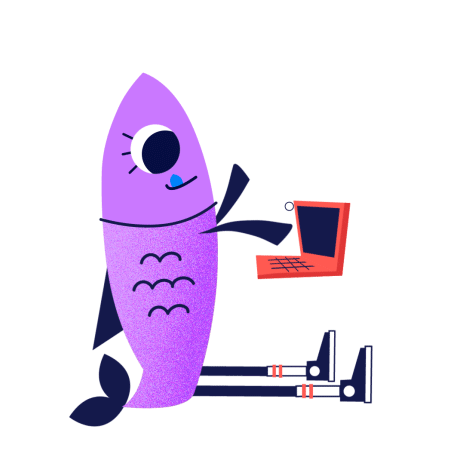

```{r setup, include=FALSE}
knitr::opts_chunk$set(echo = TRUE)
```
```{r, include=FALSE}
nchar("In this post you will find our experience and best tips to face and outperform your next Kaggle, Datathon or any data competition.")
```


Are you considering join a Datathon or data competition? In this post we'll bring you 10 tips that can help you to outperform your competitors. So without further ado;

<br>

# **1. Set your main goal and check your time and resources (skills, hardware...)**

Depending on your profile and the competition requirements, you should think about your main goal by joining a data challenge. It could be learning about a new tool, improve your coding and algorithmical skills, achieve the 1st position and therefore the prize, or just for fun. Whatever it is, that's great.

It's important to have a bright and well-defined picture of your goal, because you are going to invest so much time in the project. Having clear your personal idea of success will help you in your valley of despair.

<br>

# **2. Choose the challenge field/industry according your interests.**


Following with the 'you're going to invest so much time' idea, how are you joining a challange in a field that doesn't inspire you? Hopefully, many organizations and platforms are launching it's own data challanges open to the public. Kaggle is the principal one, nevertheless there are many more. We propose several options  [here](../../vizs-and-tips/data-competition-platforms).

<br>

# **3. Build the right team. Set up tools to exchange code.**

You should choose your teammates depending on your principal objective. It's an unseen topic with related posts, but we consider it is sufficiently important one. 

You better choose an inspiring teammate you feel good with and encourage you if you want to learn about a new topic or technology. If the project needs different profiles and you want to be among the prize winners, go for a multidisciplinary team. If the project doesn't need it, choose a teammate with your skill level. If it's possible, a little more skilled.

These are just a few examples. The main point here is choosing teammates to maximize invested time return by minimizing interpersonal problems and strengthen synergies.

<br>


# **4. Deep research about the challenge topic and environment.**



Once you have built the team, we propose you to start a research about the industry your challenge is on. This effort will lead you to a better understanding of the problem and the solution, avoiding useless iterations in your data science workflow. By starting with clear premises you will take apart basic concetps missunderstandings, a fact that could fool your whole solution and conclusions.

Let's explain this concept. Suppose your challenge consist on forecasting the conversion rate given a product portfolio, based on the online activity recorded by Google Analytics. Here, we must have clear-minded and relevant knowledge about this data source behaviour. How the bounce rate works, the customer journey recording since he open our web page and is matched with a cookie to the final conversion, leaving the web or logging as a user. Also, different behaviours of null records, bots, several cases where the default source is 'direct'...

Without this kind of information it could be difficult to craft meaningful variables to increase the model performance. But worst of all, any conclusion you get is most likely to be misunderstood and impossible to get powerful and business-disruption insights. 

<br>

# **5. Excel your exploratory analysis. Remember you could use external data sources.**

As any data science project, it consist of iterative phases. Since you have an industry landscape understanding, you will take a look on the data. If any doubt comes to your mind, return to the research stage.

So in this exploratory phase, you are focused on your data and extract information about features itself and interactions. We usually start summarizing the features by its distribution, number of NAs, categories... Features with high NAs percentage or with a minimal variance we can choose between removing or encoding it as binary variable NA/Not_NA Majoritay_Class/Not_Majoritary class. Many other encoding techniques can be applied, [like these.](https://www.kaggle.com/waydeherman/tutorial-categorical-encoding). The full exploratory toolbox can be found on Google or Kaggle.

Finally, as a reminder, you usually can use external data sources to enrich the provided data. Demographic data to contextualize your zip code feature. Or a past event to explain a spike in your data. Obviously, you must take into account which kind of this information you will have in your forecasting set.

<br>


# **6. Set your project and code structure.**

Here we will show you our most common project structure. The directory structure of a Data Science CdU depends on the project nature, its development and production environments.

Project:

- data: 
  - 1_raw:
  - 2_processed:
- models:
- notebooks:
  - 1_eda:
  - 2_poc: 
  - 3_modeling:
  - 4_evaluation:
- src:
  - 1_get_data:
  - 2_processing:
  - 3_modeling:
  - 4_evaluation:
  - 5_helpers:

We consider we can simplify this structure in the Datathon case, because we don't need to automate the ETL or the assessment and validation process inside a productive workflow. In fact, the exploratory analysis and the main script are the principal points here. Our main script calls to the preprocess, train, test and evaluation modules.

Datathon_Project:

- data:
- exploratory:
- helpers:
- log:
- main.R / main.py
- outputs:
  - models:
  - preds:
  - validation:
  
Regarding the **main script structure**, we usually build a custom cross validation with the objective of being flexible to train different models and stack its predictions. Our project template is as follows:

Loading environment (packages, modules and functions)
Crafting features
Split dataset and datasetOOSample
Split dataset into folds
For each fold in folds:
  Training with the rest
  Predict in fold
  Evalutaion
  (In the last fold, stacking models training if you want it)
Out of Sample prediction 
Evaluación (Base models and stacking comparaison)
Test set prediction.

<br>

# **7. Run your models.**

Firs of all, we advise you to focus in a model family and loss function that better fit  a priori our data, response variable and evaluated metric. The first results let you to test your code and pipeline and will be the starting point for further improvements.

You can use Google to search about different algorithm families and loss functions according your data and objective.
Also, there such an amazing info in Kaggle kernels, Reddit feed and YouTube speaks.

<br>


# **8. Cross Validation, OOS and backtesting.**

Special attention to the error metrics. One of the goals that we set in our data competitions is to know as precisely as possible the error interval (confidence or prediction) of our models before we submit predictions.
 
To know about our forecast uncertainity behind several scenarios, data subsets and synthetic data make us feel proud. Also, it could helps us to be sure about our error metrics improvements are not due to spurious behaviour or bugs.


<br>


# **9. Model interpretability**

In some data competitions, the best teams have to expose their projects in a final event. Here, in addition to talk about your data flow and research done, you probably want to talk about some insights and interpretable interactions between data and not only the model prediction.


Many packages like SHAP or LIME integrate different modules focused on the model and predictions interpretability. These modules instead of looking for a "mean" variable importance in a global point of view, compose additionally a local feature contribution in each predicted observation. 

<br>


# **10. Write down your observed strengths and weaknesses. It will be the starting point for your next proyect. **

Once you have finished the project and committed the predictions, writing down your strengths and weaknesses is a cool idea. These thoughts are such a fantastic starting point to the next competition or project.

<br>

So here is our contribution, hoping you will **ace your competition!** And the most important, **have fun!!**


<style>
p {
  word-spacing: 3px;
  text-indent: 20px;
  text-align: justify;
}
.page-subtitle {
  text-align: left  !important;
    text-indent: 0px !important;
}
</style>

<script type="text/javascript" src="//downloads.mailchimp.com/js/signup-forms/popup/unique-methods/embed.js" data-dojo-config="usePlainJson: true, isDebug: false"></script><script type="text/javascript">window.dojoRequire(["mojo/signup-forms/Loader"], function(L) { L.start({"baseUrl":"mc.us4.list-manage.com","uuid":"91551f7ed29389a0de4f47665","lid":"d95c503a48","uniqueMethods":true}) })</script>

