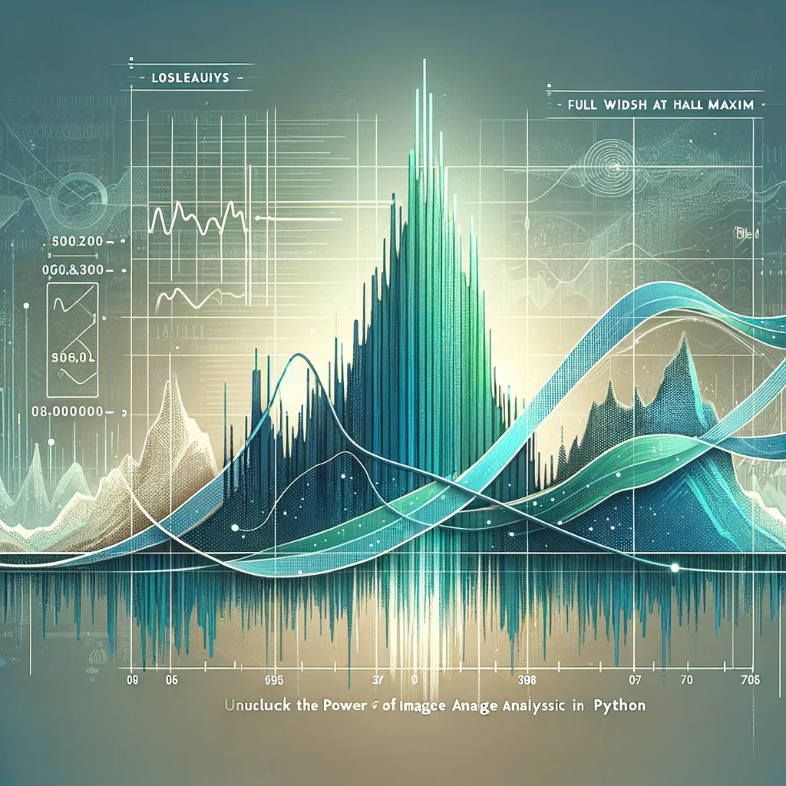

```{r setup, include=FALSE}
knitr::opts_chunk$set(echo = TRUE, eval = FALSE)
```

In the realm of image analysis and signal processing, the concept of Full Width at Half Maximum (FWHM) is a vital metric used to determine the spread of a signal or the resolution of an imaging system. This guide will walk you through the process of measuring the FWHM from an image using Python, a powerful programming language beloved for its simplicity and robust libraries. Whether you’re a researcher analyzing microscopic images or an engineer working on improving camera resolution, mastering the FWHM calculation in Python can provide insightful data on your subject matter.

# Measuring FWHM from an Image

<br>

## **What is FWHM?**

**FWHM is a measurement of the width of a signal or a peak at its half maximum height**. In imaging, it's often used to describe the resolution of a system, with a smaller FWHM indicating a higher resolution and sharper images. In practical terms, measuring the FWHM from an image can tell us about the blur or spread of a particular feature, which is crucial for various applications such as materials science, astronomy, and medical imaging.

We’ll start by loading and preprocessing our image, ensuring it's in the perfect state for analysis. Then, we’ll move on to the critical task of identifying the peak intensity values. Finally, we will meticulously calculate the FWHM, dissecting each pixel's contribution to the bigger picture.

Before diving into the code, ensure you have the **following prerequisites covered:**

- Python installed on your system (preferably Python 3.7 or above)
- Image processing libraries: NumPy and SciPy
- Image reading and displaying library: OpenCV or Pillow
- Matplotlib library for plotting (optional but recommended)

You can install the necessary Python libraries using pip:

```{bash}
pip install numpy scipy opencv-python pillow matplotlib
```

<br>

## **Hands-on in measuring FWHM from an Image in Python**

Now, let’s get our hands dirty with some Python code. The following steps and accompanying code snippets will help you measure the FWHM from an image.

Step 1: Read the image in grayscale

The first step in our journey is to read the image. By converting it to grayscale, we reduce the complexity of the image, focusing solely on intensity values rather than color. This simplification is crucial as it makes subsequent analysis more straightforward and computationally efficient. The code snippet below utilizes OpenCV, a powerful library for image operations, to load the image and check its validity, ensuring that we have a solid starting point for our analysis.

```{python}
import cv2

image_path = 'path_to_your_image.jpg'
image = cv2.imread(image_path, cv2.IMREAD_GRAYSCALE)

if image is None:
    raise ValueError("Image not found or the path is incorrect")
```


Step 2: Detect the Peaks

To measure the FWHM, we first need to identify the peak in the image. This could be the brightest point in an astronomical image or the highest intensity value in a spectroscopic image.
The next step involves detecting the peak in the image. **Peaks in an image can signify various things depending on the context** – it could represent the brightest star in a galaxy or the highest concentration of a substance in a microscopic image. By using NumPy, a fundamental package for scientific computing with Python, we can efficiently locate the peak pixel, setting the stage for the crucial task of FWHM measurement.

```{python}
import numpy as np

peak_pixel = np.unravel_index(np.argmax(image, axis=None), image.shape)
peak_value = image[peak_pixel]
```


Step 3: Calculate the Half Maximum

Here, we calculate the half maximum value, a vital reference point for determining the FWHM. The half maximum is essentially half the peak intensity value, and it is around this value that we measure the width of the peak. This step is straightforward yet pivotal, as accurate calculation of this value is crucial for the correct measurement of the FWHM.

```{python}
half_max = peak_value / 2.0
```

Step 4: Measure the FWHM

**This crucial step involves measuring the width of the peak at its half maximum intensity.** We focus on a one-dimensional slice of the image, typically a horizontal line that passes through the peak. This approach simplifies the problem while still providing us with valuable insights into the image's characteristics. The FWHM is determined by finding where the intensity values cross the half maximum value, allowing us to quantify the spread of the peak.

```{python}
# Get the horizontal cross-section of the image at the peak
cross_section = image[peak_pixel[0], :]

# Find where the cross_section crosses the half maximum
crosses_half = np.where(cross_section >= half_max)[0]

# Calculate FWHM
fwhm = crosses_half[-1] - crosses_half[0] + 1
Step 5: Display Results (Optional)
```

Enhanced Robustness in FWHM Calculation

Incorporating error handling at this stage enhances the robustness and reliability of our script. By anticipating and managing potential errors, we can ensure that the script provides clear and actionable feedback, making it more user-friendly and easier to debug. This step is particularly important when dealing with a variety of images, where unexpected data formats or issues might arise.
```{python}
# Assuming previous variables (cross_section, half_max) are defined

try:
    crosses_half = np.where(cross_section >= half_max)[0]
    
    if crosses_half.size == 0:
        raise ValueError("No points cross the half maximum. Check the image and data.")
    
    fwhm = crosses_half[-1] - crosses_half[0] + 1
    print(f"The Full Width at Half Maximum (FWHM) is: {fwhm} pixels")
except ValueError as ve:
    print(ve)
except Exception as e:
    print(f"An error occurred while calculating the FWHM: {e}")
```


Step 5: Plot the cross-section with the FWHM

```{python}
import matplotlib.pyplot as plt

plt.plot(cross_section)
plt.plot([crosses_half[0], crosses_half[-1]], [half_max, half_max], 'ro-')
plt.title('FWHM Measurement')
plt.xlabel('Pixel Position')
plt.ylabel('Pixel Value')
plt.show()

print(f"The Full Width at Half Maximum (FWHM) is: {fwhm} pixels")
```

```{python}
# Assuming 'cross_section', 'crosses_half', and 'half_max' are obtained as shown before
# Also assuming 'image' is the 2D numpy array from the grayscale image

# Display the image
plt.imshow(image, cmap='gray')
plt.colorbar()

# Draw a horizontal line at the y-coordinate of the peak
plt.axhline(y=peak_pixel[0], color='cyan', linestyle='--')

# Plot the FWHM on the image
plt.plot([crosses_half[0], crosses_half[-1]], [peak_pixel[0], peak_pixel[0]], 'ro-')

# Adding annotations
plt.text(crosses_half[0], peak_pixel[0], 'FWHM Start', color='white')
plt.text(crosses_half[-1], peak_pixel[0], 'FWHM End', color='white')

plt.title('Image with FWHM Indicated')
plt.xlabel('Pixel Position X')
plt.ylabel('Pixel Position Y')
plt.show()
```


<br>

## **Stay updated on Python tips**

You've now learned how to measure the Full Width at Half Maximum (FWHM) from an image using Python! This technique is broadly applicable and **can be expanded** to measure FWHM in two dimensions, apply to various types of data, and customized for your specific needs. The Python ecosystem provides a straightforward and efficient path to add image analysis capabilities to your skill set.

Remember, for different types of images or more complex scenarios, you might need to apply image **preprocessing techniques such as noise reduction, thresholding, or edge detection to enhance the accuracy of your FWHM measurements.**

If you want to stay updated...

```{=html}
<!-- Begin Mailchimp Signup Form -->
<link href="//cdn-images.mailchimp.com/embedcode/horizontal-slim-10_7.css" rel="stylesheet" type="text/css">
<link rel="stylesheet" type="text/css" href="https://csshake.surge.sh/csshake.min.css">
<style type="text/css">
	#mc_embed_signup{background:#fff; clear:left; font:14px Helvetica,Arial,sans-serif; width:100%;}
	 #mc_embed_signup .button {
  background-color: #0294A5; /* Green */
  color: white;
  transition-duration: 0.4s;
}
#mc_embed_signup .button:hover {
  background-color: #379392 !important; 
}

</style>
<div id="mc_embed_signup">
<form action="https://typethepipe.us4.list-manage.com/subscribe/post?u=91551f7ed29389a0de4f47665&amp;id=d95c503a48" method="post" id="mc-embedded-subscribe-form" name="mc-embedded-subscribe-form" class="validate" target="_blank" novalidate>
 <div id="mc_embed_signup_scroll">
	<label for="mce-EMAIL"> Suscribe for more Python tips!</label>
	<input type="email" value="" name="EMAIL" class="email" id="mce-EMAIL" placeholder="your best email" required>
    <!-- real people should not fill this in and expect good things - do not remove this or risk form bot signups-->
    <div style="position: absolute; left: -5000px;" aria-hidden="true"><input type="text" name="b_91551f7ed29389a0de4f47665_d95c503a48" tabindex="-1" value=""></div>
    <div class="clear"><input type="submit" value="Submit!" name="subscribe" id="mc-embedded-subscribe" class="button"></div>
    </div>
</form>
</div>

<!--End mc_embed_signup-->
```


<style>
p {
  word-spacing: 3px;
  text-indent: 20px;
  text-align: justify;
}
.page-subtitle {
  text-align: left  !important;
    text-indent: 0px !important;
}
.card-text {
  text-align: left  !important;
    text-indent: 0px !important;
}
</style>
<style>
.hljs-keyword,.hljs-selector-tag,.hljs-subst{color:#2e8516;font-weight:bold}.hljs-comment, .hljs-quote {
    color: #0e847b;
    font-style: italic;
}.hljs-number, .hljs-literal, .hljs-variable, .hljs-template-variable, .hljs-tag .hljs-attr {
    color: #008021;
}
</style>
