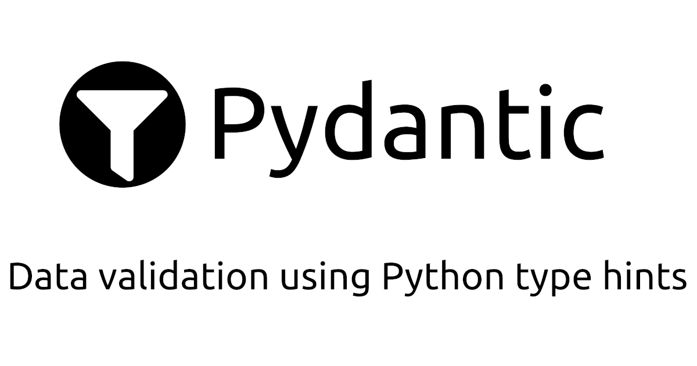

# What is a Pydantic Enum?

Oh, this is great question! Never heard that one before. A Pydantic Enum, for the uninitiated, is a nifty little feature from the Pydantic library that helps you control the chaos of the data jungle. **It's a combination of Python's Enum (short for enumeration) and Pydantic's validation powers. Enums let you define a set of named values that your data must adhere to.** Pydantic then checks if your data is part of this exclusive club, and if it isn't, kindly shows it the door.

<br>

## **How does Pydantic Enum help me?**

If you've ever dealt with data, you know that it has a mind of its own. Sometimes, it's pristine and perfect. Other times, it's a dumpster fire. Pydantic Enum is here to save you from those days when your data decides to go rogue.

By defining enums and using them in your Pydantic models, you create a set of rules that your data must follow, like a stern yet fair teacher. This way, you can ensure that only valid data enters your system, and any outliers are dealt with accordingly.

```{python}
from enum import Enum
from pydantic import BaseModel, ValidationError

class Pet(BaseModel):
  name: str
  animal_type: str
  sex: str
  
```

**You can be more specific defining your Pydantic models by using Enums:**

```{python}
from pydantic import ValidationError

class Sex(Enum):
  MALE = 'male'
  FEMALE = 'female'
  
class Animals(Enum):
  CAT = 'cat'
  DOG = 'dog'
  FISH = 'fish'
  BIRD = 'bird'

# And then

class Pet(BaseModel):
  name: str
  animal_type: Animals
  sex: Sex
  
Pet(name='Timmy', animal_type='bird', sex='male')

```
This will fail due to not existent enum value (Tiger not in allowed animals):
```{python}
import pytest

with pytest.raises(ValidationError, match=' value is not a valid enumeration member') as e_info:
  Pet(
    name='Timmy', 
    animal_type='tiger', 
    sex='male'
  )
print(e_info.value)
```

(*Note the `UPPER_CASE_NOTATION`)

<br>

## **What about IntENum? Which is the difference between Enum and IntEnum?**

In a nutshell, the main difference between Enum and IntEnum is the type of values they represent. Enum is a generic enumeration class for any data type, while IntEnum is specifically designed for integer values and allows for direct comparison with integers.

Two are the main benefits that bring using IntEnums in the correct use cases:
- As IntEnum ensures that all the enumeration members have an integer value, it's also possible to order them.
- IntEnum members can be compared to integers directly, while Enum members can't be used in integer comparison operators.

```{python}
from enum import IntEnum
import pytest

class ResponseCode(IntEnum):
    OK = 200
    NOT_FOUND = 404
    ERROR = 500
    
assert ResponseCode.OK == 200
assert ResponseCode.OK <= ResponseCode.NOT_FOUND

with pytest.raises(TypeError, match='cannot extend enumeration') as e_info: # Check that a TypeError is raised
  class ExtendedResponseCode(ResponseCode):
      CUSTOM = 300
print(e_info.value)

```

<br>

# Is it possible to subclass an Enum (or an StrEnum / IntEnum)?

It is not supposed to be possible. If you do so by direct inheritance a TypeError may be raised. To explain that, the documentation says: "Allowing subclassing of enums that define members would lead to a violation of some important invariants of types and instances."

Which are those violations? Let's check the [Guido comment in (2013)](https://mail.python.org/pipermail/python-dev/2013-April/125716.html):

```{python, eval=FALSE}
from enum import Enum

class Color(Enum):
  red = 1
  green = 2
  blue = 3

class MoreColor(Color): # this is not possible as we've seen
  cyan = 4
  magenta = 5
  yellow = 6

type(MoreColor.red) is Color

type(MoreColor.red) is not MoreColor

#In other words, while `red` is accessible in MoreColor, it's actually a
#Color instance?

#Oh dear, this is actually a mess. I don't want MoreColor.red and
#Color.red to be distinct objects, but then the isinstance() checks
#will become confusing. If we don't override isinstance(), we'll get

#not isinstance(Color.red, MoreColor)
#isinstance(MoreColor.yellow, Color)
```


In some Python versions, this is working without an error message, but it is a unwanted behaviour.

```{python, eval=FALSE}
class Color(Enum):
  red = 1
  green = 2
  blue = 3

class MoreColor(Enum, Color):
  cyan = 4
  magenta = 5
  yellow = 6
```

One could argue that enumerations exist to guarantee mutual exclusion over a finite not ordered set. Appending additional members onto an existing enumeration don't violates this guarantee. So being sure about your use case and what you're doing, it's possible to create a workaround. **A clean solution using a decorator is**:

```{python}
from enum import Enum
from typing import Any, Callable

class EnumBase(Enum):
    def __eq__(self, other: Any) -> bool:
        if isinstance(other, Enum):
            return self.value == other.value
        return False
      
def extend_enum(parent_enum: EnumBase) -> Callable[[EnumBase], EnumBase]:
    """Decorator function that extends an enum class with values from another enum class."""
    def wrapper(extended_enum: EnumBase) -> EnumBase:
        joined = {}
        for item in parent_enum:
            joined[item.name] = item.value
        for item in extended_enum:
            joined[item.name] = item.value
        return EnumBase(extended_enum.__name__, joined)
    return wrapper
```

```{python}
class Parent(EnumBase):
  A = 1
  B = 2
  
@extend_enum(Parent)
class ExtendedParent(EnumBase):
  C = 3
  
print(
type(Parent.A) is Parent,
type(Parent.A) is not ExtendedParent,
Parent.A == ExtendedParent.A
)
```

But this is not a perfect solution, as it has some drawbacks or limitations you should be aware of. In this case, a nor related Enum (called `RandomEnum`) that implements the same enum value, is equal in the comparison to our `Parent` and `ExtendedParent` classes :
```{python}

class RandomEnum(EnumBase):
  A = 1
  
Parent.A == RandomEnum.A == ExtendedParent.A
```

<br>

## **Stay updated on Pydantic and Python tips**

Hopefully, this post has helped you become familiar with Enum usage in Pydantic and allowed you to enjoy a showcase of some of its functionalities.

If you want to stay updated...

```{=html}
<!-- Begin Mailchimp Signup Form -->
<link href="//cdn-images.mailchimp.com/embedcode/horizontal-slim-10_7.css" rel="stylesheet" type="text/css">
<link rel="stylesheet" type="text/css" href="https://csshake.surge.sh/csshake.min.css">
<style type="text/css">
	#mc_embed_signup{background:#fff; clear:left; font:14px Helvetica,Arial,sans-serif; width:100%;}
	 #mc_embed_signup .button {
  background-color: #0294A5; /* Green */
  color: white;
  transition-duration: 0.4s;
}
#mc_embed_signup .button:hover {
  background-color: #379392 !important; 
}

</style>
<div id="mc_embed_signup">
<form action="https://typethepipe.us4.list-manage.com/subscribe/post?u=91551f7ed29389a0de4f47665&amp;id=d95c503a48" method="post" id="mc-embedded-subscribe-form" name="mc-embedded-subscribe-form" class="validate" target="_blank" novalidate>
 <div id="mc_embed_signup_scroll">
	<label for="mce-EMAIL"> Suscribe for more Python and Pydantic tips!</label>
	<input type="email" value="" name="EMAIL" class="email" id="mce-EMAIL" placeholder="your best email" required>
    <!-- real people should not fill this in and expect good things - do not remove this or risk form bot signups-->
    <div style="position: absolute; left: -5000px;" aria-hidden="true"><input type="text" name="b_91551f7ed29389a0de4f47665_d95c503a48" tabindex="-1" value=""></div>
    <div class="clear"><input type="submit" value="Submit!" name="subscribe" id="mc-embedded-subscribe" class="button"></div>
    </div>
</form>
</div>

<!--End mc_embed_signup-->
```


<style>
p {
  word-spacing: 3px;
  text-indent: 20px;
  text-align: justify;
}
.page-subtitle {
  text-align: left  !important;
    text-indent: 0px !important;
}
.card-text {
  text-align: left  !important;
    text-indent: 0px !important;
}
</style>
<style>
.hljs-keyword,.hljs-selector-tag,.hljs-subst{color:#2e8516;font-weight:bold}.hljs-comment, .hljs-quote {
    color: #0e847b;
    font-style: italic;
}.hljs-number, .hljs-literal, .hljs-variable, .hljs-template-variable, .hljs-tag .hljs-attr {
    color: #008021;
}
</style>
