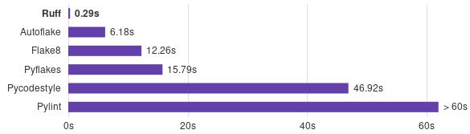

```{r setup, include=FALSE}
knitr::opts_chunk$set(echo = TRUE, eval = FALSE)
```


# The Need for Speed. Ruff module, Ruff rules and pre-commit

In the world of software development, every second counts. For Python developers, the time spent on code linting can sometimes be a real productivity killer. But what if there was a tool that could make this process lightning-fast, giving you nearly real-time feedback as you code? Meet Ruff, the game-changing Python linter that's about to revolutionize your development workflow.

Python is renowned for its simplicity and readability, making it a go-to language for many developers. However, as projects grow in complexity, the build times and code analysis can slow down significantly. This is where Ruff steps in. It's based on a simple but powerful idea: Python tooling could be much, much faster.

Imagine a Python linter that's approximately 150 times faster than Flake8 on macOS. That's Ruff for you. It's not just slightly faster; it's blazingly fast. For instance, when linting the entire CPython codebase from scratch, it's the difference between sitting around for 12+ seconds and getting almost instant feedback in just 300-500 milliseconds. It's a game-changer that saves you time and makes your development process more efficient.

## Ruff's Impressive Performance
Ruff's speed is not just an empty claim. It's roughly 75 times faster than pycodestyle, 50 times faster than pyflakes and pylint, and the list goes on. Whether you're working with a small script or a large codebase, Ruff's performance boost is noticeable.

Ruff's lightning-fast performance is just the beginning. It prompts us to question the status quo in Python development. How long should it take to lint a million lines of code? Ruff's speed makes us wonder what other developer tools in the Python ecosystem can be accelerated. Could we have instant autoformatters, even faster type checkers, and more? These are the questions that Ruff inspires us to explore.

## How Ruff Works
Ruff is written in Rust, but here's the magic: as a user, you won't even notice it's not written in Python. It leverages RustPython's AST parser and implements its own AST traversal, visitor abstraction, and lint-rule logic. It supports Python 3.10, including the new pattern matching syntax. Ruff is also pip-installable, making it easy to incorporate into your workflow.

Ruff goes beyond just speed; it brings features you might have missed when moving between Python and other languages. It supports ESLint-like caching, TypeScript-like file watching, and pyproject.toml-based configuration, which is becoming the standard in the Python ecosystem.

Ruff is built on two core hypotheses: Python tooling could be rewritten in more performant languages, and an integrated toolchain can tap into efficiencies that aren't available to a disparate set of tools. Ruff exemplifies these ideas by generating all violations in a single pass and even autofixing issues without a noticeable performance penalty.


## Python Ruff rules

Ruff has a set of over 700 rules of the 

## Integrating Ruff in you project with Pyproject yaml and pre-commit

Suposse the folowing pyproject.toml file that could be usual in a data related project:

```{python}
[tool.poetry]
name = "data-project"
version = "0.0.1"
description = "Python 🐍 service that is intended to do wonderful things✧"
authors = ["TypeThePipe.com"]
readme = "README.md"
classifiers = [
    "Topic :: Software Development :: Libraries :: Python Modules",
    "Programming Language :: Python :: 3.11",
]


[tool.poetry.dependencies]
python = "~3.11.0"
sqlmodel = "^0.0.8"
pydantic = "^1.10.4"
numpy = "^1.24.2"
pandas = "^1.5.3"
scipy = "^1.10.1"
statsmodels = "^0.13.5"
rollbar = "^0.16.3"
sqlalchemy = "1.4.35"
alembic = "^1.10.2"
psycopg2 = "^2.9.5"


[tool.poetry.group.dev.dependencies]
black = "^23.1"
flake8 = "^4.0"
isort = "^5.10"
flakeheaven = "^0.11"
pytest = "^7.2"
pytest-postgresql = "^4.1.1"
psycopg = "^3.1.8"
coverage = {version = "^7.2.1", extras = ["toml"]}
pre-commit = "^2.17.0"
mypy = "^1.0.1"
pytest-dependency = "^0.5.1"
dvc = { version = "^2.10.2", extras = ["s3"] }
mkdocs = "^1.4.2"
mkdocstrings = "^0.19.1"
mkdocs-material = "^9.0.5"


[tool.poetry.group.notebook.dependencies]
jupyterlab = "^3.6.1"
notebook = "^6.5.2"
plotly = "^5.13.0"

[build-system]
requires = ["poetry-core"]
build-backend = "poetry.core.masonry.api"

#
# Testing & Linting configuration
#
[tool.pytest.ini_options]
minversion = "6.0"
addopts = "-ra -q"
testpaths = ["tests/unit"]
filterwarnings = ["ignore::DeprecationWarning"]

[tool.isort]
# Black Compatibility
profile = "black"


#####
# Typing
#####
[tool.mypy]
python_version = "3.11"
warn_return_any = true
warn_unused_configs = true
ignore_missing_imports = true
exclude = ["nb"]

#####
# Flake8 wrapper with pyproject.toml support
#####
[tool.flakeheaven]
exclude = ["README.md"]
# format = "colored"
# nicer output
format = "grouped"
max_line_length = 88
show_source = true
extend-ignore = "E203, W503"
extended_default_ignore = []

[tool.flakeheaven.plugins]
# include everything in pyflakes except F401
pyflakes = ["+*", "-F401"]
# enable only codes from S100 to S199
flake8-bandit = ["-*", "+S1??"]
# enable everything that starts from `flake8-`
"flake8-*" = ["+*"]
# explicitly disable plugin
flake8-docstrings = ["-*"]
flake8-bandit = ["+*", "-S322"]
flake8-bugbear = ["+*"]
flake8-builtins = ["+*", "-A003"]
flake8-comprehensions = ["+*"]
flake8-docstrings = ["-*"]
flake8-eradicate = ["+*"]
flake8-isort = ["+*"]
flake8-mutable = ["+*"]
flake8-pytest-style = ["+*"]
flake8-spellcheck = ["-*"]
pyflakes = ["+*"]
pylint = ["+*"]

#####
# Coverage config
#####

[tool.coverage.run]
branch = true

# List of file patterns to ignore
omit = [
    "tests/",
    "nb/"
]

source = [
    "src/"
]


[tool.coverage.report]

fail_under = 70 # Minimum coverage 70%

# Ignore source code that can’t be found
ignore_errors = true

# Don’t report files that have no executable code
skip_empty = true

# Don’t include files in the report that are 100% covered
skip_covered = true
```


Then you could change all the linter as a replacement for Flake8, isort, autoflake and pyupgrade.

```{python}

```


sf


## Try Ruff Today
If you're curious to experience the speed and efficiency of Ruff for yourself, you can try it today by running:

```{bash}
pip install ruff
```

As linter, running it for all current folder files:
```{python}
ruff check .
```

<br>

## **Stay updated on Pydantic and Python tips**

Hopefully, this post has helped you become familiar with a newcomer to the Python linter and pre-commit hook landscape, say hi to Ruff.

If you want to stay updated...

```{=html}
<!-- Begin Mailchimp Signup Form -->
<link href="//cdn-images.mailchimp.com/embedcode/horizontal-slim-10_7.css" rel="stylesheet" type="text/css">
<link rel="stylesheet" type="text/css" href="https://csshake.surge.sh/csshake.min.css">
<style type="text/css">
	#mc_embed_signup{background:#fff; clear:left; font:14px Helvetica,Arial,sans-serif; width:100%;}
	 #mc_embed_signup .button {
  background-color: #0294A5; /* Green */
  color: white;
  transition-duration: 0.4s;
}
#mc_embed_signup .button:hover {
  background-color: #379392 !important; 
}

</style>
<div id="mc_embed_signup">
<form action="https://typethepipe.us4.list-manage.com/subscribe/post?u=91551f7ed29389a0de4f47665&amp;id=d95c503a48" method="post" id="mc-embedded-subscribe-form" name="mc-embedded-subscribe-form" class="validate" target="_blank" novalidate>
 <div id="mc_embed_signup_scroll">
	<label for="mce-EMAIL"> Suscribe for more Python tips!</label>
	<input type="email" value="" name="EMAIL" class="email" id="mce-EMAIL" placeholder="your best email" required>
    <!-- real people should not fill this in and expect good things - do not remove this or risk form bot signups-->
    <div style="position: absolute; left: -5000px;" aria-hidden="true"><input type="text" name="b_91551f7ed29389a0de4f47665_d95c503a48" tabindex="-1" value=""></div>
    <div class="clear"><input type="submit" value="Submit!" name="subscribe" id="mc-embedded-subscribe" class="button"></div>
    </div>
</form>
</div>

<!--End mc_embed_signup-->
```


<style>
p {
  word-spacing: 3px;
  text-indent: 20px;
  text-align: justify;
}
.page-subtitle {
  text-align: left  !important;
    text-indent: 0px !important;
}
.card-text {
  text-align: left  !important;
    text-indent: 0px !important;
}
</style>
<style>
.hljs-keyword,.hljs-selector-tag,.hljs-subst{color:#2e8516;font-weight:bold}.hljs-comment, .hljs-quote {
    color: #0e847b;
    font-style: italic;
}.hljs-number, .hljs-literal, .hljs-variable, .hljs-template-variable, .hljs-tag .hljs-attr {
    color: #008021;
}
</style>
