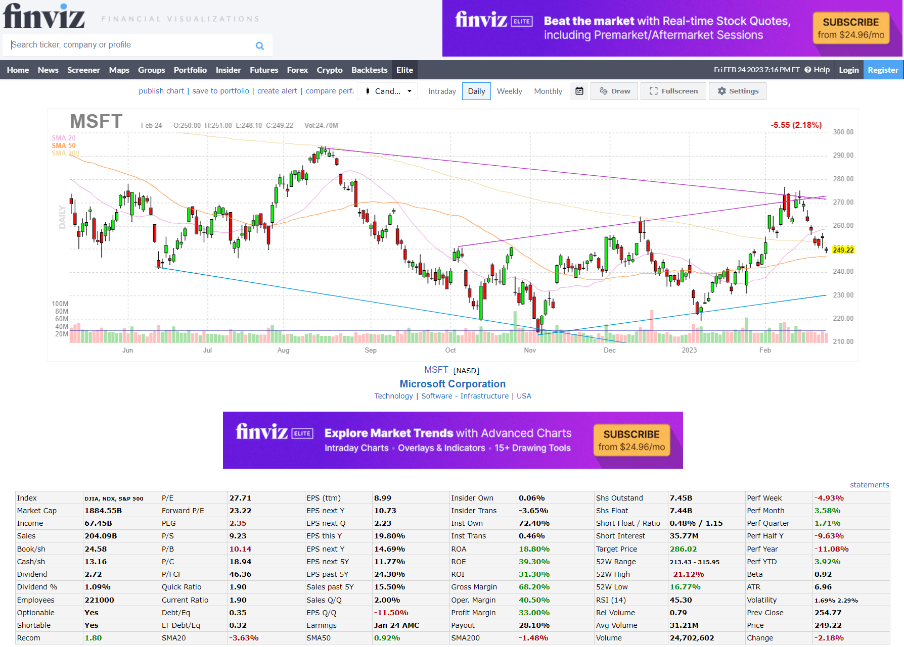
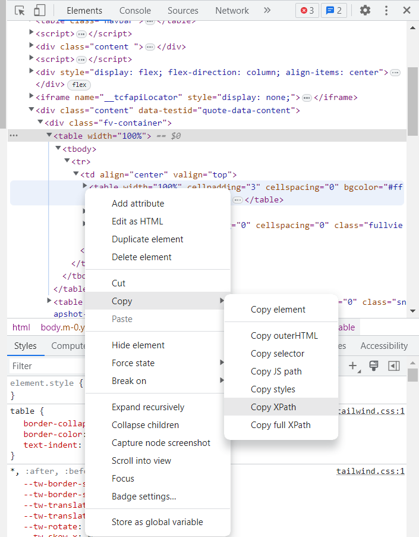

```{r setup, include=FALSE}
knitr::opts_chunk$set(echo = TRUE, warning = FALSE)
```

```{r, echo = FALSE, message=FALSE, warning=FALSE}
library(tidyverse)
library(lubridate)
library(glue)
library(rvest)
```

# Introduction

If you're an active trader or investor, you're probably aware of the importance of keeping up with the latest stock market news and trends. One tool that many traders use to stay on top of market movements is [Finviz](https://finviz.com), a popular financial visualization website that offers a range of powerful tools and data visualizations to help traders make informed investment decisions.

While Finviz is a valuable resource for traders, manually collecting and analyzing data from the website can be time-consuming and inefficient. But this is a data science blog, right? Let's build a scraper to make our life easier! With this simple function I'm about to show, you will be able to extract the data from the website and analyze it in a streamlined way.

## Disclaimer

Before diving into the topic, it's important to note that web scraping can potentially violate website terms of service and can even be illegal in some cases. Let's be [polite](https://dmi3kno.github.io/polite/) and don't use this code to resell any information, as this is not permitted by their terms of use. For educational and personal purposes only.

# Into the water

To build this simple scraper we are going to use the ```rvest``` package. R developers are quite funny, aren't they?

First thing is to get the full html we will parse later.
```{r}
symbol <- "MSFT"
finviz_url <- glue::glue("https://finviz.com/quote.ashx?t={symbol}")
finviz_html <- tryCatch(rvest::read_html(finviz_url), error=function(e) NULL)
```

This is what the website look like after searching for a ticker. 



We want to focus mainly on the table at the bottom which contains a ton of information for the company, including relevant data such as market capitalization, P/E, insider and institutional ownership or short interest.
Also, it's nice to have our companies organized by sector and industry, as this information is also relevant for potential analysis.
Let's get this small piece of information first, which sits right below the chart, in the middle of the page:

```{r}
sector_str <- finviz_html %>% 
  rvest::html_element(xpath = '/html/body/div[4]/div/table[1]') %>% 
  rvest::html_table() %>% 
  head(1) %>% 
  pull(X4) 

sector_str
```

Finding the path to the specific element we are looking for is as easy as stepping into developing mode in the web browser (F12) and find your way to the element within the html code. Right-click and copy XPath as shown in the image below:



It's easy to notice that the information we got above it's all stored as a character of length one. This is typically undesirable as they represent different variables.

We can clean it easily with some text engineering. Tidyverse saves the day again:
```{r}
sector_df <- sector_str %>% 
  str_split("[|]", simplify = T) %>% 
  str_squish() %>% 
  as_tibble() %>% 
  mutate(variable = c("sector", "industry", "country")) %>% 
  relocate(variable) %>% 
  add_row(variable = "ticker", value = symbol, .before = 1)

sector_df
```
Much better.

We will scrape now the main table:
```{r}
raw_tbl <- finviz_html %>% 
  rvest::html_element(xpath = '/html/body/div[4]/div/table[2]') %>% 
  rvest::html_table() 
```

However, in this case variables and values are totally mixed up in the table:

```{r}
raw_tbl
```

We can extract headers and values with the following chunk of code:

```{r}
# flatten_chr will collapse all columns into one vector

headers <- raw_tbl %>% select(seq(1,11,2)) %>% flatten_chr() 
values <- raw_tbl %>% select(seq(2,12,2)) %>% flatten_chr()
```

This is what the header vector looks like now:
```{r}
headers
```

Perfect! Finally pasting all the info together, we get this fine data frame containing all the information:
```{r}
finviz_df <- tibble(value = values) %>%
  bind_cols(variable = headers, .) %>% 
  bind_rows(sector_df, .)

finviz_df
```

# Function to take away

We can easily assemble a function joining all these pieces together. [Ready to rumble](https://www.youtube.com/watch?v=nendMLrpI-s):


```{r}
Get_finviz_data <- function(symbol){
  
  Sys.sleep(1)          # It's a good practice to use a sleep to make repeated calls to the server
  
  finviz_url <- glue::glue("https://finviz.com/quote.ashx?t={symbol}")
  finviz_html <- tryCatch(rvest::read_html(finviz_url), error=function(e) NULL)
  
  if(is.null(finviz_html)) return(NULL)
  
  sector_str <- finviz_html %>% 
    rvest::html_element(xpath = '/html/body/div[4]/div/table[1]') %>% 
    rvest::html_table() %>% 
    head(1) %>% 
    pull(X4) 
  
  sector_df <- sector_str %>% 
    str_split("[|]", simplify = T) %>% 
    str_squish() %>% 
    as_tibble() %>% 
    mutate(variable = c("sector", "industry", "country")) %>% 
    relocate(variable) %>% 
    add_row(variable = "ticker", value = symbol, .before = 1)
  
  raw_tbl <- finviz_html %>% 
    rvest::html_element(xpath = '/html/body/div[4]/div/table[2]') %>% 
    rvest::html_table() 
  
  headers <- raw_tbl %>% select(seq(1,11,2)) %>% flatten_chr() 
  values <- raw_tbl %>% select(seq(2,12,2)) %>% flatten_chr()
  
  finviz_df <- tibble(value = values) %>%
    bind_cols(variable = headers, .) %>% 
    bind_rows(sector_df, .)
  
  return(finviz_df)
}
```

And there you have it! A functional scraper in less than 30 lines of code where we showed how to use the convenient library ```rvest``` to download financial data from any public company.


```{=html}
<!-- Begin Mailchimp Signup Form -->
<link href="//cdn-images.mailchimp.com/embedcode/horizontal-slim-10_7.css" rel="stylesheet" type="text/css">
<link rel="stylesheet" type="text/css" href="https://csshake.surge.sh/csshake.min.css">
<style type="text/css">
	#mc_embed_signup{background:#fff; clear:left; font:14px Helvetica,Arial,sans-serif; width:100%;}
	 #mc_embed_signup .button {
  background-color: #0294A5; /* Green */
  color: white;
  transition-duration: 0.4s;
}
#mc_embed_signup .button:hover {
  background-color: #379392 !important; 
}

</style>
<div id="mc_embed_signup">
<form action="https://typethepipe.us4.list-manage.com/subscribe/post?u=91551f7ed29389a0de4f47665&amp;id=d95c503a48" method="post" id="mc-embedded-subscribe-form" name="mc-embedded-subscribe-form" class="validate" target="_blank" novalidate>
 <div id="mc_embed_signup_scroll">
	<label for="mce-EMAIL"> Don't miss the next chapters on our Financial journey in R series!</label>
	<input type="email" value="" name="EMAIL" class="email" id="mce-EMAIL" placeholder="your best email" required>
    <!-- real people should not fill this in and expect good things - do not remove this or risk form bot signups-->
    <div style="position: absolute; left: -5000px;" aria-hidden="true"><input type="text" name="b_91551f7ed29389a0de4f47665_d95c503a48" tabindex="-1" value=""></div>
    <div class="clear"><input type="submit" value="Submit!" name="subscribe" id="mc-embedded-subscribe" class="button"></div>
    </div>
</form>
</div>

<!--End mc_embed_signup-->
```


