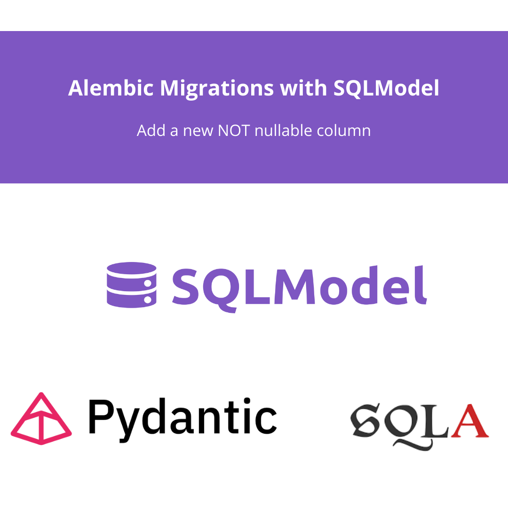

```{r setup, include=FALSE}
knitr::opts_chunk$set(echo = TRUE, eval = FALSE)
```


# What is the interaction between SQLModel and Alembic?

SQLModel and Alembic migrations? They're like a power duo in the whole database game. SQLModel is a quite new library for defining data models, combining Pydantic and SQLALchemy. It is true that SQLALchemy v2 addresses common spots. But if you're in the [FastAPI](https://fastapi.tiangolo.com/tutorial/first-steps/) and Pydantic ecosystem, it's worth to give a try. It feels so natural! On the other hand, Alembic, well, it's your go-to database migration tool in Python. When you put them together, managing your database schema becomes a whole lot smoother. Today, we're diving into a cool move: **adding a not nullable column to your database tables.**

But first of all, if you come from the Data Analytics or Data Science world, you could be asking...

<br>

## **What is a database migration? Why use Alembic?**

When you're managing a production service database, you would need to be sure database status is stable, robust and changes are trackeable. Imagine you want to add a new column to an existing table. You better have a Python model (SQLAlchemy or SQLModel) specifying its characteristics (type, nullable, default value...). Also, you need to **keep track of the previous database status, the delta change of adding the column, and the way to revert to previous database status if needed.** This features are often avoided in beginners / PoC data science / analytics projects, but it comes as mandatory if you want to step up your project robustness and quality.


Alembic, in particular, is like the cool maestro in this orchestra. **Alembic creates and tracks migration scripts, which are like roadmaps for your database's journey.** This way, you can make changes without losing your data's integrity. So, whether you're giving your database a makeover with fresh features, fixing those pesky bugs, or just keeping everything neat and tidy, a tool like Alembic is your trusty sidekick in the world of data-driven projects.

You can check the [Alembic starting guide](https://alembic.sqlalchemy.org/en/latest/tutorial.html) as a first step. The basic commands are:

```{bash}
# init the alembic project
alembic init alembic

# add a revision (a database change)
alembic revision -m "Add updated_at column"

# sync the database status to the last revision
alembic upgrade head
```


<br>

## **How to add a new column in SQLModel and Alembic**

Imagine you have this SQLModel object, representing a database entity. 

```{python}
import datetime
from pydantic import BaseModel 
from sqlmodel import SQLModel, Field
from enum import Enum

class ListingAddress(BaseModel):
    country_code: str
    nuts3_region: str
    postal_code: str
    
class ListingType(Enum):
    SALE: 'sale'
    RENT: 'rent'
    
class Listings(SQLModel):
    id: int = Field(primary_key=True)
    address: ListingAddress
    listing_type: ListingType
    listed_price: float
    tags: list[str] | None = Field(default=None, nullable=True)
    user_rating: float | None = Field(default=None, nullable=True, ge=0, le=5) # new nullable column
    created_at: datetime.datetime
```

Imagine you want to add a new column. Let's add two of them. One nullable (called `user_rating`) and other not nullable (`updated_at`). In the SQLModel object it should be easy and you could do it like:

```{python}
class Listings(SQLModel):
    id: int = Field(primary_key=True)
    address: ListingAddress
    listing_type: ListingType
    listed_price: float
    tags: list[str] | None = Field(default=None, nullable=True)
    user_rating: float | None = Field(default=None, nullable=True, ge=0, le=5) # new nullable column
    created_at: datetime.datetime
    updated_at: datetime.datetime # new NOT nullable column
```

Note that the default `Field``nullabe` value is `False`. A good practice would be to add Fields to all, adding descriptions and some metadata. In this example we used Field just as needed to make it primary_kay or nullable.

By adding this new field, and running the Alembic revision, a new column would be added. Let's check that the two different new fields would have different impact in the database migrations.

<br>

## **How to add a new column in SQLModel and Alembic**

As we have seeing in the previous paragraph, it is quite simple to add a new field to the SQLModel. After running the Alembic migrations, we would have:

```{python}
"""Add listings updated_at field

Revision ID: d23aa9jc7d5p
Revises: cc9a661c7f9f
Create Date: 2023-10-30 00:00:00

"""
import sqlalchemy as sa
from alembic import op

# revision identifiers, used by Alembic.
revision = "d23aa9jc7d5p"
down_revision = "cc9a661c7f9f"
branch_labels = None
depends_on = None


def upgrade() -> None:
    # ### commands auto generated by Alembic - please adjust! ###
    op.add_column(
        "listings",
        sa.Column("user_rating", sa.Float(), nullable=True),
    )
    # ### end Alembic commands ###


def downgrade() -> None:
    # ### commands auto generated by Alembic - please adjust! ###
    op.drop_column("listings", "user_rating")
    # ### end Alembic commands ###
```
Would you like to add default values to previous rows for this new column? Usually, what you use with SQLModel / SQLAlchemy is the `default_generator` argument. It looks like:

```{python}
    op.add_column(
        "listings",
        sa.Column("user_rating", sa.Float(), nullable=True, server_default="0.0"),
    )
```

But, is it possible to add a **new column not nullable** and fill the past records with other columns? 

<br>

### **How to add a new column NOT nullable column in SQLModel and Alembic**

But what if the column should be not nullable?? It throws an error in the running the migration cause of course the existing database has not the column, so creating it would create null values.


If you want to fill the null values with other columns values, an easy way to do it is to have the following Alembic migration file:

```{python}
"""Add listings updated_at field

Revision ID: d23aa9jc7d5p
Revises: cc9a661c7f9f
Create Date: 2023-10-30 00:00:00

"""
import sqlalchemy as sa
from alembic import op

# revision identifiers, used by Alembic.
revision = "d23aa9jc7d5p"
down_revision = "cc9a661c7f9f"
branch_labels = None
depends_on = None


def upgrade() -> None:
    # ### commands auto generated by Alembic - please adjust! ###
    op.add_column(
        "listings",
        sa.Column("updated_at", sa.DateTime(), nullable=True),
    )
    op.execute(
        """
        UPDATE listings
        SET updated_at = created_at
        WHERE updated_at is NULL;
        """
    )
    op.alter_column("listings", "updated_at", nullable=False)
    # ### end Alembic commands ###


def downgrade() -> None:
    # ### commands auto generated by Alembic - please adjust! ###
    op.drop_column("listings", "updated_at")
    # ### end Alembic commands ###
```


It is not auto-generated by the SQLModel object, but it is still easy to achieve.


<br>

## **Stay updated on Pydantic and Python tips**

Hopefully, this post has helped you getting and overview on SQLModel and Alembic. Also, how to add not nullable columns while using SQLModel and Alembic.

If you want to stay updated...

```{=html}
<!-- Begin Mailchimp Signup Form -->
<link href="//cdn-images.mailchimp.com/embedcode/horizontal-slim-10_7.css" rel="stylesheet" type="text/css">
<link rel="stylesheet" type="text/css" href="https://csshake.surge.sh/csshake.min.css">
<style type="text/css">
	#mc_embed_signup{background:#fff; clear:left; font:14px Helvetica,Arial,sans-serif; width:100%;}
	 #mc_embed_signup .button {
  background-color: #0294A5; /* Green */
  color: white;
  transition-duration: 0.4s;
}
#mc_embed_signup .button:hover {
  background-color: #379392 !important; 
}

</style>
<div id="mc_embed_signup">
<form action="https://typethepipe.us4.list-manage.com/subscribe/post?u=91551f7ed29389a0de4f47665&amp;id=d95c503a48" method="post" id="mc-embedded-subscribe-form" name="mc-embedded-subscribe-form" class="validate" target="_blank" novalidate>
 <div id="mc_embed_signup_scroll">
	<label for="mce-EMAIL"> Suscribe for more Python, SQLModel and Pydantic tips!</label>
	<input type="email" value="" name="EMAIL" class="email" id="mce-EMAIL" placeholder="your best email" required>
    <!-- real people should not fill this in and expect good things - do not remove this or risk form bot signups-->
    <div style="position: absolute; left: -5000px;" aria-hidden="true"><input type="text" name="b_91551f7ed29389a0de4f47665_d95c503a48" tabindex="-1" value=""></div>
    <div class="clear"><input type="submit" value="Submit!" name="subscribe" id="mc-embedded-subscribe" class="button"></div>
    </div>
</form>
</div>

<!--End mc_embed_signup-->
```


<style>
p {
  word-spacing: 3px;
  text-indent: 20px;
  text-align: justify;
}
.page-subtitle {
  text-align: left  !important;
    text-indent: 0px !important;
}
.card-text {
  text-align: left  !important;
    text-indent: 0px !important;
}
</style>
<style>
.hljs-keyword,.hljs-selector-tag,.hljs-subst{color:#2e8516;font-weight:bold}.hljs-comment, .hljs-quote {
    color: #0e847b;
    font-style: italic;
}.hljs-number, .hljs-literal, .hljs-variable, .hljs-template-variable, .hljs-tag .hljs-attr {
    color: #008021;
}
</style>
