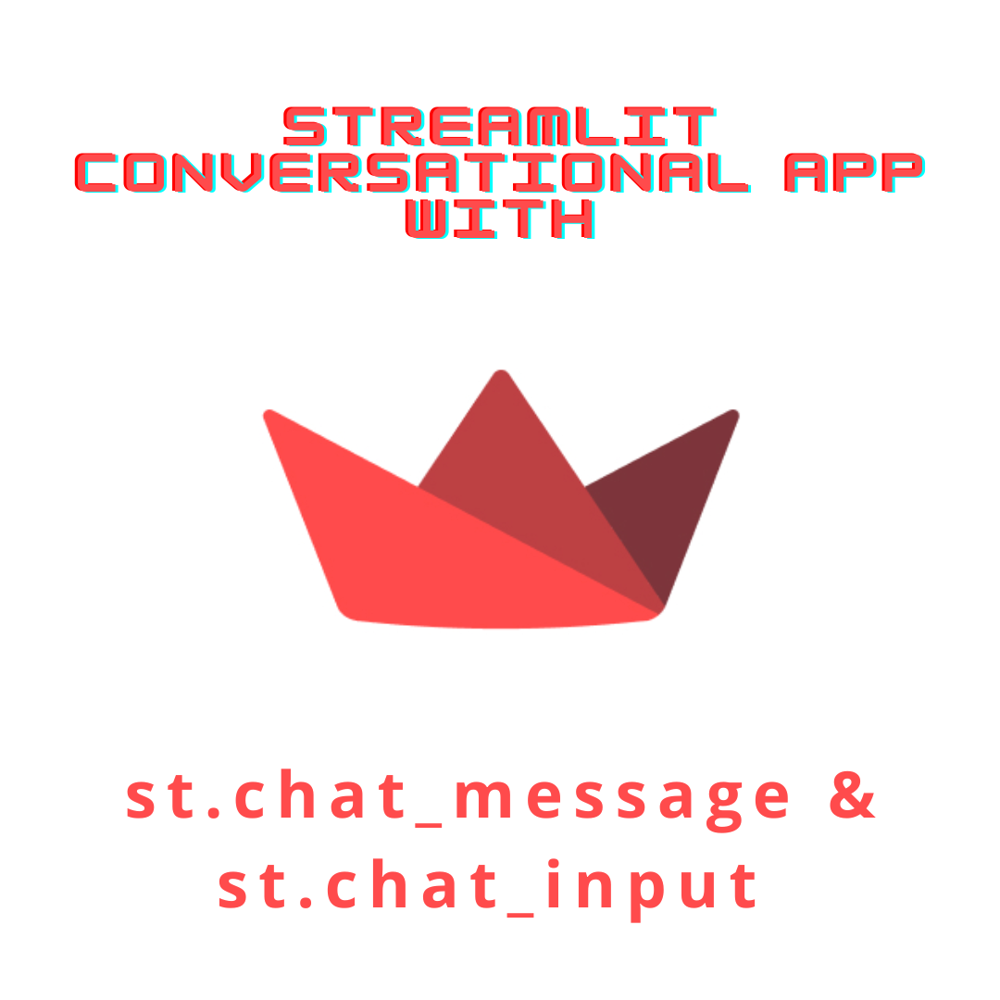

In this post (half featured by a fine-tuned LLM) we are discussing the new Streamlit feature and tutorial: chat interface.

<br>

# New way to create convesational ChatGPT-like apps with Stramlit

Oh, wow! Let's talk about building conversational apps with Streamlit and the incredible GPT models. Because, you know, everyone loves talking to chatbots. They're just so useful and never annoying. So, let's dive into this tutorial and explore the fascinating world of chat-based applications ;) I promise it won't be like talking to a brick wall. Trust me.

The tutorial starts by introducing Streamlit's chat elements, `st.chat_message` and `st.chat_input`. These elements make it super easy to build Graphical User Interfaces (GUIs) for conversational agents or chatbots.

But wait, it gets even better! You can build anything from a basic chatbot to a ChatGPT-like experience using purely Python code. Python is all you need!

[In the first part of the tutorial](https://docs.streamlit.io/knowledge-base/tutorials/build-conversational-apps#:~:text=elements%20we%27ll%20use.-,Chat%20elements,-Streamlit%20offers%20several), they teach you how to build a bot that mirrors your input. Yes, you heard it right. A bot that echoes back whatever you say. They even introduce session state to store the chat history, as if anyone would ever want to remember a conversation with a bot that repeats everything you say. It's like having a tape recorder but with extra steps. (LLM writer has become quite ironic today)

Next, they move on to building a simple chatbot GUI with streaming. The bot now responds to your messages with random predefined responses. How exciting! They even add a delay to simulate the bot "thinking" before responding. Because what's more thrilling than waiting for a chatbot to come up with a pre-determined message? It's like watching paint dry, but with the added suspense of wondering what the next random response will be.

<br>

## Stramlit ChatGPT-like app. How to.

Finally, they reach the climax of the tutorial: building a ChatGPT-like app. It is possible by using the OpenAI API to generate responses. And of course, for that you need to get an API key to follow along.

In summary, this tutorial takes you on a thrilling journey of building chat-based applications with Streamlit and GPT models. Enjoy!

```{python}
#import openai
#import streamlit as st
#
#st.title("ChatGPT-like clone")
#
#openai.api_key = st.secrets["OPENAI_API_KEY"]
#
#if "openai_model" not in st.session_state:
#    st.session_state["openai_model"] = "gpt-4"
#
#if "messages" not in st.session_state:
#    st.session_state.messages = []
#
#for message in st.session_state.messages:
#    with st.chat_message(message["role"]):
#        st.markdown(message["content"])
#
#if prompt := st.chat_input("What is up?"):
#    st.session_state.messages.append({"role": "user", "content": prompt})
#    with st.chat_message("user"):
#        st.markdown(prompt)
#
#    with st.chat_message("assistant"):
#        message_placeholder = st.empty()
#        full_response = ""
#        for response in openai.ChatCompletion.create(
#            model=st.session_state["openai_model"],
#            messages=[
#                {"role": m["role"], "content": m["content"]}
#                for m in st.session_state.messages
#            ],
#            stream=True,
#        ):
#            full_response += response.choices[0].delta.get("content", "")
#            message_placeholder.markdown(full_response + "▌")
#        message_placeholder.markdown(full_response)
#    st.session_state.messages.append({"role": "assistant", "content": full_response})
```

You could find this and more code examples [here](https://docs.streamlit.io/knowledge-base/tutorials/build-conversational-apps)

<br>

## Three keys on how to build chat based applications

You can find here three general tips in order to boost your Streamlit application:

- User-Centric Design: Prioritize the needs and preferences of your users when developing a chat-based application. Consider their goals, pain points, and communication preferences to ensure a seamless and intuitive user experience.

Fine-tune your LLM or other NLP model: Implement robust NLP techniques to enhance the application's ability to understand and interpret user input accurately. Also, it seems like an awesome idea to train specifically to your use case in order to provide more contextually relevant and personalized responses.

- Scalability and Performance: Build a scalable architecture that can handle high volumes of concurrent users and maintain optimal performance. Implement efficient data storage, caching mechanisms, and use cloud-based services to handle the computational demands of processing and serving chat-based interactions.

## **Stay updated on Streamlit and Python tips**

By harnessing the power of Streamlit and GPT, you can unlock a world of possibilities and create highly engaging and interactive conversational applications that will captivate your users and elevate your online presence.

If you want to stay updated...

```{=html}
<!-- Begin Mailchimp Signup Form -->
<link href="//cdn-images.mailchimp.com/embedcode/horizontal-slim-10_7.css" rel="stylesheet" type="text/css">
<link rel="stylesheet" type="text/css" href="https://csshake.surge.sh/csshake.min.css">
<style type="text/css">
	#mc_embed_signup{background:#fff; clear:left; font:14px Helvetica,Arial,sans-serif; width:100%;}
	 #mc_embed_signup .button {
  background-color: #0294A5; /* Green */
  color: white;
  transition-duration: 0.4s;
}
#mc_embed_signup .button:hover {
  background-color: #379392 !important; 
}

</style>
<div id="mc_embed_signup">
<form action="https://typethepipe.us4.list-manage.com/subscribe/post?u=91551f7ed29389a0de4f47665&amp;id=d95c503a48" method="post" id="mc-embedded-subscribe-form" name="mc-embedded-subscribe-form" class="validate" target="_blank" novalidate>
 <div id="mc_embed_signup_scroll">
	<label for="mce-EMAIL"> Suscribe for more Python and Streamlit tips!</label>
	<input type="email" value="" name="EMAIL" class="email" id="mce-EMAIL" placeholder="your best email" required>
    <!-- real people should not fill this in and expect good things - do not remove this or risk form bot signups-->
    <div style="position: absolute; left: -5000px;" aria-hidden="true"><input type="text" name="b_91551f7ed29389a0de4f47665_d95c503a48" tabindex="-1" value=""></div>
    <div class="clear"><input type="submit" value="Submit!" name="subscribe" id="mc-embedded-subscribe" class="button"></div>
    </div>
</form>
</div>

<!--End mc_embed_signup-->
```


<style>
p {
  word-spacing: 3px;
  text-indent: 20px;
  text-align: justify;
}
.page-subtitle {
  text-align: left  !important;
    text-indent: 0px !important;
}
.card-text {
  text-align: left  !important;
    text-indent: 0px !important;
}
</style>
<style>
.hljs-keyword,.hljs-selector-tag,.hljs-subst{color:#2e8516;font-weight:bold}.hljs-comment, .hljs-quote {
    color: #0e847b;
    font-style: italic;
}.hljs-number, .hljs-literal, .hljs-variable, .hljs-template-variable, .hljs-tag .hljs-attr {
    color: #008021;
}
</style>
