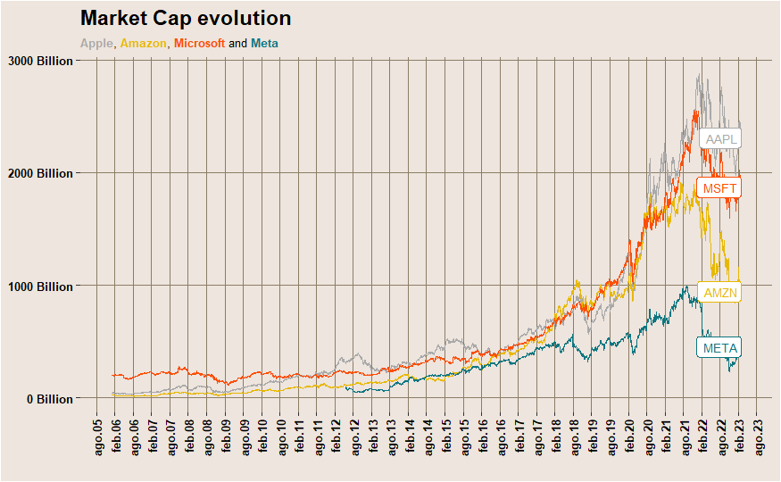

<br>

```{r, include=FALSE}
nchar("Starting the 'Value Invetsing with R' series. Brush up your Ggplot2 Skills: Using the Financial Market Prep API data to create stunning plots with a Financial Times inspired ggplot theme")
```

```{r setup, include=FALSE}
knitr::opts_chunk$set(echo = TRUE, warning = FALSE, message = FALSE)
```


Over the past months, heavy market drifts have occurred, and no one could have imagined the frenzy of free money being stopped. **The idea that the end of history had arrived has been shattered**.

As we entered **2023, we witnessed certain stocks soaring in the markets**, attempting to recover from their previous losses, while other **macroeconomic indicators continued to deteriorate.** However, uncertainty still weighs heavily on the minds of investors, perhaps even more so than ever before, given the threats of inflation, labor market instability, dollarization pitfalls, trust decay in central banks and financial institutions, interest rates, potential real estate crash in specific local areas...

A significant question raises: **how to protect ourselves against such circumstances** and what we can expect in each possible scenario?

Therefore, it presents a fantastic opportunity to **brush up our R, tidy & ggplot, skills and delve further into the market structure**. Through this series of posts, we are primarily examining the stock market, its dynamics, cycles, valuation metrics, as well as the pre-IPO and startup ecosystem, the bond market, real estate, and even a touch of crypto. However, as you'll see, we are mainly deepening our understanding of value/fundamentals-focused investing strategies.

<br>

# What is value investing?

Value investing is an investment strategy that involves buying stocks or other financial assets that are believed to be undervalued by the market, **focusing in their intrinsic value**. The ultimate goal of value investing then, is to identify **companies that are temporarily undervalued by the market due to factors such as short-term negative news, volatility, or even investor sentiment**. By buying these assets at a discounted price, value investors hope to profit from the market's eventual recognition of the company's true value, resulting in a higher stock price.

So we are far in this series from the high frequency, short-term or daily trades. Although, it's a quite prolific ad profitable field, also an interesting intersection between Data Science and Finance ;)

The approach, skills and even the involved risks are way different from one way to trade to other. The *value investing approach* could also be seen or performed as a defensive strategy, not as greedy as other ones. But it also involves long-term and macroeconomic risks that are not present (or have less impact) in short-to-medium term strategies.

<br>

# Generating Financial Market Prep free API key 

To start, we need to access the data. There are many options for doing so, one of which is to create an API token in the Financial Market Prep page.

The available data on this API continues to grow month after month. Truth be told, some functionalities could be improved, such as allowing for more parameterization in data retrieval. Nevertheless, **the sheer amount and quality of the data available is just stunning**, which is why we are using it throughout this series.

[Select the free plan.](https://site.financialmodelingprep.com/login) Then we'll come back and set up the API key in your R environment.

```{r, warning=FALSE, message=FALSE}
library(tidyverse)
library(ggplot2)
library(ggthemes)
library(magrittr)
library(lubridate)
library(factoextra)
library(fmpcloudr)
```

```{r, eval=FALSE}
fmpc_set_token('your_token') # example fmpc_set_token('09431214923a63117b0p00ff1cart2alp') 
```

```{r, include=FALSE}
fmpc_set_token(Sys.getenv('FMP_KEY'))#'17434614923c63597a0b12df4cabbacb')
```


Now the token is already set up, so we can start downloading data. As in March 2023, you can do 250 call to the free API.

In this post we are exploring the API and doing the first plots

<br>


# Financial Market Prep API in fmpcloudr package

As you have seen, they also have a very handy R package, `fmpcloudr`. In this paragraph we are briefly exploring the kind of data available.

- Daily market capitalization, OHLC (open, high, low, close) prices, and volume data.

```{r, eval=FALSE}
fmpcloudr::fmpc_price_current()

fmpcloudr::fmpc_price_intraday()
```

- Historical price data with up to 1-minute resolution and historical dividents

```{r, eval=FALSE}
fmpcloudr::fmpc_price_history()

fmpcloudr::fmpc_security_dividends(symbols, startDate = '2020-01-01')

```

- Financial ratios and stock fundamentals, including liquidity, profitability, debt, operating performance, cash flow, investment valuation ratios, and other key metrics, updated quarterly and annually.

```{r, eval=FALSE}
fmpcloudr::fmpc_financial_metrics()

fmpcloudr::fmpc_financial_metrics()

fmpcloudr::fmpc_earning_call_transcript()
```

- Analysts' price targets to provide insight into market expectations.

```{r, eval=FALSE}
fmpcloudr::fmpc_analyst_outlook()

fmpcloudr::fmpc_economic_results()

fmpcloudr::fmpc_security_ratings()
```

- Sentiment analysis to gauge overall market sentiment towards a stock.

Sentiment data not available in the R package. So we have to construct the GET call. We are showing how in next posts and opening a PR to their package.

- Technical indicators

```{r, eval=FALSE}
# Simple moving average
fmpcloudr::fmpc_security_tech_indic(symbols, indicator = 'SMA', freq = 'daily', period = 10)
 
# Exponential moving average
fmpcloudr::fmpc_security_tech_indic(symbols, indicator = 'EMA',  freq = '1min', period = 10)
```


- Insiders trade and institutional ownership data to keep you informed about significant stockholders.

```{r, eval=FALSE}
fmpcloudr::fmpc_13f_data() # holders

fmpcloudr::fmpc_cots_data()
```

- Real-time stock price data, SEC filings, institutional holders, price target, and other essential information.
```{r, eval=FALSE}
fmpcloudr::fmpc_rss_sec()
```

- Macroeconomic data and Calendar events tracking upcoming dividends, stock splits.. ant its historical data.

```{r,  eval=FALSE}
fmpcloudr::fmpc_economic_results()

fmpcloudr::fmpc_economic_results(event = 'adpEmploymentChange', country = 'US') 

fmpcloudr::fmpc_calendar_events('earning')
```

- Information on funds, European markets, forex, crypto, and commodities.

Such and awesome collection of data! :D And it's probably enough (with the free tier) to start to analyze and even slow trade in a more *value investing* way.

More information in their [documentation](https://site.financialmodelingprep.com/developer/docs)

<br>

## Market Capitalization in R

As promised, we are just introducing the package and brushing up our ggplot skills. Therefore, we are focusing in this post on the evolution of market cap, allowing us to compare trends between different stocks. **It is well known that growth stocks have experienced a massive surge in recent years, ranging from technology growth companies to pump-and-dump penny stocks, 'meme-stocks' defying the establishment (gl CreditSuisse) and SPACs frenzy.** The market has been flooded with free money for almost a decade, with tech players lowering the entry barriers for retail investors, and benefiting from lockdown savings and subsidies.

Let's examine the impact of this phenomenon on a set of stocks categorized as 'growth' and 'value'. Since life is a continuum, we will first categorize them by hand according to the consensus. We will then conduct an initial analysis, which will be elaborated further in subsequent posts, attempting to cluster them based on their actual performance. In this chapter, we will use the market cap fluctuation to achieve this, although other features could also be utilized and macroeconomic factors taken into account. Stay tuned for upcoming TypeThePipe posts!

```{r, eval=FALSE}
symbols = c('AAPL', 'META', 'AMZN', 'GOOG','MSFT')
data <- fmpcloudr::fmpc_security_mrktcap(symbols, limit = 30*12*12)
```

```{r, include=FALSE}
#write_rds(data, 'data_stock.rds')
data <- read_rds('data_stock.rds')
data
```

```{r}
data %<>% mutate(date = ymd(date))
```


```{r}
ggplot(data, aes(date, marketCap, colour = symbol)) +
  geom_line() 

```

<br>

## Financial Times Theme in Ggplot

Not bad for a 2 lines plot, but lets add some Financial Times kind of flavor:

```{r}
# old chunk in my codebase seen in Reddit but and can't find the source. If anyone has the original link, very glad to add it here! :)
ft_theme <- 
  theme(panel.grid.major.x =element_line(colour = "wheat4"),
        panel.grid.major.y =element_line(colour = "wheat4"),
        panel.grid.minor.x = element_blank(),
        panel.grid.minor.y = element_blank(),
        axis.text = element_text(colour = "black", size = 8, face = "bold"),
        axis.title.x = element_text(colour = "black", size = 8, face = "bold", vjust = 0.8),
        axis.title.y = element_blank(),
        strip.text = element_text(size=8, colour = "blue4", face = "bold"),
        plot.title = ggtext::element_markdown(color = "black", size = 14, face = "bold"),
        plot.subtitle = ggtext::element_markdown(color = "black", size = 8),
        plot.tag = element_text(color = "black", face = "italic", size = 182, lineheight = 0.9),
        plot.tag.position = c(0.15,0.02),
        plot.caption = ggtext::element_markdown(),
        panel.background = element_rect(fill = "seashell2"),
        plot.background = element_rect(fill = "seashell2"), 
        panel.border = element_blank(),
        panel.spacing.y = unit(3, "lines")
        ) 
```


```{r}

data %>% 
  ggplot(aes(date, marketCap, group=symbol, colour=symbol)) +
  geom_line(size = 0.5) + 
  guides(colour="none") + 
  geom_label(data = data %>% filter(date==max(date)),
              aes(label = symbol),
              label.size = 0.1,  size=2.2,
              label.padding = unit(0.2, "lines"),
              nudge_x=200) +
  coord_cartesian(clip = 'off') +        # Allow labels to bleed past the canvas boundaries
  scale_x_date(date_breaks = "6 month",  # Date labels for each month.
               date_labels = "%b%y",
               guide = guide_axis(angle = 90)) +
  scale_y_continuous(labels=function(x)  sprintf("%d Billion", x / 10^9)) + 
  labs(title="Market Cap evolution - FAAMG",
       subtitle="<span style='color: #A9A9A9;'><b>Apple</b></span>,
       <span style='color: #E7B800;'><b>Amazon</b></span>, 
       <span style='color: #FC4E07;'><b>Microsoft</b></span> and 
       <span style='color: #0D7680;'><b>Meta</b></span>",
       x=" ")+ 
  scale_color_manual(values = c("#A9A9A9", "#E7B800", "#34AB53", "#0D7680", "#FC4E07")) +
  ft_theme
```

Let's do the same reusing our Financial Times inspired theme to some considered *value stocks*.

```{r, eval=FALSE}
symbols_value = c('MCD', 'BRK-A', 'PG', 'KO')
data_value <- fmpcloudr::fmpc_security_mrktcap(symbols_value, limit = 30*12*12)
```

```{r, echo=FALSE}
#write_rds(data_value, 'data_value_stock.rds')
data_value <- read_rds('data_value_stock.rds')
```

```{r}
data_value %<>% mutate(date = ymd(date),
                       symbol = str_replace(symbol, "BRK-A", "BRK"))
```

```{r}
data_value %>% 
  ggplot(aes(date, marketCap, group=symbol, colour=symbol)) +
  geom_line(size = 0.5) + 
  guides(colour="none") + 
  geom_label(data = data_value %>% filter(date==max(date)),
              aes(label = symbol),
              label.size = 0.1,  size=3,
              label.padding = unit(0.2, "lines"),
              nudge_x=200) +
  coord_cartesian(clip = 'off') +        # Allow labels to bleed past the canvas boundaries
  scale_x_date(date_breaks = "6 month",  # Date labels for each month.
               date_labels = "%b%y",
               guide = guide_axis(angle = 90)) +
  scale_y_continuous(labels=function(x)  sprintf("%d Billion", x / 10^9)) + 
  labs(title="Market Cap evolution - Value Stocks",
       subtitle="<span style='color: #A9A9A9;'><b>Berkshire Hathaway</b></span>,
       <span style='color: #E7B800;'><b>Procter & Gamble</b></span>, 
       <span style='color: #FC4E07;'><b>Coca-Cola</b></span> and 
       <span style='color: #0D7680;'><b>Mcdonald's</b></span>",
       x=" ")+ 
  scale_color_manual(values = c("#554178", "#df2b24", "#E7B800", "#003CAE")) +
  ft_theme
```

<br>

## Could we cluster stocks based in their recent 2023 performance?

Time series clustering is a very controversial topic. Therefore we are skipping it during this first introductory post, and we are using a simple clustering based on simple stats: daily return (approximated using the already downloaded market cap delta) and volatility.

```{r}
data_basic_stats <- data %>% 
  filter(date>='2023-01-01') %>% 
  group_by(symbol) %>% 
  mutate(lag_mktcap = lag(marketCap,order_by = date),
         diff = (marketCap - lag_mktcap) /lag_mktcap * 100) %>% 
  summarise_at(.vars = 'diff', c(funs(mean(., na.rm = TRUE)), funs(sd(., na.rm = TRUE))))

```

```{r}
data_value_basic_stats <- data_value %>% 
  filter(date>='2023-01-01') %>% 
  group_by(symbol) %>% 
  mutate(lag_mktcap = lag(marketCap,order_by = date),
         diff = (marketCap - lag_mktcap) /lag_mktcap * 100) %>% 
  summarise_at(.vars = 'diff', c(funs(mean(., na.rm = TRUE)), funs(sd(., na.rm = TRUE))))

  
```

Since we are only examining the dataset and it only has two dimensions, we opt to use the straightforward elbow method to select 3 clusters. However, we could also try with 2 and 4 clusters to compare the outcomes.

```{r}
data_stats <- data_basic_stats %>% bind_rows(data_value_basic_stats)

tot_withinss <- map_dbl(2:5, function(k) {
  model <- kmeans(data_stats %>% select(mean, sd), centers = k)
  model$tot.withinss
})

data.frame(k = 2:5,
           tot_withinss = tot_withinss) %>%
  ggplot(aes(x = k, y = tot_withinss)) +
  geom_line() +
  scale_x_continuous(breaks = 2:5)


fit = kmeans(data_stats %>% select(mean, sd), 3)

data_stats %<>% mutate(cluster = fit$cluster,
                      cluster_mean = fit$centers[cluster,1],
                      cluster_sd = fit$centers[cluster,2],
                      )
```


In the field of economics, there is a tendency to apply discrete categories, often based on historical but arbitrary thresholds, such as recession / not recession, stagflation, growth stocks versus value stocks... We should go beyond basic KPIs and try to approximate underlaying factors driving the markets. 

Throughout this series, we will strive to analyze and categorize data in a way that reflects richer and higher-dimensional information.


```{r}
ggplot(data_stats, aes(mean, sd, colour=factor(cluster))) +
  geom_point() +
  geom_label(aes(label = symbol), size=3, label.r = unit(5, 'points')) + 
  guides(colour=FALSE)
```

We can easily expand our analysis to other stocks. Let's discover how to do so in using the Financial Market Prep API and R package, and in next post we'll elaborate on those ts clusterization methods, common patterns, turning points...

```{r}
total_tickers <- fmpc_symbols_available()
```

```{r}
total_tickers$exchangeShortName %>% unique() %>% head(20)
list_symbols <- total_tickers %>% filter(exchangeShortName=='NYSE') %>% pull(symbol)
```

This APi call provides quite a lot (all) of them!

```{r, eval=FALSE}
data <- fmpcloudr::fmpc_security_mrktcap(list_symbols, limit = 30*3)
```

We now have the capability to conduct the analysis on the entire NYSE, or at least the most highly capitalized stocks. But that will be another day ;)

For now, we can see **again a decay in the value stocks in these two first months of 2023** vs the growth ones. The market has once again received a dose of optimism. Could it be a good option to start/continue a DCA strategy? Perhaps its suitability varies based on industry and current valuation? Most likely, it does.

We are extending this analysis and talking about valuation metrics in our second post of the series! So...


```{=html}
<!-- Begin Mailchimp Signup Form -->
<link href="//cdn-images.mailchimp.com/embedcode/horizontal-slim-10_7.css" rel="stylesheet" type="text/css">
<link rel="stylesheet" type="text/css" href="https://csshake.surge.sh/csshake.min.css">
<style type="text/css">
	#mc_embed_signup{background:#fff; clear:left; font:14px Helvetica,Arial,sans-serif; width:100%;}
	 #mc_embed_signup .button {
  background-color: #0294A5; /* Green */
  color: white;
  transition-duration: 0.4s;
}
#mc_embed_signup .button:hover {
  background-color: #379392 !important; 
}

</style>
<div id="mc_embed_signup">
<form action="https://typethepipe.us4.list-manage.com/subscribe/post?u=91551f7ed29389a0de4f47665&amp;id=d95c503a48" method="post" id="mc-embedded-subscribe-form" name="mc-embedded-subscribe-form" class="validate" target="_blank" novalidate>
 <div id="mc_embed_signup_scroll">
	<label for="mce-EMAIL"> Don't miss the next chapters of the Financial Value Investing in R series!</label>
	<input type="email" value="" name="EMAIL" class="email" id="mce-EMAIL" placeholder="your best email" required>
    <!-- real people should not fill this in and expect good things - do not remove this or risk form bot signups-->
    <div style="position: absolute; left: -5000px;" aria-hidden="true"><input type="text" name="b_91551f7ed29389a0de4f47665_d95c503a48" tabindex="-1" value=""></div>
    <div class="clear"><input type="submit" value="Submit!" name="subscribe" id="mc-embedded-subscribe" class="button"></div>
    </div>
</form>
</div>

<!--End mc_embed_signup-->
```

<br>
