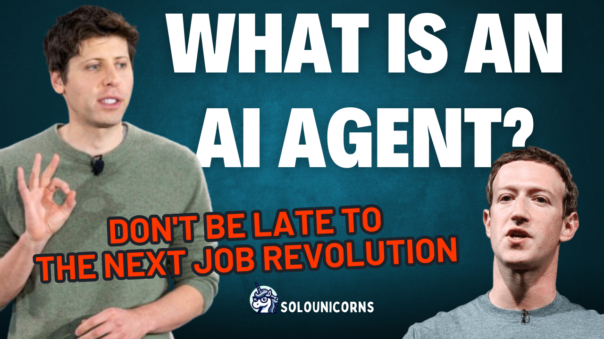

```{r setup, include=FALSE}
knitr::opts_chunk$set(echo = TRUE, eval = FALSE)
```




<br>


# Understanding AI Agents
In recent years, the buzz around AI agents has been growing exponentially. But what exactly are they, and how do they differ from the more familiar chatbots we’ve come to know? Let’s dive into the fascinating world of AI agents and explore their core concepts, latest developments, and promising use cases.

<br>

## What Is an AI Agent?
Imagine a single entity capable of performing the work of hundreds, or even thousands, of people working in perfect coordination. That’s the vision of AI agents—a future where these sophisticated entities outnumber humans and operate with minimal human oversight.

At its core, an AI agent is a highly advanced software entity equipped with a large language model (LLM) and various tools, including databases and other resources. Unlike traditional systems, AI agents are designed to operate independently, minimizing the need for constant human intervention. This evolution marks a significant leap from earlier models that required frequent prompting and context updates.

<br>

## The Evolution of AI Agents
AI agents have evolved from basic language models into highly autonomous entities. Here’s a breakdown of their key components and how they function:

**Large Language Models (LLMs):** The foundation of any AI agent is a robust language model. These models are designed to understand and generate human-like text based on the input they receive. Important considerations for LLMs include their size, context windows, and training data, which all contribute to their effectiveness.

**Tool Integration:** Modern AI agents can interact with a variety of tools, such as web browsers or custom functions. This marks a significant improvement over earlier systems where integrating external tools was more cumbersome and error-prone. Now, AI agents can seamlessly integrate with tools, handling a wide range of tasks with greater efficiency.

**Reasoning and Architecture:** AI agents excel in breaking down complex tasks into manageable steps, connecting them, and verifying the accuracy of their responses. Techniques like prompt engineering, chain of thought, and other methodologies are used to enhance their reasoning capabilities and ensure effective task execution.

**Knowledge Base and Configuration:** By incorporating diverse knowledge bases and configurations, AI agents can improve their task resolution accuracy and mimic real-world behaviors more effectively. For instance, an AI agent could be trained with extensive legal documents to assist in generating legal documents or provide legal advice.

<br>

## AI Agents vs. Chatbots
While chatbots and AI agents might seem similar, there are key differences between them. Chatbots are typically designed for handling routine inquiries and tasks. They use natural language processing to understand and respond to user inputs but require continuous prompting to function effectively. Their capabilities are limited to predefined interactions and responses.

On the other hand, AI agents represent a leap forward. They are not just about responding to queries but can handle complex tasks like managing schedules, automating reports, and even creating documents. AI agents are equipped to perform tasks autonomously and adapt to various scenarios without the need for constant input.

Real-World Applications and Future Prospects
The potential applications of AI agents are vast and varied. Here are a few intriguing examples:

Autonomous Vehicles and Robotics: Companies like Tesla are pushing the boundaries of autonomous driving and robotic systems, moving from rule-based systems to neural networks and AI agents for enhanced decision-making and functionality.

Finance and Legal Sectors: AI agents are beginning to make waves in finance and legal industries, where their ability to handle domain-specific knowledge and perform complex tasks can revolutionize these fields. Startups are already exploring how AI agents can transform these industries.

<br>

## Emerging Trends and Techniques
Recent advancements in AI agent technology are driven by innovations in prompt engineering and reasoning techniques. For example:

**Reason-Act-Observe-React Method:** This approach addresses complex hierarchical problems through iterative processes, enhancing the agent’s ability to handle complex tasks.

Mixture of Experts: This technique aims to reduce variance in outputs by using a combination of different models, similar to boosting techniques in machine learning.

Choosing the Right AI Agent Framework
With a variety of frameworks and tools available, selecting the right one for your project can be challenging. It often comes down to balancing your technical skills, available resources, and the stability of the solution. Consider factors like the frequency of updates, compatibility with your project requirements, and the tool’s ability to meet your needs.

In conclusion, AI agents are not just an exciting technological advancement; they represent a shift towards more autonomous and capable systems. As we continue to explore and develop these technologies, the possibilities for their application are virtually limitless. Stay tuned for more insights and developments in the world of AI agents!

For a deeper dive into the world of AI agents, check out our detailed video on the topic:


<br>´


## **Stay updated on AI concepts**

Hopefully, this post has helped familiarize you with AI agents.

If you want to stay updated...

```{=html}
<!-- Begin Mailchimp Signup Form -->
<link href="//cdn-images.mailchimp.com/embedcode/horizontal-slim-10_7.css" rel="stylesheet" type="text/css">
<link rel="stylesheet" type="text/css" href="https://csshake.surge.sh/csshake.min.css">
<style type="text/css">
	#mc_embed_signup{background:#fff; clear:left; font:14px Helvetica,Arial,sans-serif; width:100%;}
	 #mc_embed_signup .button {
  background-color: #0294A5; /* Green */
  color: white;
  transition-duration: 0.4s;
}
#mc_embed_signup .button:hover {
  background-color: #379392 !important; 
}

</style>
<div id="mc_embed_signup">
<form action="https://typethepipe.us4.list-manage.com/subscribe/post?u=91551f7ed29389a0de4f47665&amp;id=d95c503a48" method="post" id="mc-embedded-subscribe-form" name="mc-embedded-subscribe-form" class="validate" target="_blank" novalidate>
 <div id="mc_embed_signup_scroll">
	<label for="mce-EMAIL"> Suscribe for more AI explanations!</label>
	<input type="email" value="" name="EMAIL" class="email" id="mce-EMAIL" placeholder="your best email" required>
    <!-- real people should not fill this in and expect good things - do not remove this or risk form bot signups-->
    <div style="position: absolute; left: -5000px;" aria-hidden="true"><input type="text" name="b_91551f7ed29389a0de4f47665_d95c503a48" tabindex="-1" value=""></div>
    <div class="clear"><input type="submit" value="Submit!" name="subscribe" id="mc-embedded-subscribe" class="button"></div>
    </div>
</form>
</div>

<!--End mc_embed_signup-->
```


<style>
p {
  word-spacing: 3px;
  text-indent: 20px;
  text-align: justify;
}
.page-subtitle {
  text-align: left  !important;
    text-indent: 0px !important;
}
.card-text {
  text-align: left  !important;
    text-indent: 0px !important;
}
</style>
<style>
.hljs-keyword,.hljs-selector-tag,.hljs-subst{color:#2e8516;font-weight:bold}.hljs-comment, .hljs-quote {
    color: #0e847b;
    font-style: italic;
}.hljs-number, .hljs-literal, .hljs-variable, .hljs-template-variable, .hljs-tag .hljs-attr {
    color: #008021;
}
</style>
