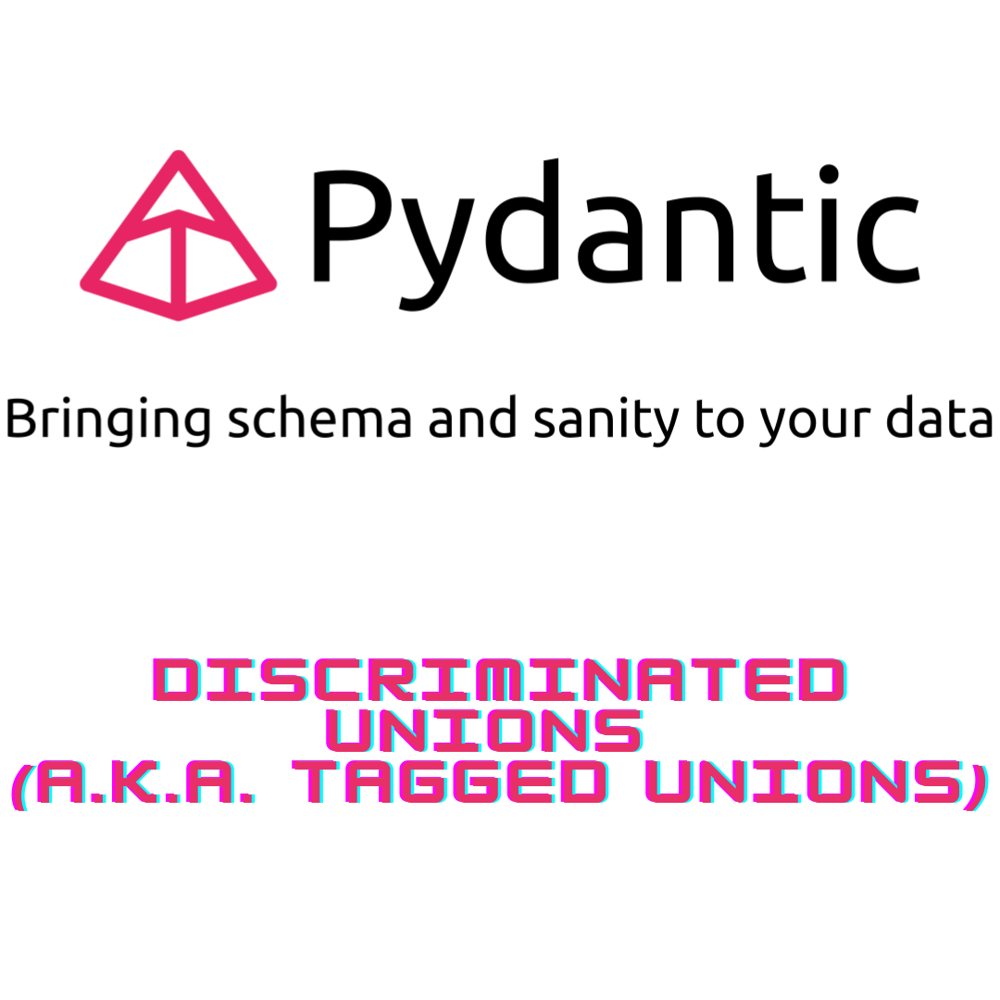

# What is LangChain AI?

Language models have rapidly evolved, opening up new possibilities for AI-driven applications. LangChain is an innovative framework that empowers developers to leverage the potential of language models for AI applications. It enables seamless integration of language models with data sources and provides customizable components and pre-built chains for efficient development.

It is a groundbreaking framework designed to harness the power of language models and unleash their potential in a data-aware and agentic manner. With LangChain, developers can seamlessly connect language models to various data sources, creating intelligent applications that interact with their environment. Whether you're a seasoned AI enthusiast or a beginner, LangChain offers a comprehensive set of components and off-the-shelf chains, making it easy to get started or customize existing solutions for complex use-cases. In this post, we'll delve into the world of LangChain, exploring its capabilities and demonstrating how it can supercharge your AI projects using the Python programming language. Get ready to unlock the true power of language models with LangChain!

[Here you can find its Github repository](https://github.com/hwchase17/langchain)

<br>

## **How does Pydantic discriminator works?**

Pydantic's discriminator feature allows the definition of data structures with multiple types, using a discriminator field to determine the actual object type. This enables type validation and serialization/deserialization based on the discriminator value, ensuring data integrity and flexibility in representing different types of objects.

Since [Pydantic 1.9, we could make use of it](https://docs.pydantic.dev/latest/usage/types/#discriminated-unions-aka-tagged-unions:~:text=Required%20Fields.-,Discriminated%20Unions%20(a.k.a.%20Tagged%20Unions,-)). Let's showcase it in an easy way:

```{python}
from pydantic import BaseModel, Field, parse_obj_as
from typing import Literal, Union, Annotated

class Tiger(BaseModel):
    animal_type: Literal["tiger"] = "tiger"
    ferocity_scale: float = Field(..., ge=0, le=10)

class Shark(BaseModel):
    animal_type: Literal["shark"] = "shark"
    ferocity_scale: float = Field(..., ge=0, le=10)

class Lion(BaseModel):
    animal_type: Literal["lion"] = "lion"
    ferocity_scale: float

class WildAnimal(BaseModel):
    __root__: Annotated[Union[Tiger, Shark, Lion], Field(..., discriminator='animal_type')]

my_shark = WildAnimal.parse_obj({'animal_type': 'shark', 'ferocity_scale': 5}).__root__
#print(Shark(ferocity_scale=5).json())

# Desarialice
WildAnimal.parse_raw(Shark(ferocity_scale=5).json())
print(isinstance(my_shark, Shark))
```
The below polimorfic code example and some other interesting discussions could be found here:
https://github.com/pydantic/pydantic/discussions/5785

<br>

## **Pydantic Annotated union discriminator example**

But we could use a very simple approach to achieve most of the usage by using the `Annotated` union.

```{python}
Animal = Annotated[Union[Tiger, Shark], Field(discriminator='animal_type')]
raw_data = {
    "animal_type": "tiger",
    "ferocity_scale": 6
}
parse_obj_as(Animal, raw_data)
```

Get ready for the magic of the Field class, courtesy of Pydantic. It's armed with a special power called "discriminator." By setting the discriminator to "pet_type," we unlock the ability to distinguish between our fantastic creatures. It's like giving them their own special spotlight!

Hold on tight, because we're about to venture into the wild lands of raw_data. It holds the secrets of a "pet_type" with the fiery spirit of a "tiger" and a mesmerizing "stripes" count of 6. It's as if we're peering into a digital zoo!

And now, it's showtime! We summon the powerful parse_obj_as to work its coding wizardry. We present it with our regal Animal and the enigmatic raw_data. Abracadabra! With a wave of its wand, the transformation unfolds. The raw data morphs into a stunning representation of our chosen Animal. It's like a magical metamorphosis!

<br>

## **Example of Polimorfic Base Model**
```{python}
class PolymorphicBaseModel(BaseModel):
    type: str

    _subtypes = dict()

    def __init_subclass__(subcls, type=None, **kwargs):
        super().__init_subclass__(**kwargs)
        if type:
            # n.b. if a subclass declares its own _subtypes dict, it'll take precedence over this one.
            # This would allow us to re-use the same type names across different classes.
            if type in subcls._subtypes:
                raise AttributeError(
                    f"Class {subcls} cannot be registered with polymorphic type='{type}' because it's already registered "
                    f" to {subcls._subtypes[type]}"
                )
            subcls._subtypes[type] = subcls
    @classmethod
    def _convert_to_real_type(cls, data):
        data_type = data.get("type")

        if data_type is None:
            raise ValueError(f"Missing 'type' for {cls}")

        subcls = cls._subtypes.get(data_type)

        if subcls is None:
            raise TypeError(f"Unsupported sub-type: {data_type}")
        if not issubclass(subcls, cls):
            raise TypeError(f"Inferred class {subcls} is not a subclass of {cls}")

        return subcls(**data)

    @classmethod
    def parse_obj(cls, data):
        return cls._convert_to_real_type(data)
    
    
class Animal(PolymorphicBaseModel):
    name: str
    color: str = None

class Cat(Animal, type="cat"):
    type: Literal["cat"] = "cat"
    hairless: bool

class Dog(Animal, type="dog"):
    type: Literal["dog"] = "dog"
    breed: str

cat_instance = Animal.parse_obj({"type":"cat", "hairless": False, "name": "meaw", "color": "black"})
print(isinstance(cat_instance, Cat))

```
Tthe PolymorphicBaseModel, a base class that sets the stage for polymorphic behavior. It defines a required type attribute and introduces a hidden _subtypes dictionary to keep track of subtypes.

Next, we dive into the __init_subclass__ method, where the magic happens. It allows subclasses to register themselves with a specific polymorphic type. This lets us distinguish between different subtypes within the PolymorphicBaseModel hierarchy.

But hold on, there's more to uncover! We make use of the _convert_to_real_type method, responsible for converting data to its actual subtype based on the provided type attribute. It checks if the type is valid, finds the corresponding subclass, and ensures it is a valid subclass of the base class.

Finally, we arrive at the parse_obj method, where the true parsing takes place. It serves as the entry point for parsing objects of the polymorphic hierarchy. Using the _convert_to_real_type method, it transforms the data into an instance of the appropriate subclass.

And there you have it! A glimpse into the realm of polymorphic models. It's a world where base classes and subtypes come together, allowing for flexible and dynamic object parsing. Embrace the power of polymorphism and let your code adapt and evolve with grace!

<br>

## **Pydantic 2: TypeAdapter to parse data into a discriminated union**


In Pydantic v2, you can utilize the TypeAdapter to parse data into a discriminated union. However, please note that Pydantic v2 is currently in pre-release, and the module's current version is v1.7.

Therefore, **make sure to upgrade to Pydantic v2 when it becomes available to utilize this feature.**

```{r, eval=FALSE}
from pydantic import TypeAdapter

adapter = TypeAdapter(Annotated[Union[Child1, Child2], Field(discriminator='type')])

child = adapter.validate_json(my_json_data)

```

<br>

## **Stay updated on Pydantic and Python tips**

Hopefully, this post has helped familiarize you with the usage of unions and discriminators in Pydantic, showcasing some of its functionalities and enabling you to enjoy their benefits.

If you want to stay updated...

```{=html}
<!-- Begin Mailchimp Signup Form -->
<link href="//cdn-images.mailchimp.com/embedcode/horizontal-slim-10_7.css" rel="stylesheet" type="text/css">
<link rel="stylesheet" type="text/css" href="https://csshake.surge.sh/csshake.min.css">
<style type="text/css">
	#mc_embed_signup{background:#fff; clear:left; font:14px Helvetica,Arial,sans-serif; width:100%;}
	 #mc_embed_signup .button {
  background-color: #0294A5; /* Green */
  color: white;
  transition-duration: 0.4s;
}
#mc_embed_signup .button:hover {
  background-color: #379392 !important; 
}

</style>
<div id="mc_embed_signup">
<form action="https://typethepipe.us4.list-manage.com/subscribe/post?u=91551f7ed29389a0de4f47665&amp;id=d95c503a48" method="post" id="mc-embedded-subscribe-form" name="mc-embedded-subscribe-form" class="validate" target="_blank" novalidate>
 <div id="mc_embed_signup_scroll">
	<label for="mce-EMAIL"> Suscribe for more Python and Pydantic tips!</label>
	<input type="email" value="" name="EMAIL" class="email" id="mce-EMAIL" placeholder="your best email" required>
    <!-- real people should not fill this in and expect good things - do not remove this or risk form bot signups-->
    <div style="position: absolute; left: -5000px;" aria-hidden="true"><input type="text" name="b_91551f7ed29389a0de4f47665_d95c503a48" tabindex="-1" value=""></div>
    <div class="clear"><input type="submit" value="Submit!" name="subscribe" id="mc-embedded-subscribe" class="button"></div>
    </div>
</form>
</div>

<!--End mc_embed_signup-->
```


<style>
p {
  word-spacing: 3px;
  text-indent: 20px;
  text-align: justify;
}
.page-subtitle {
  text-align: left  !important;
    text-indent: 0px !important;
}
.card-text {
  text-align: left  !important;
    text-indent: 0px !important;
}
</style>
<style>
.hljs-keyword,.hljs-selector-tag,.hljs-subst{color:#2e8516;font-weight:bold}.hljs-comment, .hljs-quote {
    color: #0e847b;
    font-style: italic;
}.hljs-number, .hljs-literal, .hljs-variable, .hljs-template-variable, .hljs-tag .hljs-attr {
    color: #008021;
}
</style>
