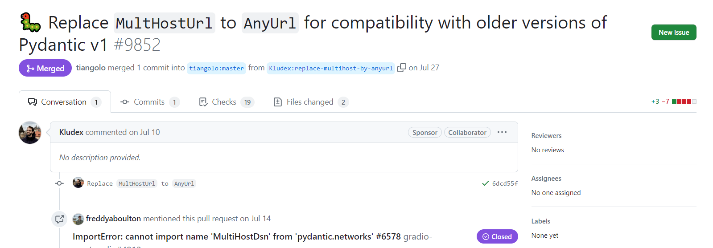

```{r setup, include=FALSE}
knitr::opts_chunk$set(echo = TRUE, eval = FALSE)
```



Great work has been accomplished by the Pydantic, FastAPI, and related communities during the release of Pydantic v2, with a strong emphasis on compatibility.

However, there is a recurring issue that has surfaced among users of Gradio and Hugging Face. This issue pertains to the import error related to Pydantic networks.

The message `cannot import name multihostdsn from pydantic.networks` is due of this v1 and v2 compatibility. It is easily solved by upgrading your Pydantic version to v1.10 or more, or migrating to Pydantic v2 if you organization / project is still not prepared for that major release migration.

<br>

## Solve the Pydantic error with Poetry: cannot import name MultiHostDsn from pydantic.network

As it is a rule in this blog, let's jump quick to the solution and write a few lines of code that should solve your problem. For example, if your using poetry as your dependencies manager, you can add the Pydantic package in its v1 version, v1.10 minor version and the latest patch v.10.1 till the latest (currently v.1.10.13 is the latest version). [More about package Semantic Versioning convention here](https://semver.org/).

To solve this error while using Poetry, just enter this in the terminal and the poetry project folder:

```{bash}

poetry add pydantic=^1.10


```

Then, you can check you Pydantic package version from the poetry.lock as:

```{bash}

poetry show pydantic

```

or even 

```{bash}

poetry show pydantic | awk '/version { print $3 }'

```

If the change is not occurring and the env get stuck, you can always drop your environment, clear cache (shouldd't be required) and lock/install again the pyproject file.


## Solve the error with Pip ot Pipenv: cannot import name MultiHostDsn from pydantic.network

If you are using pip/pipenv you can easily do:

```{bash}

pip install --upgrade pydantic==1.10.*

```


If you are interested in more info, you can check the [GitHub issue conversation](https://github.com/gradio-app/gradio/issues/4912) and the [PR fixing the problem](https://github.com/tiangolo/fastapi/pull/9852) that has been included in the >=1.10 release.


```{=html}
<!-- Begin Mailchimp Signup Form -->
<link href="//cdn-images.mailchimp.com/embedcode/horizontal-slim-10_7.css" rel="stylesheet" type="text/css">
<link rel="stylesheet" type="text/css" href="https://csshake.surge.sh/csshake.min.css">
<style type="text/css">
	#mc_embed_signup{background:#fff; clear:left; font:14px Helvetica,Arial,sans-serif; width:100%;}
	 #mc_embed_signup .button {
  background-color: #0294A5; /* Green */
  color: white;
  transition-duration: 0.4s;
}
#mc_embed_signup .button:hover {
  background-color: #379392 !important; 
}

</style>
<div id="mc_embed_signup">
<form action="https://typethepipe.us4.list-manage.com/subscribe/post?u=91551f7ed29389a0de4f47665&amp;id=d95c503a48" method="post" id="mc-embedded-subscribe-form" name="mc-embedded-subscribe-form" class="validate" target="_blank" novalidate>
 <div id="mc_embed_signup_scroll">
	<label for="mce-EMAIL"> Suscribe for more Python tips!</label>
	<input type="email" value="" name="EMAIL" class="email" id="mce-EMAIL" placeholder="your best email" required>
    <!-- real people should not fill this in and expect good things - do not remove this or risk form bot signups-->
    <div style="position: absolute; left: -5000px;" aria-hidden="true"><input type="text" name="b_91551f7ed29389a0de4f47665_d95c503a48" tabindex="-1" value=""></div>
    <div class="clear"><input type="submit" value="Submit!" name="subscribe" id="mc-embedded-subscribe" class="button"></div>
    </div>
</form>
</div>

<!--End mc_embed_signup-->
```