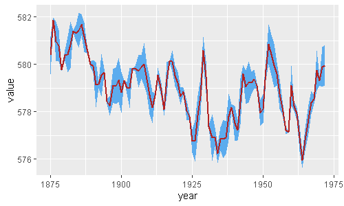

<br>
```{r, include=FALSE}
nchar("¡Plot your confidence interval easily with R! With ggplot geom_ribbon() de ggplot you can add shadow areas to your lines. We show you how to deal with it!")
```
```{r setup, include=FALSE}
knitr::opts_chunk$set(echo = TRUE)
```

```{r, eval=FALSE, warning=FALSE, message=FALSE}
library(tidyverse)
huron <- data.frame(year = 1875:1972, 
                    value = LakeHuron,
                    std = runif(length(LakeHuron),0,1))

huron %>% 
  ggplot(aes(year, value)) + 
  geom_ribbon(aes(ymin = value - std, ymax = value + std), fill = "steelblue2") + 
  geom_line(color = "firebrick", size = 1)

```

For a multi-line plot, you should include the colour and group aesthetic as follows:

```{r, warning=FALSE, message=FALSE}
library(tidyverse)
huron <- data.frame(year = rep(1875:1972,2), 
                    group = c(rep("a",98),rep("b",98)),
                    value = c(LakeHuron, LakeHuron + 5),
                    std = runif(length(LakeHuron)*2,0,1))

huron %>% 
  ggplot(aes(year, value, fill = group)) + 
  geom_ribbon(aes(ymin = value - std, ymax = value + std, group=group), fill = "steelblue2") + 
  geom_line(color = "firebrick", size = 1)

```


