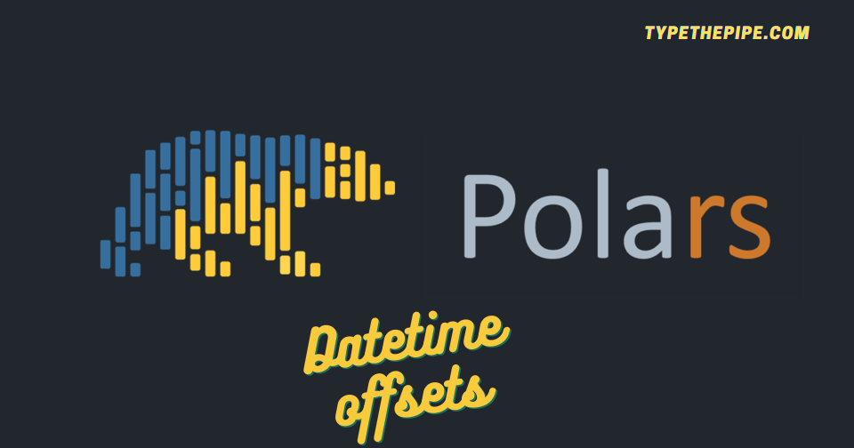

```{r setup, include=FALSE}
knitr::opts_chunk$set(echo = TRUE)
```



<br>

# **Working with Polars datetime columns**

Following our Python Polars series, today we are delving into the exciting world of datetime data wrangling. The journey has been captivating so far, as Polars' syntax and powerful capabilities have truly revolutionized data wrangling in Python. Polars' datetime handling capabilities have proven to be a game-changer for data wrangling in Python.

Polars' datetime handling goes beyond the basics, offering seamless filtering, sorting, and grouping based on datetime columns. This allows you to unlock valuable insights from your time-series data effortlessly. Say goodbye to the days of wrestling with complex datetime operations manually, and join the Polars bandwagon to unleash the true potential of datetime handling in Python!

Now, let's explore one of the latest additions to **Polars (version 0.18.5)**: the `.dt.dst_offset` function. This function allows you to retrieve the daylight savings offset at each point in your datetime data. This becomes particularly useful when working with data from multiple countries, **as daylight savings may not be observed simultaneously across the globe.** With `.dt.dst_offset`, you can effortlessly account for these variations and ensure accurate analysis. It's a powerful tool that adds an extra dimension to your datetime manipulations, allowing you to navigate the intricacies of global time changes with ease.

To put it all into practice, let's consider a scenario where we have a dataset containing datetime information from various countries. Using Polars' datetime functions, such as `.dt.dst_offset`, we can calculate the daylight savings offset for each timestamp, enabling us to gain deeper insights into how time changes affect our data across different regions. This newfound capability empowers us to make more informed decisions and derive valuable conclusions from our time-series analysis.

<br>

## **Datetime Selectors**

We start our exploration of datetime columns in Polars by directly selecting them using the Polars selectors: select(cs.datetime(time_zone="*")). This enables us to effortlessly extract and manipulate datetime information from our dataset.

**What are Polars selectors?** Selectors in Polars provide an intuitive way to select columns from DataFrame or LazyFrame objects based on various criteria like column name, data type, or other properties. They enhance and unify the functionality offered by the col() expression, making column selection a breeze. What's more, selectors even allow you to broadcast expressions over the selected columns, further expanding their versatility. With selectors, you have a powerful tool at your disposal to streamline column selection and manipulation in Polars.

To make use of this feature, ensure that you have **Polars version 0.18.1 or above**. If you're using Poetry or Pipenv for dependency management, upgrading your dependencies to the latest versions will ensure you have access to all the new functionalities and enhancements.

<br>

## **Polars `pl.date_range` function**

Let's delve into the powerful date_range function provided by Polars. This function allows you to generate a sequence of dates within a specified range with incredible ease. By specifying the start and end dates, along with the desired frequency (such as daily, weekly, or monthly), you can quickly create a DataFrame that spans the entire range of dates.

The date_range function also provides flexibility in handling time zones. You can specify the time zone for the generated dates, ensuring consistency and accuracy in your time-related analyses across different region for a wide range of use cases, such as creating synthetic time-series data, filling gaps in existing data, or generating test datasets for time-related analyses.

Note that starting from previous versions of Polars, the date_range function now requires the `eager=True` parameter to be specified in order to expand the range over rows. This ensures that the date range is not consolidated into a single row if that is not the desired behavior.

<br>

## **Polars `convert_time_zone()` function**

Datetime columns when any row contains time zone information, converts the column in TZ aware and 'UTC' as default, converting the existing timezones to UTC. If you want to maintain a custom tz for the column, you can use te schema / schema_override constructor arguments

<br>

## **Example: Select datetime columns matching their time zone and compute their offset with Polars Selectors**

But let's take it a step further and introduce an exciting new feature: generating row offsets based on datetime columns!
First of all you would need a Polars version > 0.18.1. You should upgrade your poetry/pipenv dependencies. 

```{r, eval=FALSE}
poetry update polars # would pick up minor version updates too
```

And here you can find and example of **how to select datetime columns and generate their row offset!**


```{python}
from datetime import date, datetime

import polars as pl
import polars.selectors as cs
import zoneinfo

import pytz

start = pl.datetime(2023, 9, 1)
stop = pl.datetime(2023, 12, 1)
df = pl.DataFrame(
    {"dt": pl.date_range(start=start, end=stop, interval="1mo", time_zone="UTC", eager=True)},
    schema={"dt": pl.Datetime("ns", "UTC")},
).with_columns(
    [
        pl.col("dt").dt.convert_time_zone("Europe/Berlin").suffix("_Berlin"),
        pl.col("dt").dt.convert_time_zone("Australia/Sydney").suffix("_Sydney"),
    ]
)
```

Select all datetime columns with timezone

```{python}
df.select(cs.datetime(time_zone="*"))
```

Select the offsets that may differ by column but also by row as the daylight savings are not the same around the world.

```{python}
df.select(cs.datetime(time_zone="*").dt.dst_offset())
```


Note how if any column metadata is provided, the timezone is infered from the first record, and the following rows are transported to that time zone.

<br>

Get ready for our next post, where we'll unveil other datetime operations with Polars! From rolling windows to rounding dates, combining datetime values, and converting string columns seamlessly – we've got it all covered. Stay in the loop and discover the boundless possibilities of data manipulation with Polars in Python!

<br>

```{=html}
<!-- Begin Mailchimp Signup Form -->
<link href="//cdn-images.mailchimp.com/embedcode/horizontal-slim-10_7.css" rel="stylesheet" type="text/css">
<link rel="stylesheet" type="text/css" href="https://csshake.surge.sh/csshake.min.css">
<style type="text/css">
	#mc_embed_signup{background:#fff; clear:left; font:14px Helvetica,Arial,sans-serif; width:100%;}
	 #mc_embed_signup .button {
  background-color: #0294A5; /* Green */
  color: white;
  transition-duration: 0.4s;
}
#mc_embed_signup .button:hover {
  background-color: #379392 !important; 
}

</style>
<div id="mc_embed_signup">
<form action="https://typethepipe.us4.list-manage.com/subscribe/post?u=91551f7ed29389a0de4f47665&amp;id=d95c503a48" method="post" id="mc-embedded-subscribe-form" name="mc-embedded-subscribe-form" class="validate" target="_blank" novalidate>
 <div id="mc_embed_signup_scroll">
	<label for="mce-EMAIL"> Suscribe for more Python Polars content!</label>
	<input type="email" value="" name="EMAIL" class="email" id="mce-EMAIL" placeholder="your best email" required>
    <!-- real people should not fill this in and expect good things - do not remove this or risk form bot signups-->
    <div style="position: absolute; left: -5000px;" aria-hidden="true"><input type="text" name="b_91551f7ed29389a0de4f47665_d95c503a48" tabindex="-1" value=""></div>
    <div class="clear"><input type="submit" value="Submit!" name="subscribe" id="mc-embedded-subscribe" class="button"></div>
    </div>
</form>
</div>

<!--End mc_embed_signup-->
```

<style>
.hljs-keyword,.hljs-selector-tag,.hljs-subst{color:#2e8516;font-weight:bold}.hljs-comment, .hljs-quote {
    color: #0e847b;
    font-style: italic;
}.hljs-number, .hljs-literal, .hljs-variable, .hljs-template-variable, .hljs-tag .hljs-attr {
    color: #008021;
}
</style>


