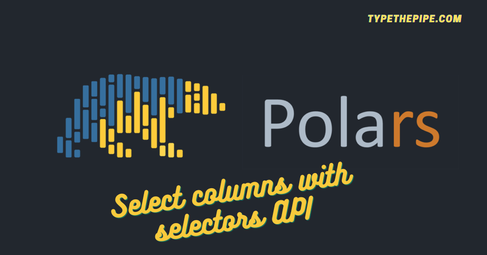

```{r setup, include=FALSE}
knitr::opts_chunk$set(echo = TRUE)
```



<br>

# Column selection in Polars

Embarking on the transition from the trusty Pandas Python library to the exhilarating realm of Polars for data manipulation is like setting off on a thrilling adventure!

Are you tired of the endless code scrolling just to pick the right columns for your Python DataFrames? Look no further! This post could be your hidden gem for precise and efficient column selection. In this guide, we'll take you on a journey through the intricacies of Polars Selectors, helping you simplify your data analysis tasks and supercharge your Python projects.

Whether you're a data scientist, analyst, or developer, mastering this essential skill will save you time and effort, avoiding unwanted extra SO searches. Let's dive in the way you work with DataFrames in Python with Polars!

<br>

## Polars: Choosing Columns with Square Brackets

This approach comes with certain limitations and is best suited for interactive and exploratory coding.

Let's explore some examples after creating the base DataFrame (note it's not Lazy for this time, which you usually will use while working with high amounts of data):


```{python}
import polars as pl
import random 

# Create a Polars DataFrame with base columns
df = pl.DataFrame({
    'name': ['Alice', 'Bob', 'Charlie'], 
    'offensive_skill': [5, 30, 85], 
    'defensive_skill': [92, 30, 10]
    },
    schema={
        "name":pl.Utf8,
        "offensive_skill":pl.Int32,
        "defensive_skill":pl.Int32
    }
)
```

We can select a column using square brackets with a string inside `[]`. Note that the output is a Polars `Series`.

```{python}
df["name"].head(3)
```

We can choose a column with a list of strings inside `[]`. We should expect now a Polars `DataFrame` as an output:

```{python}
df[["name","defensive_skill"]].head(3)
```
The major caveats about square brackets column selection is that it can only be used in eager mode.
So let's start and deepen into the native Polars `select` expression.

<br>

## Polars Select 

One of the key benefits of using Polars `select` function is that it can be employed in lazy mode, allowing for optimization and parallel execution by Polars. 

It's essential to note that this method consistently yields a Polars DataFrame. 

To effortlessly choose specific columns, simply pass their string names as a list to the Polars select function.

```{python}
(
    df
    .select(
        ["name", "defensive_skill"]
    )
    .head(3)
)

```

In the next paragraphs we will discover that this is just a simple way to do it, as you usually would use `pl.col()` inside `select()` function.

<br>

### Polars selecting columns by regex

```{python}
df.select(
    "^.*skill$"
)
```

<br>

### Selecting columns with an expression with Polars and aliasing

As we commented previously, we can create powerful column expressions and transformations while selecting by using `pl.col()`:

```{python}
(
    df
    .select(
        pl.col("defensive_skill").mean().alias("defensive_skill_mean"),
        pl.col("defensive_skill").std().alias("defensive_skill_std"),
        pl.col("offensive_skill").mean().suffix("_mean"), # shorter to add a suffix to a column name
        pl.col("offensive_skill").std().suffix("_std")
    )
    .head(3)
)
```
 
 <br>
 
### Polars selecting all columns or exclude

Polars offers the flexibility to select all columns or exclude specific ones, providing you with powerful control over your data manipulation tasks.

```{python}
df.select(
    pl.all()
)
```

```{python}
df.select(
    pl.exclude("defensive_skill") 
    #pl.exclude(["name", "defensive_skill"]) # pass a list for select several columns
)
```

<br>

### Polars selecting columns based on type

Also, Polars' capability to select columns based on their data type will simplify your data analysis. 

```{python}
df.select(
    pl.col(pl.Utf8)
    #pl.col([pl.Utf8, pl.Int32]) # several types as a list
    #pl.col(pl.NUMERIC_TYPES) # all numeric types
)
```


<br>

## Polars selectors API


Enhance your data analysis efficiency with Selectors! Selectors provide a convenient way to select columns from DataFrame or LazyFrame objects based on their name, data type, or other attributes. They streamline and extend the functionality offered by the col() expression, while also enabling the easy application of expressions to the selected columns. Say goodbye to tedious column selection and hello to the simplicity of Selectors!

```{python}
import polars.selectors as cs
```

One could use this API to easily select columns by type as the example above, but in a simpler / more readable way:

```{python}
df.select(
    cs.string()
)
```


For datetime and timezone selection and manipulation with Polars, please find our post about [selecting datetimes and timezones with Polar selectors](https://typethepipe.com/vizs-and-tips/python-polars-select-datetime-columns-selector/)

```{python}
df.select(
    cs.datetime()
)
```

A summary of all selector functions:

Function                      | Description                                           |
|-------------------------------|-------------------------------------------------------|
| 📊 all()                         | Select all columns.                                  |
| 📈 by_dtype(*dtypes)             | Select columns matching the given data types.        |
| 🏷️ by_name(*names)               | Select columns matching the given names.             |
| 🧩 categorical()                 | Select all categorical columns.                       |
| 🔍 contains(substring)           | Select columns containing the given substring(s).    |
| 📅 date()                        | Select all date columns.                             |
| ⏳ datetime([time_unit, time_zone]) | Select datetime columns, optionally filter by unit/zone. |
| ⏱️ duration([time_unit])         | Select duration columns, optionally filter by unit.  |
| 🏁 ends_with(*suffix)            | Select columns ending with the given substring(s).   |
| 📦 expand_selector(target, selector) | Expand a selector to column names with respect to a specific target. |
| ⏮️ first()                       | Select the first column in the current scope.        |
| 📈 float()                       | Select all float columns.                            |
| 🔢 integer()                     | Select all integer columns.                          |
| 🧐 is_selector(obj)              | Check if the object/expression is a selector.        |
| ⏭️ last()                        | Select the last column in the current scope.         |
| 🔍 matches(pattern)              | Select columns matching the given regex pattern.     |
| 📊 numeric()                     | Select all numeric columns.                          |
| 🚀 starts_with(*prefix)          | Select columns starting with the given substring(s). |
| 📝 string(*[, include_categorical]) | Select Utf8 (and optionally Categorical) string columns. |
| 📆 temporal()                    | Select all temporal columns.                          |
| 🕰️ time()                        | Select all time columns.                              |


All of them could be find in the [Polars selectors documentation](https://pola-rs.github.io/polars/py-polars/html/reference/selectors.html)

<br>

```{=html}
<!-- Begin Mailchimp Signup Form -->
<link href="//cdn-images.mailchimp.com/embedcode/horizontal-slim-10_7.css" rel="stylesheet" type="text/css">
<link rel="stylesheet" type="text/css" href="https://csshake.surge.sh/csshake.min.css">
<style type="text/css">
	#mc_embed_signup{background:#fff; clear:left; font:14px Helvetica,Arial,sans-serif; width:100%;}
	 #mc_embed_signup .button {
  background-color: #0294A5; /* Green */
  color: white;
  transition-duration: 0.4s;
}
#mc_embed_signup .button:hover {
  background-color: #379392 !important; 
}

</style>
<div id="mc_embed_signup">
<form action="https://typethepipe.us4.list-manage.com/subscribe/post?u=91551f7ed29389a0de4f47665&amp;id=d95c503a48" method="post" id="mc-embedded-subscribe-form" name="mc-embedded-subscribe-form" class="validate" target="_blank" novalidate>
 <div id="mc_embed_signup_scroll">
	<label for="mce-EMAIL"> Suscribe for more Python content!</label>
	<input type="email" value="" name="EMAIL" class="email" id="mce-EMAIL" placeholder="your best email" required>
    <!-- real people should not fill this in and expect good things - do not remove this or risk form bot signups-->
    <div style="position: absolute; left: -5000px;" aria-hidden="true"><input type="text" name="b_91551f7ed29389a0de4f47665_d95c503a48" tabindex="-1" value=""></div>
    <div class="clear"><input type="submit" value="Submit!" name="subscribe" id="mc-embedded-subscribe" class="button"></div>
    </div>
</form>
</div>

<!--End mc_embed_signup-->
```

<style>
.hljs-keyword,.hljs-selector-tag,.hljs-subst{color:#2e8516;font-weight:bold}.hljs-comment, .hljs-quote {
    color: #0e847b;
    font-style: italic;
}.hljs-number, .hljs-literal, .hljs-variable, .hljs-template-variable, .hljs-tag .hljs-attr {
    color: #008021;
}
</style>


