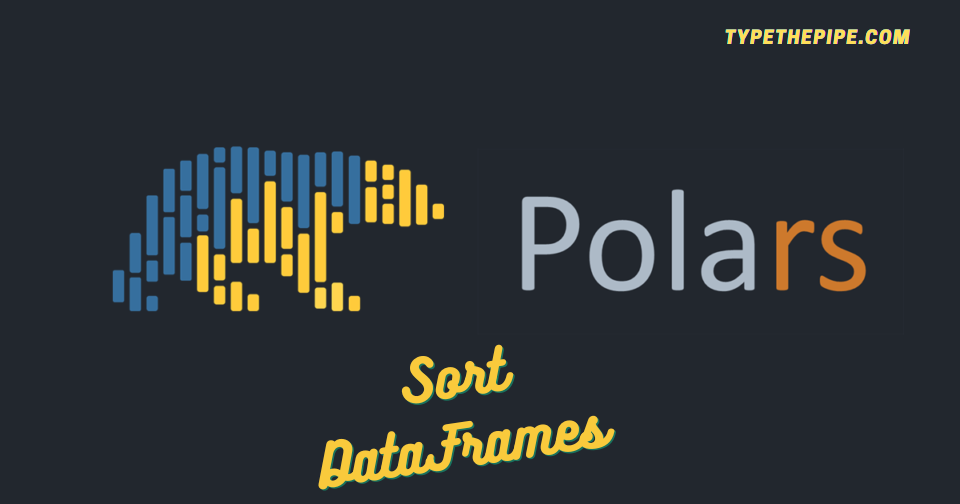

```{r setup, include=FALSE}
knitr::opts_chunk$set(echo = TRUE)
```



# How to sort data in Python Polars

Sorting data is a fundamental operation in data analysis and manipulation, and when it comes to doing it efficiently and effectively in Python. Whether you're a data scientist, analyst, or simply a Python enthusiast looking to work with structured data, understanding how to sort data using Polars can significantly enhance your data processing capabilities. In this blog post, we will explore the ins and outs of **sorting data in Polars**. Get ready to dive into the world of Polars and master the art of data sorting with ease.

<br>

## **Polars sort a dataframe**

Polars DataFrame sort method has the following typing:
```
DataFrame.sort(
    by: IntoExpr | Iterable[IntoExpr],
    descending: bool | Sequence[bool] = False,
    nulls_last: bool = False,
) → DataFrame
```

The `descending` and `null_last` arguments have a default `False` behaviour.

Let's deep into it and start by create a simple Polars dataframe and check the sorting basics. You can call it directly over an string representing a column name, or sort it by using a `pl.col()` structure.

```{python}
import polars as pl

df = pl.DataFrame(
    {
        "Company": ["Tesla", "Tesla_old", "Apple", "Microsoft"],
        "Market_Cap": [0.798, None, 2.78, 2.44],
        "Diluted_EPS": [0.79, None, 1.26, 2.69],
    }
)
```


```{python}
df.sort("Market_Cap")

df.sort("Market_Cap").frame_equal(df.sort(pl.col("Market_Cap"))) # Comparte to check it is equal
```

Check that as expected, the default behaviour is to place nulls at the beginning and sort values in ascending way.

<br>

### Sort Polars Dataframe by several columns

Now, let's sort it in descending order and move null values to the end of the Polars dataframe. You can experiment with removing `null_last` as its default is `False`. However, when you set "descending" to `Tru0`e, `null_last` automatically becomes `True`, making null values appear at the end by default.

```{python}
df.sort(
    ["Market_Cap", "Diluted_EPS"],
    descending=True,
    nulls_last=True # not needed when descending is True
)

```

Doing it by expression is also possible and becomes especially handy when you want to sort by columns while applying arithmetic operations, such as:

```{python}
df.sort(
    pl.col("Market_Cap") / pl.col("Diluted_EPS"), 
    descending=True, 
)

```

<br>

### Polars Sort expression. Be careful with Polars expression expansion while sorting

As discussed in [this GH issue](https://github.com/pola-rs/polars/issues/7017), it might not be immediately intuitive for someone who has recently started using the Polars library to attempt sorting within a select statement. When you employ expression expansion, you end up with two separate expressions, each of which sorts their respective columns.

This approach can inadvertently disrupt the relative order of your data, potentially resulting in unexpected behavior for the user. It's important to be aware of this potential issue to ensure that your data sorting operations align with your intended outcomes and don't inadvertently compromise the data's coherence and integrity.

```{python}
df.select(pl.col(["Company","Diluted_EPS"]).sort())

# You can do smth similar by packing them inside an Struct
# df.select(pl.struct(["Company", "Diluted_EPS"]).sort())
```
<br>

## **Polars sorted flag**

In Polars, the use of a "sorted" flag comes in handy when you want to explicitly indicate that a column has been sorted, especially when it pertains to data generated, f.e over a range of date. This flag is automatically applied when you've used the `sort()` expression. This flag serves as a performance-enhancing tool, optimizing subsequent operations and enabling certain functions to work more efficiently when they require the data to be in a sorted state before their execution.

Let's take a look at an illustrative example:

```{python}
df["Diluted_EPS"].is_sorted()
```
```{python}
df_not_sorted_but_flagged_as_sorted = df.with_columns(pl.col("Diluted_EPS").set_sorted())
df_not_sorted_but_flagged_as_sorted["Diluted_EPS"].is_sorted()

```

Remember te reasignation as Polars does not work with inplace operations.

```{python}
df_sorted = df.sort("Diluted_EPS", descending=True)
print(df_sorted["Diluted_EPS"].is_sorted())
```
What's happening here?? We can access to Polars column flags by doing:

```{python}

df_sorted["Diluted_EPS"].flags

```

The proper way to verify this is to:

```{python}
print(df_sorted["Diluted_EPS"].is_sorted(descending=True))

any(df_sorted["Diluted_EPS"].flags) # Or directly if you don't know the order
```


<br>

## **Stay updated on Polars and Python tips**

Hopefully, this post has helped you become familiar with Polars sort usage and allowed you to enjoy a showcase of some of its features.

If you want to stay updated...

```{=html}
<!-- Begin Mailchimp Signup Form -->
<link href="//cdn-images.mailchimp.com/embedcode/horizontal-slim-10_7.css" rel="stylesheet" type="text/css">
<link rel="stylesheet" type="text/css" href="https://csshake.surge.sh/csshake.min.css">
<style type="text/css">
	#mc_embed_signup{background:#fff; clear:left; font:14px Helvetica,Arial,sans-serif; width:100%;}
	 #mc_embed_signup .button {
  background-color: #0294A5; /* Green */
  color: white;
  transition-duration: 0.4s;
}
#mc_embed_signup .button:hover {
  background-color: #379392 !important; 
}

</style>
<div id="mc_embed_signup">
<form action="https://typethepipe.us4.list-manage.com/subscribe/post?u=91551f7ed29389a0de4f47665&amp;id=d95c503a48" method="post" id="mc-embedded-subscribe-form" name="mc-embedded-subscribe-form" class="validate" target="_blank" novalidate>
 <div id="mc_embed_signup_scroll">
	<label for="mce-EMAIL"> Suscribe for more Python Polars content!</label>
	<input type="email" value="" name="EMAIL" class="email" id="mce-EMAIL" placeholder="your best email" required>
    <!-- real people should not fill this in and expect good things - do not remove this or risk form bot signups-->
    <div style="position: absolute; left: -5000px;" aria-hidden="true"><input type="text" name="b_91551f7ed29389a0de4f47665_d95c503a48" tabindex="-1" value=""></div>
    <div class="clear"><input type="submit" value="Submit!" name="subscribe" id="mc-embedded-subscribe" class="button"></div>
    </div>
</form>
</div>

<!--End mc_embed_signup-->
```

<style>
.hljs-keyword,.hljs-selector-tag,.hljs-subst{color:#2e8516;font-weight:bold}.hljs-comment, .hljs-quote {
    color: #0e847b;
    font-style: italic;
}.hljs-number, .hljs-literal, .hljs-variable, .hljs-template-variable, .hljs-tag .hljs-attr {
    color: #008021;
}
</style>


