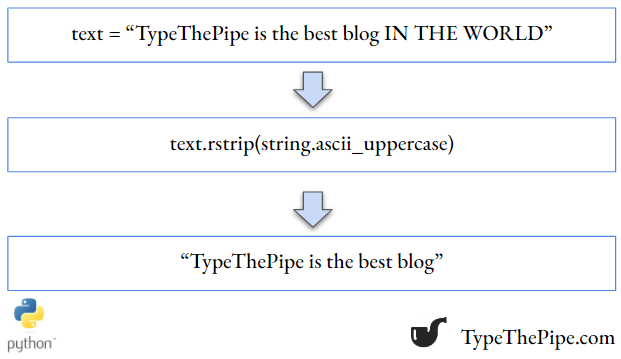

<br>

```{r setup, include=FALSE}
knitr::opts_chunk$set(echo = TRUE, eval = FALSE)
```

<br>


## **Python string upper strip**


In the ever-evolving world of Python programming, there are certain functions and methods that stand as essential tools in the toolkit of every coder. Among these, the combination of the upper() and strip() functions emerges as a powerful duo for text manipulation. In this blog post, we'll delve into the intricacies of these two string methods, exploring how they can be harnessed to transform and sanitize text data, all while maintaining the readability and elegance that Python is celebrated.

Imagine you have this string:

```{python}
import string

text = "AES: charmaleon tt"

```

<br>

### Uppercase only a part of string Python

Let's start by knowing how to uppercase a part of Python string. As we may know, Python strings are subscriptable (you can access its inner elements individually) but not mutable (can't reassign its internal elements value). So we need to create a partial copy of the string, apply the `upper()` function to it, and `replace()` that part in the original string.

```{python}

temp_cstr_copy = text[-2:].upper()

text = text.replace(text[-2:], temp_cstr_copy)

print(text)

```
<br>

### Strip uppercase strings

As we can see in the ``strip()` docstring, it accepts a string chain. To remove uppercase letters in the beginning and the end of a given string, we could make use of `string`, and specifically, `string.ascii_uppercase` object.

```{python}

text.strip(string.ascii_uppercase)

```

As one can see, all the surrounding uppercase letters has been removed in this copy of the string. We could do better adding stripping also blank spaces and ':' symbol.

```{python}

text.strip(string.ascii_uppercase + " " + ":")

```

<br>

### Lstrip and Rstrip

If you want to just to do it on the left or right of the string, you could use the common `lstrip()` and rstrip() string methods.

```{python}

text.rstrip(string.ascii_uppercase + " ")

```

<br>

## **Operate in Python with regular expressions**

Another option for more complex text operations are Regular Expressions.

Regular expressions, often abbreviated as "regex" or "regexp," are powerful tools in the arsenal of any Python programmer. They provide a flexible and efficient way to search, match, and manipulate text data based on patterns. Whether you're working with data validation, text extraction, or pattern recognition, regular expressions are a valuable asset. In Python, the re module is the go-to library for working with regular expressions. Let's dive into some code examples to see how you can harness the power of regular expressions in Python.

```{python}
import re 

text = "Hello, my e-mail is example@email.com and my phone number is 555-123-4567."

# Define a regex pattern for email addresses
email_pattern = r'\b[A-Za-z0-9._%+-]+@[A-Za-z0-9.-]+\.[A-Z|a-z]{2,7}\b'
emails = re.findall(email_pattern, text)

# Define a regex pattern for phone numbers
phone_pattern = r'\b\d{3}-\d{3}-\d{4}\b'
phone_numbers = re.findall(phone_pattern, text)

print("E-mail addresses found:", emails)
print("Phone numbers found:", phone_numbers)
```
If you want more information, practice and validate regular expresions, you can visit any of the [top Regex Validator pages](https://www.google.com/search?q=regex+validator&oq=regex+validator&aqs=chrome..69i57j69i59.1981j0j7&sourceid=chrome&ie=UTF-8)

<br>

You can see related basic Python tips on [TypeThePipe](https://typethepipe.com)

<br>


<style>
.hljs-keyword,.hljs-selector-tag,.hljs-subst{color:#2e8516;font-weight:bold}.hljs-comment, .hljs-quote {
    color: #0e847b;
    font-style: italic;
}.hljs-number, .hljs-literal, .hljs-variable, .hljs-template-variable, .hljs-tag .hljs-attr {
    color: #008021;
}
</style>
