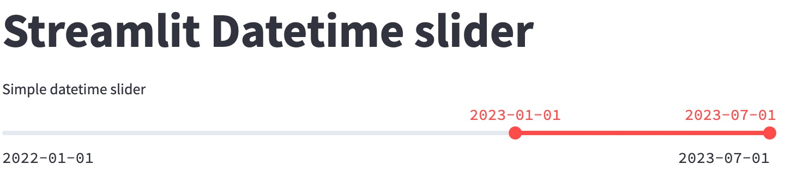

<br>

```{r setup, include=FALSE}
knitr::opts_chunk$set(echo = TRUE, eval = FALSE)
```

Yesterday, I was asked to configure a Streamlit datetime slider easily. Previously, it required some effort and tweaking of the ``st.slider()`` function. However, now it is possible to achieve this smoothly, as the slider function works nearly flawlessly with dates.


```{python, eval=FALSE, warning=FALSE, message=FALSE}
import datetime
import streamlit as st

MIN_MAX_RANGE = (datetime.datetime(2022,1,1), datetime.datetime(2023,7,1))
PRE_SELECTED_DATES = (datetime.datetime(2023,1,1), datetime.datetime(2023,7,1))

selected_min, selected_ax = st.slider(
    "Datetime slider",
    value=PRE_SELECTED_DATES,
    min_value=MIN_MAX_RANGE[0],
    max_value=MIN_MAX_RANGE[1],
)

```

For configure the slider steps when the user interacts with it, you could do as follows. Keep in mind that the intermediate values will not be selectable by default and may require an additional step. Additionally, there is an option to customize the date format for display.

```{python, warning=FALSE, message=FALSE}
selected_min, selected_ax = st.slider(
    "Datetime slider",
    value=PRE_SELECTED_DATES,
    step=datetime.timedelta(days=2),
    min_value=MIN_MAX_RANGE[0],
    max_value=MIN_MAX_RANGE[1],
    format="YYYY-MM-DD",    
)

```

Another functionality of the sliders is to include a helper, which we use quite often. However, please be aware that in certain versions of Streamlit, using the ``help`` argument in the datetime slider may disrupt the display of the slider title.

<br>

You can see related Streamlit tips on [TypeThePipe](https://typethepipe.com)

<br>
