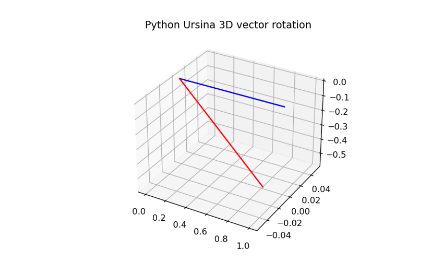

# Ursina object manipulation. Entity and vector rotations made easy

Ursina is a Python module that provides a lightweight game development framework. It is built on top of the popular game engine, Panda3D, and aims to simplify the process of creating 2D and 3D games using Python.

Let's get straight to the point. Although there are several ways to do it, we're showing a simple but robust approach. Let's take a look at one that generally can be useful for us. We start rotating a simple vector using auxiliary functions. In the second part, we're exploring how to rotate a proper Ursina Entity. We're going to make our little cube do a mind-blowing pirouette.

<br>

## **Ursina vector rotation. How to rotate a Vec3 object**

The Vec3 object in Ursina is a fundamental tool for working with three-dimensional coordinates. It represents a point or a vector in 3D space, consisting of three components: X, Y, and Z.

```{python}
import numpy as np
import matplotlib.pyplot as plt
import logging
logging.getLogger("ursina").setLevel(logging.WARNING)
from ursina import *


from ursina import Vec3


def unit_vector(vector):
    """ Returns the unit vector of the vector."""
    return vector / np.linalg.norm(vector)

def angle_between(v1, v2):
    """Finds angle between two vectors"""
    v1_u = unit_vector(v1)
    v2_u = unit_vector(v2)
    return np.arccos(np.clip(np.dot(v1_u, v2_u), -1.0, 1.0))

def x_rotation(vector,theta):
    """Rotates 3-D vector around x-axis"""
    R = np.array([[1,0,0],[0,np.cos(theta),-np.sin(theta)],[0, np.sin(theta), np.cos(theta)]])
    return np.dot(R,vector)

def y_rotation(vector,theta):
    """Rotates 3-D vector around y-axis"""
    R = np.array([[np.cos(theta),0,np.sin(theta)],[0,1,0],[-np.sin(theta), 0, np.cos(theta)]])
    return np.dot(R,vector)

def z_rotation(vector,theta):
    """Rotates 3-D vector around z-axis"""
    R = np.array([[np.cos(theta), -np.sin(theta),0],[np.sin(theta), np.cos(theta),0],[0,0,1]])
    return np.dot(R,vector)


original_vector = Vec3(1, 0, 0)
angle_between(original_vector, original_vector)

rotated_vector = y_rotation(original_vector, 120)
angle_between(original_vector, rotated_vector)

fig = plt.figure()
ax = fig.add_subplot(projection='3d')
ax.plot(np.linspace(0,original_vector[0]),np.linspace(0,original_vector[1]),np.linspace(0,original_vector[2]), 'b')
ax.plot(np.linspace(0,rotated_vector[0]),np.linspace(0,rotated_vector[1]),np.linspace(0,rotated_vector[2]), 'r')

plt.title("Python Ursina 3D vector rotation")
plt.show()
```
<br>

## **Entity 3d object rotation in Ursina**

As annotated [here](https://stackoverflow.com/questions/70320542/how-do-you-rotate-ursina-entities-around-their-local-axes#:~:text=The%20default%20rotation%20axes%20in,seen%20from%20the%20outside%20in.), the predefined rotation axes in Ursina are as described below:

x: Perform a clockwise rotation around the x-axis, observed from the external viewpoint.

y: Perform a clockwise rotation around the y-axis, observed from the external viewpoint.

z: Perform a counterclockwise rotation around the z-axis, observed from the external viewpoint. This direction is reversed due to the nature of 2D games.


```{python}
app = Ursina()

rotation_resetter = Entity()
cube = Entity(parent=rotation_resetter, model='cube', texture='white_cube')


def update():
    rotation_resetter.rotation_x += 100 * (held_keys['a'] - held_keys['d']) * time.dt
    rotation_resetter.rotation_z += 100 * (held_keys['w'] - held_keys['s']) * time.dt

    cube.rotation = cube.world_rotation
    rotation_resetter.rotation = (0,0,0)

EditorCamera()

#app.run()
```

Run this code, make use of 'a', 'd', 'w' and 's' and witness the transformation for yourself. Remember that rotation in x axis 

**Disclaimer: No cubes were harmed during the making of this blog post. Dancing moves are for entertainment purposes only.


<br>

## **Stay updated on Python tips**

Happy coding, and may your pixels dance to the beat of your imagination!

If you want to stay updated...

```{=html}
<!-- Begin Mailchimp Signup Form -->
<link href="//cdn-images.mailchimp.com/embedcode/horizontal-slim-10_7.css" rel="stylesheet" type="text/css">
<link rel="stylesheet" type="text/css" href="https://csshake.surge.sh/csshake.min.css">
<style type="text/css">
	#mc_embed_signup{background:#fff; clear:left; font:14px Helvetica,Arial,sans-serif; width:100%;}
	 #mc_embed_signup .button {
  background-color: #0294A5; /* Green */
  color: white;
  transition-duration: 0.4s;
}
#mc_embed_signup .button:hover {
  background-color: #379392 !important; 
}

</style>
<div id="mc_embed_signup">
<form action="https://typethepipe.us4.list-manage.com/subscribe/post?u=91551f7ed29389a0de4f47665&amp;id=d95c503a48" method="post" id="mc-embedded-subscribe-form" name="mc-embedded-subscribe-form" class="validate" target="_blank" novalidate>
 <div id="mc_embed_signup_scroll">
	<label for="mce-EMAIL"> Suscribe for more Python tips!</label>
	<input type="email" value="" name="EMAIL" class="email" id="mce-EMAIL" placeholder="your best email" required>
    <!-- real people should not fill this in and expect good things - do not remove this or risk form bot signups-->
    <div style="position: absolute; left: -5000px;" aria-hidden="true"><input type="text" name="b_91551f7ed29389a0de4f47665_d95c503a48" tabindex="-1" value=""></div>
    <div class="clear"><input type="submit" value="Submit!" name="subscribe" id="mc-embedded-subscribe" class="button"></div>
    </div>
</form>
</div>

<!--End mc_embed_signup-->
```


<style>
p {
  word-spacing: 3px;
  text-indent: 20px;
  text-align: justify;
}
.page-subtitle {
  text-align: left  !important;
    text-indent: 0px !important;
}
.card-text {
  text-align: left  !important;
    text-indent: 0px !important;
}
</style>
<style>
.hljs-keyword,.hljs-selector-tag,.hljs-subst{color:#2e8516;font-weight:bold}.hljs-comment, .hljs-quote {
    color: #0e847b;
    font-style: italic;
}.hljs-number, .hljs-literal, .hljs-variable, .hljs-template-variable, .hljs-tag .hljs-attr {
    color: #008021;
}
</style>
