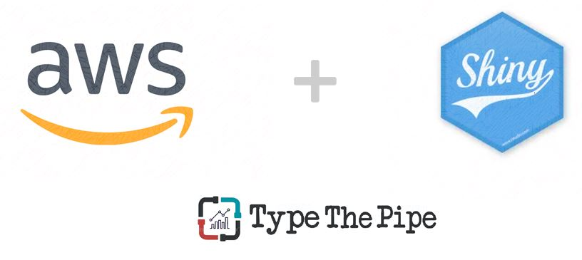

```{r, include=FALSE}
nchar("¿Quieres compartir tu aplicación Shiny R? ¿Quieres evitar instalaciones en local o subirla a servidores gestionados por 3ros? Levanta tu máquina EC2 en AWS y despliga tu App gratis")
```



# 1. Preparamos nuestra Shiny APP

En primer lugar prepararemos la app de Shiny. Vamos a dejar la aplicación lista y preparada para ser desplegada en AWS.
Para ello recomendamos:

- minimizar el número de librerias a instalar,
- comenzar la app con una función del estilo `LoadOrInstallRequiredPackages`
- despliega tu app en Github/GitLab

Como veremos en breve, no es totalmente necesario tener la app en un repositorio, aunque sí altamente recomendable. Explicaremos una alternativa de transferencia de ficheros a la máquina de AWS.

# 2. Levantemos la máquina EC2 en AWS

## 2.1 Intro & Launch Instance

Como pincelada, comentar qe el servicio de EC2 dentro de la cloud de Amazon nos facilita instanciar máquinas virtuales con imágenes preconfiguradas.

Para ello, lo primero que debemos hacer es crearnos una cuenta en AWS, si no la tenemos ya. Amazon nos permite el acceso a un Tier Gratuito con acceso a la gama baja de diferentes servicios, sin incurrir en coste alguno. Aun así, en el registro deberemos introducir una tarjeta como requisito, pero todo lo que explicaremos a continuación no tendrá coste alguno.

Abre en una nueva pestaña [https://portal.aws.amazon.com](https://portal.aws.amazon.com/billing/signup?nc2=h_ct&src=header_signup&redirect_url=https%3A%2F%2Faws.amazon.com%2Fregistration-confirmation#/start) y comienza el proceso de alta.


<figcaption>Planes AWS</figcaption>


Seleccionamos el *Basic Plan*, ya que nos permite desplegar de manera gratuíta el tiempo equivalente a tener 1 máquina levantada al mes. Una vez hayamos completado el registro, nos llevará a un portal donde tendremos acceso a todos los productos de AWS (EC2, S3, Lambda...)

En la barra de búsqueda, buscamos el servicio EC2. Haremos click en él como se muestra a continuación.


<figcaption>Seleccionamos el servicio EC2</figcaption>


Esto nos lleva a la home de EC2, donde deberemos buscar el botón de *Launch instance*


<figcaption>Lanzamos la instancia de EC2</figcaption>


## 2.2 Configuración de la Instancia

Ahora debemos configurar la máquina que vamos a levantar. En primer lugar la AMI (Amazon Machine Image), que como comentábamos antes, es una preconfiguración de la máquina que nos permite agilizar el *set up*. 
En esta ocasión elegiremos un **Ubuntu 18.04**.


<figcaption>Ubuntu 18.04 x86</figcaption>


A continuación, debemos elegir las características de la máquina a desplegar, el *instance type*.
Para poder hacer todo el proceso de manera gratuíta, elegimos la **t2.micro** ya que es la única que podremos levantar sin coste. 


<figcaption>El free tier incluye una máquina t2.micro</figcaption>


## 2.3 Generar la key

El último paso para tener nuestra instancia levantada es guardarnos la *private key* usada para conectarnos a la instancia de manera segura. Descargaremos un arcivo con extensión **.pem**, que usaremos posteriormente en para conectarnos y que no debemos perder.


<figcaption>Creamos el key pair (o utilizamos una existente) </figcaption>


# 3. Conexión a nuestra instancia.

Hasta este punto, ya tenemos nuestra instancia lanzada y será cuestión de minutos que pase de estado *inizialiting* a *running*.

Cuando la tengamos corriendo, ya podremos conectarnos a ella. ¿Cómo? A contunuación os mostramos cómo hacerlo desde Windows.

## 3.1 Descargar Putty

Putty es un cliente SSH que nos permite conectarnos desde Windows a estas máquinas EC2.

[https://www.putty.org/](https://www.putty.org/)

Con esto descargamos PuttyGen (que usaremos en primer lugar para transformar la *key* descargada de AWS) y el propio Putty (que usaremos para conectarnos)

## 3.2 Transformar la clave con PuttyGen

Una vez abierto PuttyGen, lo único que debemos hacer es *clikear* en *Load* y seleccionar la clave con extensión *.pem*. 

En cuanto al tipo de clave a generar, bastará con dejarlo en RSA. Por último, hacer click en **Save private key**, aceptar a no generar una *passphrase* y asignarle un nombre, que puede ser el mismo que le pusimos a la descargada de AWS (automáticamente asigna una extensión *.ppk*).


<figcaption>Putty Gen. Transformando la key descargada de AWS</figcaption>


## 3.3 Configurar la conexión

Cerramos PuttyGen y abrimos Putty. Iremos Conection -> SSH -> Auth y cargarmos la clave ppk que acabamos de generar.
Volvemos a `Session` e introducimos la IP. Podemos ponerle un nombre y darle a *Save*.


<figcaption>Cargamos la private key para la autenticación</figcaption>


<figcaption>Seteamos la IP, Save & Open</figcaption>


Con esto, sólo queda darle a *Open* y login como user: `ubuntu`.

*Got it!*


# 4. Instalar R y R Server en la máquina EC2 AWS

Una vez dentro, ejecutamos los siguientes comandos. Estamos configurando la máquina, descargando R, sus dependencias, Shiny, los paquetes necesarios y Shiny Server.

```
sudo add-apt-repository 'deb https://cloud.r-project.org/bin/linux/ubuntu bionic-cran35/'
sudo apt-key adv --keyserver keyserver.ubuntu.com --recv-keys E298A3A825C0D65DFD57CBB651716619E084DAB9
sudo apt-get update
sudo apt-get install r-base 

sudo add-apt-repository ppa:marutter/c2d4u3.5
sudo apt-get update

sudo apt-get install -y gfortran libreadline6-dev libx11-dev libxt-dev libcairo2-dev libbz2-dev liblzma-dev libcurl4-openssl-dev cmake libssl-dev libxml2 libxml2-dev r-cran-httpuv

sudo su - \
-c "R -e \"install.packages('shiny', repos='https://cran.rstudio.com/')\""

$ sudo apt-get install gdebi-core
$ wget https://download3.rstudio.org/ubuntu-14.04/x86_64/shiny-server-1.5.13.944-amd64.deb
$ sudo gdebi shiny-server-1.5.13.944-amd64.deb
```

En caso de que tu aplicación no comience checkeando los paquetes que se va a usar, en este paso utilizaremos 

```
sudo su -c "R -e \"install.packages('shiny', repos='https://cran.rstudio.com/')\""
```

Con esto, ya tenemos el Shiny Server escuchando en el puerto 3838. Pero aun no podremos acceder a http://ip_de_la_maquina_de_ec2:3838 ya  que como último paso debemos de abrir este puerto en el *firewall*. 

Para ello iremos nuestras instancias:


<figcaption>Dentro del panel de instancias, scroll lateral a la derecha</figcaption>


Instanctias -> Security Group -> Actions -> Edit inbound rules


<figcaption>Añadimos nueva regla TCP, al puerto 3838 y para todas las IPs de origen</figcaption>


# 5. Desplegar nuestra Shiny App

Cómo comentábamos, lo ideóneo sería tener nuestra aplicación en un repositorio. 

Si dominamos git, símplemente debemos clonar el repo en la ruta `/srv/shiny-server`. También lo podemos hacer en el root y crear un link dentro de esa ruta.

Aclarar que en esa ruta debe estar la carpeta contenedora conel nombre de la app, y la propia app de Shiny, ya sea en formato app.R o server.R/ui.R

Un ejemplo sería el siguiente:

```
cd /srv/shiny-server
git clone https://github.com/CarlosVecina/Proyecto-Multivariate-Distribution.git

```

Con esto, ya tenemos nuestra app junto con la app de demo. Si entramos en http://3.133.94.92:383 llegaremos al root con todas las aplicaciones. Para acceder (y linkear/meter en un iframe...) a una app específica deberemos utilizar la url completa  http://3.133.94.92:3838/Proyecto-Multivariate-Distribution


Una segunda opción menos recomendable sería usar [Winscp](https://winscp.net/eng/docs/lang:es) para transferir los archivos.

<br>

**En el próximo post trataremos cómo acceder a nuestra aplicación de Shiny en AWS con tu url personal, convertirlo en una conexión https, configurar los puertos...** 

*Keep you posted* en [TypeThePipe](https://typethepipe.com)


<style>
p {
  word-spacing: 3px;
  text-indent: 20px;
  text-align: justify;
}
.page-subtitle {
  text-align: left  !important;
    text-indent: 0px !important;
}
.card-text {
  text-align: left  !important;
    text-indent: 0px !important;
}
</style>

<script type="text/javascript" src="//downloads.mailchimp.com/js/signup-forms/popup/unique-methods/embed.js" data-dojo-config="usePlainJson: true, isDebug: false"></script><script type="text/javascript">window.dojoRequire(["mojo/signup-forms/Loader"], function(L) { L.start({"baseUrl":"mc.us4.list-manage.com","uuid":"91551f7ed29389a0de4f47665","lid":"d95c503a48","uniqueMethods":true}) })</script>

