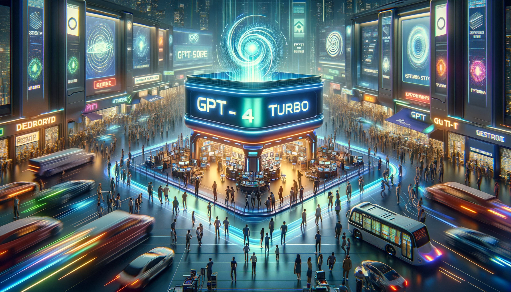

```{r setup, include=FALSE}
knitr::opts_chunk$set(echo = TRUE, warning = FALSE)
```





Desde Typethepipe repasamos las claves del evento de ayer de OpenAI y Microsoft. Parece que avanza firme en su misión de comoditizar la IA, cada vez más potente, personalizada y asequible de precio. Además, anuncia un inicio de marketplace de aplicaciones que puede venir a competir con Apple, Google, Amazon... y redefinir como interactuamos con Internet y los dispositivos electrónicos.

<br>

# OpenAI conferencia Noviembre 2023: GPT-4 Turbo y la Nueva Tienda GPT

OpenAI ha marcado un hito significativo en la evolución de herramientas y servicios de inteligencia artificial en su primer evento para desarrolladores, DevDay. Este evento liderado por Sam Altman, CEO de OpenAI, ha introducido avances notables que prometen ampliar y enriquecer el futuro de desarrolladores y usuarios por igual. Aquí les presentamos un resumen extendido y detallado para capturar la esencia de los anuncios, listos para revolucionar el campo de la IA.

<br>

## **GPT-4 Turbo: La Nueva Frontera en Modelos Generativos**

OpenAI ha desvelado el GPT-4 Turbo, una versión mejorada de su popular modelo GPT-4. Este modelo no solo cuenta con una ventana de contexto de 128.000 tokens, cuatro veces mayor que su predecesor, sino que también comprende textos e imágenes, estableciendo un nuevo estándar para los modelos generativos.

Además, la nueva API de Asistentes permite a los desarrolladores crear agentes que pueden realizar acciones como recuperar conocimientos externos o ejecutar funciones de programación, abriendo camino a una miríada de aplicaciones, desde asistentes de codificación hasta planificadores de vacaciones impulsados por IA.

<br>

## **La Democratización de la Creación de Herramientas de IA**

En una iniciativa que democratiza la creación de herramientas de IA, OpenAI ha facilitado que los usuarios construyan versiones personalizadas del GPT para diversas aplicaciones sin necesidad de conocimientos de codificación. Estos bots personalizables pueden ser para entretenimiento, productividad o incluso soluciones empresariales complejas.

Pronto, los creadores podrán publicar y potencialmente monetizar sus GPTs en una tienda dedicada, similar a la App Store de Apple. La tienda GPT presentará creaciones de constructores verificados y proporcionará una plataforma para destacar y recompensar a los GPTs más útiles y populares.


### Estrategia de Monetización en la Tienda GPT

La estrategia para monetizar estos GPTs se espera que evolucione, comenzando con una participación en los ingresos y potencialmente llevando a un modelo de suscripción para GPTs individuales si hay demanda. Las demostraciones incluyeron GPTs de organizaciones como Code.org, TripAdvisor y Canva, indicando una mezcla de contribuciones a nivel empresarial e individual a la plataforma.

La estrategia de OpenAI para monetizar estas creaciones de IA es innovadora y adaptable, comenzando con un modelo de participación en los ingresos para los creadores de GPT. Esto no solo incentiva la calidad y la utilidad de las aplicaciones de IA, sino que también promueve una economía creativa dentro de la comunidad de OpenAI. Se contempla la posibilidad de adoptar un modelo de suscripción para GPTs individuales si la demanda de los usuarios así lo justifica, lo que proporcionaría una corriente de ingresos sostenible para los creadores de contenido y herramientas de IA de alta calidad.

Esta táctica de monetización refleja un compromiso de OpenAI con la sostenibilidad y el crecimiento continuo de su ecosistema de IA, alentando a desarrolladores y empresas a invertir en la creación de GPTs especializados. Al posibilitar que los constructores de GPT se beneficien directamente de sus innovaciones, OpenAI está fomentando un entorno donde la creatividad y la tecnología van de la mano, garantizando que la Tienda GPT se convierta en un centro vibrante de actividad empresarial y desarrollo tecnológico.

<br>

## **Capacidades de Audio, Protección Legal y GPTs personalizados para empresas**

OpenAI no ha dejado atrás las capacidades de audio, lanzando una API de texto a voz con una selección de seis voces preestablecidas, mejorando las experiencias interactivas que la IA puede ofrecer. Además, con el objetivo de proteger a sus usuarios, OpenAI ha introducido Copyright Shield, con el fin de proteger a las empresas de reclamaciones de derechos de autor relacionadas con el contenido creado por las herramientas de OpenAI.

OpenAI también anunció un programa que ayuda a las empresas a construir modelos personalizados con el apoyo de los investigadores de la compañía. Este servicio, junto con la eliminación del selector de modelos en ChatGPT y el doble de tokens por límite de tasa para todos los clientes de pago de GPT-4, simplifica la experiencia del usuario y amplifica las capacidades de los modelos proporcionados.

<br>

## **Conclusión: Un Futuro Colaborativo y Accesible en IA**

En resumen, el DevDay de OpenAI ha sentado las bases para un futuro donde las herramientas de IA son más accesibles, personalizables e integrales para soluciones tanto personales como empresariales. La visión de la compañía es clara: proporcionar las herramientas y permitir que la ingeniosidad de la comunidad impulse la próxima ola de aplicaciones de IA. Esta nueva era de IA se caracteriza por la apertura para construir, compartir y monetizar innovaciones impulsadas por IA, preparando el escenario para un futuro emocionante y colaborativo.

Si deseas mantenerte actualizado...

```{=html}
<!-- Begin Mailchimp Signup Form -->
<link href="//cdn-images.mailchimp.com/embedcode/horizontal-slim-10_7.css" rel="stylesheet" type="text/css">
<link rel="stylesheet" type="text/css" href="https://csshake.surge.sh/csshake.min.css">
<style type="text/css">
	#mc_embed_signup{background:#fff; clear:left; font:14px Helvetica,Arial,sans-serif; width:100%;}
	 #mc_embed_signup .button {
  background-color: #0294A5; /* Green */
  color: white;
  transition-duration: 0.4s;
}
#mc_embed_signup .button:hover {
  background-color: #379392 !important; 
}

</style>
<div id="mc_embed_signup">
<form action="https://typethepipe.us4.list-manage.com/subscribe/post?u=91551f7ed29389a0de4f47665&amp;id=d95c503a48" method="post" id="mc-embedded-subscribe-form" name="mc-embedded-subscribe-form" class="validate" target="_blank" novalidate>
 <div id="mc_embed_signup_scroll">
	<label for="mce-EMAIL"> ¡Síguenos para las últimas novedades y contenido sobre IA! </label>
	<input type="email" value="" name="EMAIL" class="email" id="mce-EMAIL" placeholder="tu mejor email" required><input type="hidden" name="tags" value="7614568"></div>
    <!-- real people should not fill this in and expect good things - do not remove this or risk form bot signups-->
    <div style="position: absolute; left: -5000px;" aria-hidden="true"><input type="text" name="b_91551f7ed29389a0de4f47665_d95c503a48" tabindex="-1" value=""></div>
    <div class="clear"><input type="submit" value="Seguir" name="subscribe" id="mc-embedded-subscribe" class="button"></div>
    </div>
</form>
</div>

<!--End mc_embed_signup-->
```

