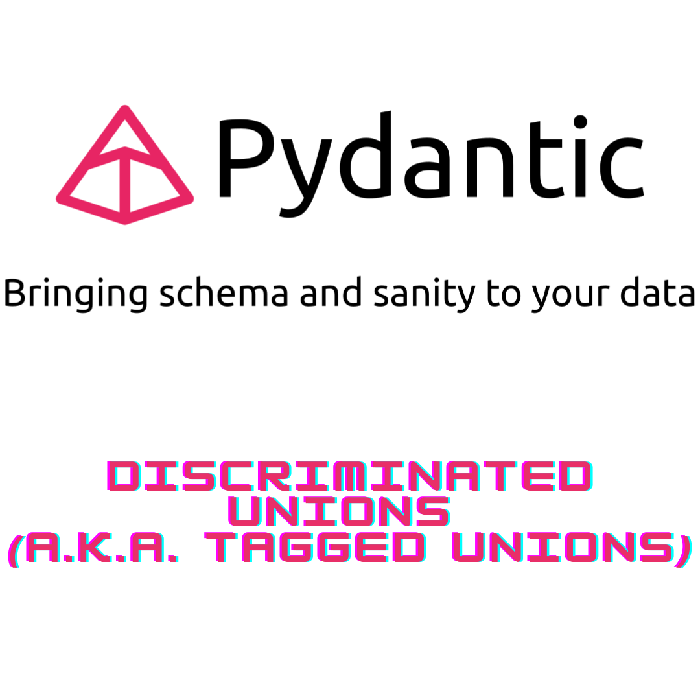

# ¿Qué es un 'discriminated union', discriminador de uniones o uniones etiquetadas y cuál es su papel en Pydantic?

Bueno, bueno, bueno, ¡miren quién decidió pasear por el mundo de los discriminadores de Pydantic! 🕶️ Prepárense, amigos, porque estamos a punto de embarcarnos en un irónico y pegajoso paseo en montaña rusa por esta selva salvaje de maravillas de la programación. ¡Abróchense los cinturones!

Entonces, ¿de qué se trata todo el revuelo de los discriminadores de Pydantic? ¡Oh, son simplemente lo más genial desde el pan rebanado, amigos míos! Imaginen esto: tienen un montón de modelos de datos, cada uno con sus propias peculiaridades y excentricidades. Es como lidiar con un grupo de divas en un drama de secundaria, excepto que en lugar de chismes, se trata de atributos y propiedades. Reinas del drama, ¿verdad?

Ahora, digamos que quieren elegir el modelo perfecto de este conjunto caótico. ¿Cómo diablos van a hacerlo? No teman, porque los discriminadores de Pydantic están aquí para salvar el día, como un superhéroe con un sentido del humor irónico. Son como el Sherlock Holmes de la selección de modelos, deduciendo el ajuste perfecto para ustedes.

<br>

## **How does Pydantic discriminator works?**


El discriminador de Pydantic permite la definición de estructuras de datos con múltiples tipos, utilizando un campo de discriminador para determinar el tipo real del objeto. Esto habilita la validación de tipos y la serialización/deserialización basada en el valor del discriminador, asegurando la integridad de los datos y la flexibilidad en la representación de diferentes tipos de objetos.

A partir de  [Pydantic 1.9, lo tenemos disponible](https://docs.pydantic.dev/latest/usage/types/#discriminated-unions-aka-tagged-unions:~:text=Required%20Fields.-,Discriminated%20Unions%20(a.k.a.%20Tagged%20Unions,-)). Let's showcase it in an easy way:

```{python}
from pydantic import BaseModel, Field, parse_obj_as
from typing import Literal, Union, Annotated

class Tiger(BaseModel):
    animal_type: Literal["tiger"] = "tiger"
    ferocity_scale: float = Field(..., ge=0, le=10)

class Shark(BaseModel):
    animal_type: Literal["shark"] = "shark"
    ferocity_scale: float = Field(..., ge=0, le=10)

class Lion(BaseModel):
    animal_type: Literal["lion"] = "lion"
    ferocity_scale: float

class WildAnimal(BaseModel):
    __root__: Annotated[Union[Tiger, Shark, Lion], Field(..., discriminator='animal_type')]

my_shark = WildAnimal.parse_obj({'animal_type': 'shark', 'ferocity_scale': 5}).__root__
#print(Shark(ferocity_scale=5).json())

# Desarialice
WildAnimal.parse_raw(Shark(ferocity_scale=5).json())
print(isinstance(my_shark, Shark))
```
Puedes encontrar este ejemplo de polimosfirmo junto con algun ejemplo de código, además de alguna interesante discusión en: 
https://github.com/pydantic/pydantic/discussions/5785

<br>

## **Ejemplo de discriminador de unión anotada Pydantic**

Pero podríamos utilizar un enfoque muy simple para lograr la mayoría de los usos mediante el uso de la unión `Annotated`.


```{python}
Animal = Annotated[Union[Tiger, Shark], Field(discriminator='animal_type')]
raw_data = {
    "animal_type": "tiger",
    "ferocity_scale": 6
}
parse_obj_as(Animal, raw_data)
```

Prepárate para la magia de la clase `Field`, cortesía de Pydantic. Está equipada con un poder especial llamado "discriminator". Al configurar el discriminador en "pet_type", desbloqueamos la capacidad de distinguir entre nuestras criaturas fantásticas. ¡Es como darles su propio foco especial!

¡Agárrate fuerte, porque estamos a punto de adentrarnos en las tierras salvajes de raw_data. Guarda los secretos de un "pet_type" con el espíritu ardiente de un "tigre" y un fascinante recuento de "rayas" de 6. Es como si estuviéramos mirando a un zoológico digital.

¡Y ahora, es hora del espectáculo! Invocamos al poderoso parse_obj_as para que haga su magia de codificación. Le presentamos a nuestro majestuoso Animal y al enigmático raw_data. ¡Abra Kadabra! Con un movimiento de su varita, la transformación se despliega. Los datos crudos se convierten en una impresionante representación de nuestro Animal elegido. ¡Es como una metamorfosis mágica!

<br>

## **Example of Polimorfic Base Model**
```{python}
class PolymorphicBaseModel(BaseModel):
    type: str

    _subtypes = dict()

    def __init_subclass__(subcls, type=None, **kwargs):
        super().__init_subclass__(**kwargs)
        if type:
            # n.b. if a subclass declares its own _subtypes dict, it'll take precedence over this one.
            # This would allow us to re-use the same type names across different classes.
            if type in subcls._subtypes:
                raise AttributeError(
                    f"Class {subcls} cannot be registered with polymorphic type='{type}' because it's already registered "
                    f" to {subcls._subtypes[type]}"
                )
            subcls._subtypes[type] = subcls
    @classmethod
    def _convert_to_real_type(cls, data):
        data_type = data.get("type")

        if data_type is None:
            raise ValueError(f"Missing 'type' for {cls}")

        subcls = cls._subtypes.get(data_type)

        if subcls is None:
            raise TypeError(f"Unsupported sub-type: {data_type}")
        if not issubclass(subcls, cls):
            raise TypeError(f"Inferred class {subcls} is not a subclass of {cls}")

        return subcls(**data)

    @classmethod
    def parse_obj(cls, data):
        return cls._convert_to_real_type(data)
    
    
class Animal(PolymorphicBaseModel):
    name: str
    color: str = None

class Cat(Animal, type="cat"):
    type: Literal["cat"] = "cat"
    hairless: bool

class Dog(Animal, type="dog"):
    type: Literal["dog"] = "dog"
    breed: str

cat_instance = Animal.parse_obj({"type":"cat", "hairless": False, "name": "meaw", "color": "black"})
print(isinstance(cat_instance, Cat))

```
El `PolymorphicBaseModel`, una clase base que sienta las bases para el comportamiento polimórfico. Define un atributo de tipo requerido e introduce un diccionario oculto `_subtypes` para llevar un registro de los subtipos.

A continuación, nos sumergimos en el método init_subclass, donde sucede la magia. Permite que las subclases se registren a sí mismas con un tipo polimórfico específico. Esto nos permite distinguir entre diferentes subtipos dentro de la jerarquía de PolymorphicBaseModel.

¡Pero espera, hay más por descubrir! Hacemos uso del método `_convert_to_real_type`, encargado de convertir los datos a su subtipo real en función del atributo de tipo proporcionado. Comprueba si el tipo es válido, encuentra la subclase correspondiente y asegura que sea una subclase válida de la clase base.

Finalmente, llegamos al método parse_obj, donde tiene lugar el verdadero análisis. Sirve como punto de entrada para analizar objetos de la jerarquía polimórfica. Utilizando el método `_convert_to_real_type`, transforma los datos en una instancia de la subclase adecuada.

¡Y ahí lo tienes! Un vistazo al mundo de los modelos polimórficos. Es un mundo donde las clases base y los subtipos se unen, permitiendo un análisis de objetos flexible y dinámico. Aprovecha el poder del polimorfismo y permite que tu código se adapte y evolucione con elegancia.

<br>

## **Pydantic 2: TypeAdapter para analizar datos en una unión discriminada**

En Pydantic v2, puedes utilizar el TypeAdapter para analizar datos en una unión discriminada. Sin embargo, ten en cuenta que Pydantic v2 se encuentra actualmente (2023-06-18) en prelanzamiento, y la versión actual del módulo es la v1.7.

Por lo tanto, asegúrate de actualizar a Pydantic v2 cuando esté disponible para aprovechar esta característica.

```{r, eval=FALSE}
from pydantic import TypeAdapter

adapter = TypeAdapter(Annotated[Union[Child1, Child2], Field(discriminator='type')])

child = adapter.validate_json(my_json_data)

```

<br>

## **Mantente al tanto de consejos sobre Pydantic y Python**

Esperamos que esta publicación te haya ayudado a familiarizarte con el uso de uniones y discriminadores en Pydantic, mostrando algunas de sus funcionalidades y permitiéndote disfrutar de sus beneficios.

Si deseas mantenerte actualizado...

```{=html}
<!-- Begin Mailchimp Signup Form -->
<link href="//cdn-images.mailchimp.com/embedcode/horizontal-slim-10_7.css" rel="stylesheet" type="text/css">
<link rel="stylesheet" type="text/css" href="https://csshake.surge.sh/csshake.min.css">
<style type="text/css">
	#mc_embed_signup{background:#fff; clear:left; font:14px Helvetica,Arial,sans-serif; width:100%;}
	 #mc_embed_signup .button {
  background-color: #0294A5; /* Green */
  color: white;
  transition-duration: 0.4s;
}
#mc_embed_signup .button:hover {
  background-color: #379392 !important; 
}

</style>
<div id="mc_embed_signup">
<form action="https://typethepipe.us4.list-manage.com/subscribe/post?u=91551f7ed29389a0de4f47665&amp;id=d95c503a48" method="post" id="mc-embedded-subscribe-form" name="mc-embedded-subscribe-form" class="validate" target="_blank" novalidate>
 <div id="mc_embed_signup_scroll">
	<label for="mce-EMAIL"> ¡Suscribete para más consejos sobre Python y Pydantic!</label>
	<input type="email" value="" name="EMAIL" class="email" id="mce-EMAIL" placeholder="your best email" required>
    <!-- real people should not fill this in and expect good things - do not remove this or risk form bot signups-->
    <div style="position: absolute; left: -5000px;" aria-hidden="true"><input type="text" name="b_91551f7ed29389a0de4f47665_d95c503a48" tabindex="-1" value=""></div>
    <div class="clear"><input type="submit" value="Submit!" name="subscribe" id="mc-embedded-subscribe" class="button"></div>
    </div>
</form>
</div>

<!--End mc_embed_signup-->
```


<style>
p {
  word-spacing: 3px;
  text-indent: 20px;
  text-align: justify;
}
.page-subtitle {
  text-align: left  !important;
    text-indent: 0px !important;
}
.card-text {
  text-align: left  !important;
    text-indent: 0px !important;
}
</style>
<style>
.hljs-keyword,.hljs-selector-tag,.hljs-subst{color:#2e8516;font-weight:bold}.hljs-comment, .hljs-quote {
    color: #0e847b;
    font-style: italic;
}.hljs-number, .hljs-literal, .hljs-variable, .hljs-template-variable, .hljs-tag .hljs-attr {
    color: #008021;
}
</style>
