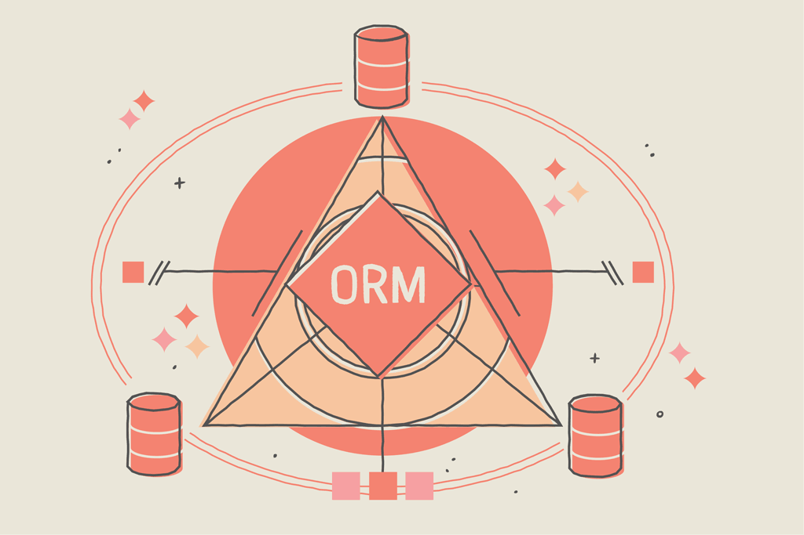

```{r setup, include=FALSE}
knitr::opts_chunk$set(echo = TRUE, warning = FALSE)
```

```{r, include=FALSE}
nchar("¿Has escuchado sobre SQLAlchemy y su nueva versión 2.0, pero no sabes qué es? SQLAlchemy es una de las ibrerías más importantes y usadas de Python a la hora de tratar con bases de datos")
```



<br>

# **¿Qué es SQLAlchemy?**

SQLAlchemy es un SQL toolkit de código abierto para interaccionar con bases de datos desde Python. SQLAlchemy proporciona una interfaz de alto nivel para realizar operaciones comunes a bases de datos de diferente naturaleza, de una manera sencilla, abstracta y generalizada, sin tener que atender demasiado a las especifidades de cada una de ellas.

A este tipo de librerías se las conoce como ORM (en inglés *Object-Relational Mapping*). Conozcamos un poco más sobre este concepto.

<br>

# **¿Qué es un ORM?**

La finalidad de un ORM es mapear (relacionar) entidades de una base de datos y objetos (p.e clases de Python) de un determinado lenguaje de programación con tablas de una base de datos. Son muy comunes en los paradigmas de programación orientada a objetos, ya que hace uso de ellos para ofrecer una abstracción y una manera de interactuar con las bases de datos en un manera *Pytonica* sin necesidad de utilizar directamente queries de SQL para ello. Se encargará de realizar las operaciones en el motor de sql de manera transparente para el usuario.

<br>

## Ventajas de usar un ORM en Python

Tener nuestras entidades como objetos en Python puede ser muy interesante a la hora de gestionar aplicaciones e interactuar(consulatar, hacer *updates*...) de manera sencilla con ellos.

Uno de las ventajas más destacables es que nos podemos abstraer y ser agnósticos a la base de datos con la que trabajemos. SQLALchemy tiene disponible una serie de dialectos, que se pueden extender y se han extendido (ElasticSearch...)

Otras cosas de las que SQLAlchemy se ocupa por nosotros es la posibilidad de gestionar un pool de conexiones, proveer un *context manager*, prevención de inyección SQL...

<br>

## Contras de usar un ORM en Python

Las cosas se pueden complicar con operaciones complejas. Mientras que nos ofrece una optimización de queries, cuando empezamos a hacer joins, agrupaciones y queries *nesteadas* a lo mejor nos queda una sintaxis bastante confusa, a lo peor sufriremos llevándolas a cabo. Muchos ORMs deja ejecutar SQL en crudo, pero perdiendo gran parte de su propósito.

Como siempre, al añadir un nivel extra de abstracción, la complejidad general podrá amentar, al mismo tiempo que debuggear se puede hacer más complejo al abstraernos de los detalles de la capa de bases de datos.


Ahora que ya sabemos más sobre qué es SQLAlchemy y qué nos permite hacer, veamos con más detalle sus elementos claves.

<br>

# **Elementos clave de SQLAlchemy**

En cualquier momento puedes bucear en la documentación de SQLAlchemy. Sin embargo, me gustaría comentar brevemente los conceptos clave con los que podrás empezar a trabajar con esta herramienta, teniendo una idea de lo que tenemos entre manos.

Por ejemplo, ¿cuál es la diferencia entre *Engine* y *Session* dentro de SQLALchemy?


**Engine**: Es parte del core de SQLAlchemy, gestionando y proveyendo las conexiones a la base de datos como API de bajo nivel. Es capaz de manejar una *pool* de conexiones, transacciones y ejecución de comandos SQL. Normalmente, se crea al inicio de la aplicación y se utiliza y comparte a lo largo de la ejecución.
En última instancia podríamos usar esta entidad para trabajar con la base de datos ejectando SQL sin necesidad de usar las capacidades como ORM en toda su extensión, con sus modelos etc..


**Session**: Es un nivel superior de abstración que se situa por encima del *Engine*. Permite realizar transacciones con la base de datos de una manera orientada a objetos. Se crearán y destruirán durante la ejección de la aplcación según sea necesario. Se encarga de hacer los commits  rollbacks.

[Respuesta en SO interesante a este respecto](https://stackoverflow.com/questions/34322471/sqlalchemy-engine-connection-and-session-difference#:~:text=When%20to%20use%20Engine%2C%20Connection%2C%20Session%20generally)

Otros conceptos interesantes:

**Dialect**: Los dialectos son los responsables de 'traducir' la sintaxis SQL genérica generada por SQLAlcemy a la sintaxis específica de la base de datos correspondiente. Por ejemplo, gestionar los tipos de datos es uno de los puntos más importantes en este proceso. Tenemos los siguientes disponibles de base:


y estos son extensibles. Es decir, que si queremos algo extra como interacción con ElasticSearch u OpenSearch (AWS), debemos instalar(o implementar) sus dialectos específicos.

Como ejemplo, el módulo [ElasticSearch dbapi](https://github.com/preset-io/elasticsearch-dbapi).

**Metadata**: Se trata de un objeto que representa y contiene información sobre el esquema de base de datos. Por ejemplo las tablas, *constraints*, columnas, relaciones... Se usa internamente para generar las instrucciones SQL y para gestionar las migraciones.

**Model**: Un modelo en SQLALchemy es un objeto de Python que represena una tabla en base de datos. Heredan de *DeclarativeBase*. 


Aquí tenemos un ejemplo sobre Postgres:

```{python}
from sqlalchemy import Column, Integer, Float
from sqlalchemy.dialects.postgresql import UUID
from sqlalchemy.orm import DeclarativeBase
import uuid


class Base(DeclarativeBase):
    pass
  
class Product(Base):

    __tablename__ = "products"

    id: uuid = Column(UUID(as_uuid=True), primary_key=True, default=uuid.uuid4)
    price = Column(Float)
    amount = Column(Integer)
    
    def __repr__(self):
        return f"""<Product(price='{self.price}', amount='{self.amount}', product_id='{self.product_id}')>"""

```

<br>


# ¿Se pude tipar con mypy en SQLAlchemy v2.0?

Sí, a partir de esta versión no será necesario instalar **stubs** o módulos específicos para que el mapeo que realiza SQLAlchemy sea compatible con Mypy y con el reconocimiento de la sintaxis por los IDEs. Bastará con **pip install sqlalchemy[mypy]**.

Siguientdo con el ejemplo anterior, el tipado estático quedaría:

```{python}
from sqlalchemy import Column, Integer, Float
from sqlalchemy.dialects.postgresql import UUID
from sqlalchemy.orm import DeclarativeBase
import uuid


class Base(DeclarativeBase):
    pass
  
class OrderNew(Base):

    __tablename__ = "orders_new"

    id: uuid = Column(UUID(as_uuid=True), primary_key=True, default=uuid.uuid4)
    price: float = Column(Float)
    amount: int = Column(Integer)
    description: str | None = Column(Integer)

    
    def __repr__(self):
        return f"""<Order(price='{self.price}', amount='{self.amount}', product_id='{self.product_id}')>"""
```

<br>


# ¿Cuándo usar *sessionmaker()*?

Nos permite crear una factoría de sesiones, configurando el comportamiento de las sesiones desde un solo lugar. Podemos con ello además separar la configuración de las sesiones de su creación, reduciendo duplicidades de código.

<br>


# ¿Qué son los Eventos ORM?

Mediante la API de eventos de SQLAlchemy, podemos configurar *listeners* que desencadenen la ejecución de determinadas funciones definidas por el usuario. Se usa o bien la función *listen()* o el decorador *@listen_for()*. Por ejemplo, esto puede ser útil en el caso de necesitar refrescar credenciales, loggear...

Aquí tenemos un ejemplo:

```{python}
from sqlalchemy import create_engine
from sqlalchemy.event import listens_for

engine = create_engine('sqlite:///typethepipe.db')

@listens_for(engine, "do_connect", named=True)
def aws_token(cparams, **kw):
    cparams['password'] = get_temp_token() 
    print("AWS token provisioned")

```

Si quieres profundizar en los eventos de SQLA, os dejamos link a la [docu](https://stackoverflow.com/questions/37718907/variable-explorer-in-jupyter-notebook) como siguiente paso.

¡Sigue leyendo nuestros [Python Posts](https://typethepipe.com/en/categories/python/)!

<br>

```{=html}
<!-- Begin Mailchimp Signup Form -->
<link href="//cdn-images.mailchimp.com/embedcode/horizontal-slim-10_7.css" rel="stylesheet" type="text/css">
<link rel="stylesheet" type="text/css" href="https://csshake.surge.sh/csshake.min.css">
<style type="text/css">
	#mc_embed_signup{background:#fff; clear:left; font:14px Helvetica,Arial,sans-serif; width:100%;}
	 #mc_embed_signup .button {
  background-color: #0294A5; /* Green */
  color: white;
  transition-duration: 0.4s;
}
#mc_embed_signup .button:hover {
  background-color: #379392 !important; 
}

</style>
<div id="mc_embed_signup">
<form action="https://typethepipe.us4.list-manage.com/subscribe/post?u=91551f7ed29389a0de4f47665&amp;id=d95c503a48" method="post" id="mc-embedded-subscribe-form" name="mc-embedded-subscribe-form" class="validate" target="_blank" novalidate>
 <div id="mc_embed_signup_scroll">
	<label for="mce-EMAIL"> ¡Suscribete para más contenido sobre Python y SQLALchemy! </label>
	<input type="email" value="" name="EMAIL" class="email" id="mce-EMAIL" placeholder="tu mejor email" required><input type="hidden" name="tags" value="7614568"></div>
    <!-- real people should not fill this in and expect good things - do not remove this or risk form bot signups-->
    <div style="position: absolute; left: -5000px;" aria-hidden="true"><input type="text" name="b_91551f7ed29389a0de4f47665_d95c503a48" tabindex="-1" value=""></div>
    <div class="clear"><input type="submit" value="¡Dale!" name="subscribe" id="mc-embedded-subscribe" class="button"></div>
    </div>
</form>
</div>

<!--End mc_embed_signup-->
```

<style>
p {
word-spacing: 3px;
text-indent: 20px;
text-align: justify;
}
.page-subtitle {
text-align: left  !important;
text-indent: 0px !important;
}
.card-text {
text-align: left  !important;
text-indent: 0px !important;
}
</style>


