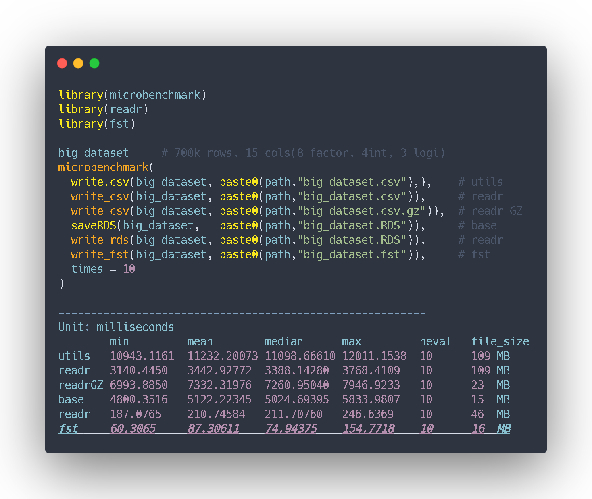

```{r, include=FALSE}
nchar("¡Un must en nuestro R environment! Velocidad imbatidad escritura y lectura. Es el paquete FST! x100 más rápido que write.csv(). Además comprime el tamaño de tu data frame")
```



```{r, warning=FALSE, echo=FALSE, eval=FALSE}
big_dataset <- read.csv(file=gzfile("../../../../static/shared_files/big_dataset.csv.gz"))
path <- "../../../../static/shared_files/"
big_dataset <- rbind(big_dataset,big_dataset,big_dataset,big_dataset,big_dataset,big_dataset,big_dataset)
```


¿Quieres guardar tu modelo de DL o un gran dataset? A continuación te mostramos la manera que hemos encontrado de optimizar la lectura, la escritura y almacenaje de data frames con el paquete FST. Si incorporar un paquete a tu *environment* no te supone un gran problema, te lo recomendamos.

En la repo del paquete hay un pequeño *benchmark* reliazado por sus autores. Queremos comprobarlo por nosotros mismos y vamos a comparar su rendimiento. Para ello compararemos su *performance* con el de las funciones que hasta hoy eran parte de nuestra caja de herramientas de R para la lectura y escritura de ficheros en proyectos de datos. Veamos:

```{r, eval = FALSE, warning=FALSE}
library(tidyverse)
big_dataset %>% nrow() # 700k filas, 15 columnas(8 factor, 4int, 3 logi)
```

```{r, eval=FALSE}
library(microbenchmark)
library(readr)
library(fst)

microbenchmark(
  write.csv(big_dataset, paste0(path,"big_dataset.csv"),),     # utils
  write_csv(big_dataset, paste0(path,"big_dataset.csv")),     # readr
  write_csv(big_dataset, paste0(path,"big_dataset.csv.gz"),), # readr GZ
  saveRDS(big_dataset, paste0(path,"big_dataset.RDS")),       # utils
  write_rds(big_dataset, paste0(path,"big_dataset.RDS")),     # readr
  write_fst(big_dataset, paste0(path,"big_dataset.fst")),     # fst
  times = 10
)

```

```{r, eval=FALSE, echo=FALSE, warning=FALSE}
file.remove(paste0(path,"big_dataset.csv"))
file.remove(paste0(path,"big_dataset.RDS"))
file.remove(paste0(path,"big_dataset.fst"))
```

```{r, eval=FALSE}
##  Unit: milliseconds
##            min 		    mean		      median        max			      neval	    file_size
##utils     10943.1161  	11232.20073   11098.66610	  12011.1538    10        109 MB
##readr     3140.4450	    3442.92772	  3388.14280	  3768.4109	    10        109 MB
##readrGZ   6993.8850	    7332.31976	  7260.95040	  7946.9233	    10        23  MB
##base      4800.3516	    5122.22345	  5024.69395	  5833.9807	    10        15  MB
##readr     187.0765	    210.74584     211.70760     246.6369      10        46  MB
"fst        60.3065		    87.30611      74.94375      154.7718      10        16  MB"
  
```

<br>

**¡Wow! Los resultados son impresionantes**, incluso mejores que los expuestos en la web de los creadores.

Podemos apreciar una mejora *x3* y *x50* en el *performance*  comparado con las funciones  readr::write_rds() y base R saveRDS()!

Una incremento increible de un *x100 performance* entre fst y las funciones que trabajan con csv y que anteriormente utilizábamos, aunque realmente esta no es una comparación del todo justa al tratarse de dos extensiones completamente diferentes (csv y bin).

<br>

**¿Y tú? ¿Estás pensando en incluir FST al *toolbox* de tu proyecto en R también?**

<br>

<script type="text/javascript" src="//downloads.mailchimp.com/js/signup-forms/popup/unique-methods/embed.js" data-dojo-config="usePlainJson: true, isDebug: false"></script><script type="text/javascript">window.dojoRequire(["mojo/signup-forms/Loader"], function(L) { L.start({"baseUrl":"mc.us4.list-manage.com","uuid":"91551f7ed29389a0de4f47665","lid":"d95c503a48","uniqueMethods":true}) })</script>


