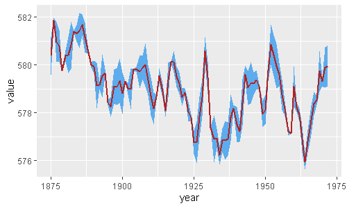

```{r, include=FALSE}
nchar("¡Plotea tus intervalos de confianza de manera facil! Con la función geom_ribbon() de ggplot podrás añadir areas sombreadas a tu plot. ¡Te enseñamos cómo!")
```
```{r setup, include=FALSE}
knitr::opts_chunk$set(echo = TRUE)
```



<br>

A continuación te mostramos el código:


```{r, eval=FALSE, warning=FALSE, message=FALSE}
library(tidyverse)
huron <- data.frame(year = 1875:1972,                        # Creamos el conjunto de datos
                    value = LakeHuron,
                    std = runif(length(LakeHuron),0,1))      # Valores random para representar la desviación   

huron %>%                                                    # Fijamos los ejes X e Y
  ggplot(aes(year, value)) +          
  geom_line(color = "firebrick", size = 1) +                 # Creamos la gráfica de linea 
  geom_ribbon(aes(ymin = value - std,
                  ymax = value + std),                       # Creamos los intervalos con valor +- std
              fill = "steelblue2") 

```

Para un grafico con varias lineas, debemos incorporar el *aesthetic* de *group* de la siguiente manera:

```{r, warning=FALSE, message=FALSE}
library(tidyverse)
huron <- data.frame(year = rep(1875:1972,2), 
                    group = c(rep("a",98),rep("b",98)),
                    value = c(LakeHuron, LakeHuron + 5),
                    std = runif(length(LakeHuron)*2,0,1))     # Creamos el conjunto de datos con dos series

# Seguimos la misma estructura para crear el plot, pero añadiendo fill=group y group=group para indicar que
# coloree y trate las dos series de manera diferenciada.
huron %>% 
  ggplot(aes(year, value, fill = group)) +                    
  geom_line(color = "firebrick", size = 1) +
  geom_ribbon(aes(ymin = value - std,
                  ymax = value + std,
                  group=group),
              fill = "steelblue2") 

```


