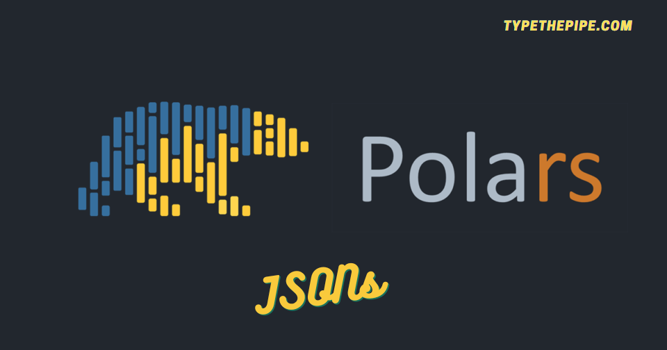

```{r setup, include=FALSE}
knitr::opts_chunk$set(echo = TRUE)
```



Como bien sabes, el formato JSON resulta útil para diversas tareas de programación, que van desde archivos de configuración hasta el almacenamiento de pesos y parámetros de modelos, lo que lo convierte en una elección versátil. Con Polars, puedes cargar, manipular y escribir archivos JSON sin esfuerzo, agilizando tus procesos de manejo de datos.

**JSON (JavaScript Object Notation) es un formato de datos amigable para el usuario, conocido por su simplicidad y legibilidad**, lo que lo hace perfecto para una variedad de aplicaciones. Su versatilidad y compatibilidad con numerosos lenguajes de programación lo convierten en una herramienta poderosa para la representación y el intercambio de datos en la era moderna.

<br>

# Cómo trabajar con archivos JSON en Polars

En medio del mundo dinámico de la manipulación y el análisis de datos, hay una biblioteca de Python que está causando sensación: como ya hemos tratado en TypeThePipe, se trata de Polars. Si bien el procesamiento de datos se asocia con frecuencia a la biblioteca Pandas, **Polars emerge durante los últimos meses, destacándose por su rendimiento ultrarrápido y un amplio conjunto de funciones, cada vez más creciente.** Lo que distingue a Polars es su capacidad para manejar datos JSON, lo que lo convierte en un activo indispensable para las personas que trabajan con estructuras de datos complejas y siempre cambiantes.

En este post, vamos a indagar en la manipulación de JSON y revelar cómo fácilmente podemos serializar/deserializar DataFrames, LazyDataFrames y Expresiones de JSON.

<br>

## **Leyendo JSON con la función de Polars read_json**

La función de Polars `read_json` nos permite fácilmente importar datos desde JSON y convertirlos en un DataFrame o LazyDataFrame estructurado, simplificandonos el proceso de análisis de datos.

Además, puedes agregar parámetros relativos al esquema del mismo. Bien estés trabajando con estructuras JSON complejas o sencillas, este método maneja la conversión de manera eficiente, lo que te ahorra tiempo y esfuerzo. Es una característica útil que hace que la manipulación de datos sea más confiable y robusta.

```{python}
import json

config_json = {
    "model_type": "regression",
    "model_reg_vars": {
        "price": "continuous",
        "zip_range": "categorical"
    },
    "model_dep_var": {
        "y": "categorical"
    },
    "model_version_tag": 1.19
}


with open('data.json', 'w', encoding='utf-8') as f:
    json.dump(config_json, f, indent=2)

```


```{python}
import polars as pl

df_from_json = (
pl.read_json("data.json",
    schema={
        'model_type': pl.Utf8, 
        'model_reg_vars': pl.Struct([pl.Field('price', pl.Utf8), pl.Field('zip_range', pl.Utf8)]), 
        'model_dep_var': pl.Struct([pl.Field('y', pl.Utf8)]), 
        'model_version_tag': pl.Float64
        }
    )
)
```

```{python}
pl.read_json("data.json").schema
```

<br>

### **Desanidando campos de JSON dentro de columnas DataFrame**

Several strategies can be taken for unnesting JSON fields from a POlars DataFrame. First one one can `rename_fields` as Struct method.

```{python}
model_reg_col_name = "model_reg_vars"
struct_names = [f'{model_reg_col_name}_{i}' for i in df_from_json[model_reg_col_name].struct.fields]

(
    df_from_json
    .select(pl.col(model_reg_col_name).struct.rename_fields(struct_names))
    .unnest(model_reg_col_name)
)
```
Another way if you have few nested fields and know their name, you can simply use `select()` and access them by `struct.field()`

```{python}
df_from_json.select(
    pl.all().exclude("model_reg_vars"),
    pl.col("model_reg_vars").struct.field("zip_range"),
    pl.col("model_reg_vars").struct.field("price")
)
```
<br>

### Desanidando campos dentro de varias columnas en Polars


Desanidar varias columnas de tipo 'struct' en Polars es una tarea que a menudo surge al tratar con datos complejos y anidados. Polars proporciona una forma directa de hacerlo utilizando el método 'unnest' en múltiples columnas de tipo 'struct' de manera simultánea. Esta operación esencialmente aplana las estructuras anidadas, haciendo que los datos sean más accesibles para su análisis y manipulación. Al especificar los nombres de las columnas que deben desanidarse, puedes trabajar de manera eficiente con los datos contenidos en esas estructuras, simplificando tus tareas de procesamiento de datos en Polars.

```{python}
df_from_json.unnest("model_dep_var", "model_reg_vars")
```

Esto es genial siempre y cuando los nombres de los campos anidados no colisionen. Si eso sucede, se espera que la función 'unnest' falle.

Una manera un tanto ingeniosa de evitar errores por columnas duplicadas es la que se propone en la respuesta a la pregunta de Stack Overflow. Sin embargo, es un enfoque un tanto 'hacker' porque debes modificar la función 'unnest' del DataFrame de Polars. Hacerlo sin una estrategia clara podría dar lugar a inconsistencias en el código de tu proyecto

```{python}
def unnest(self, columns, *more_columns, prefix=None, suffix=None, col_prefix=False, col_suffix=False, drop_existing=False):
    if isinstance(columns, str):
        columns = [columns]
    if more_columns:
        columns = list(columns)
        columns.extend(more_columns)
    #check to see if any new parameters are used, if not just return as is current behavior
    if drop_existing==False and not (prefix or suffix or col_prefix or col_suffix):
        return self._from_pydf(self._df.unnest(columns))
    final_prefix=""
    final_suffix=""
    
    for col in columns:
        if col_prefix:
            final_prefix=col+"_"+prefix if prefix else col+"_"
        if col_suffix:
            final_suffix="_"+col+suffix if suffix else "_"+col
        tempdf = self[0].select(col)
        innercols = tempdf._from_pydf(tempdf._df.unnest([col])).columns
        newcols = [final_prefix+innercol+final_suffix for innercol in innercols]
        self = (
            self
                .with_columns(pl.col(col).struct.rename_fields(newcols))
                .drop([drop_col for drop_col in newcols if drop_col in self.columns])
        )
    return self._from_pydf(self._df.unnest(columns))
pl.DataFrame.unnest=unnest
```

<br>

De esta manera, puedes agregar programáticamente un sufijo a las columnas, como equivalente a lo que hemos visto en la sección anterior.

```{python}
df_from_json.unnest("model_dep_var", "model_reg_vars", col_suffix=True)
```
<br>

## **Polars write_json**

```{python}
df_from_json.write_json()
```

```{python}
df_from_json.write_json(row_oriented=True)
```

Pero, ¿qué sucede con la serialización de no solo DataFrames de Polars, sino también expresiones de Polars? ¡También es posible!

<br>

## **Serializa expresiones de Polars y LazyDataFrames**

A partir de `polars >= 0.18.1`, es posible serializar/deserializar una expresión para que funcione de la siguiente manera:

```{python}
json_cond_select1 = pl.col('model_type').alias('ml_model_category').meta.write_json()
json_cond_select2 = pl.col('model_version_tag').meta.write_json()
json_cond_filter1 = (pl.col('model_version_tag') == 1.19).meta.write_json()

```

Las expresiones son serializables individualmente, y la configuración completa de `expr_config` también es serializable.

```{python}
expr_config = {
     'select': [
        pl.Expr.from_json(json_cond_select1),
        pl.Expr.from_json(json_cond_select2),
                ],
     'filters': [
        pl.Expr.from_json(json_cond_filter1),
      ]
}


(
    pl.read_json("data.json")
    .filter(pl.all_horizontal(expr_config["filters"]))
    .select(expr_config["select"])
).lazy().write_json()
```

<br>

### **Mantente al día de las novedades de Polars**

Espero que esta publicación te haya ayudado a familiarizarte con la serialización y el uso de JSON en Polars, y te haya permitido disfrutar de una exhibición de algunas de sus características.

Si deseas mantenerte actualizado y no perderte nada...

```{=html}
<!-- Begin Mailchimp Signup Form -->
<link href="//cdn-images.mailchimp.com/embedcode/horizontal-slim-10_7.css" rel="stylesheet" type="text/css">
<link rel="stylesheet" type="text/css" href="https://csshake.surge.sh/csshake.min.css">
<style type="text/css">
	#mc_embed_signup{background:#fff; clear:left; font:14px Helvetica,Arial,sans-serif; width:100%;}
	 #mc_embed_signup .button {
  background-color: #0294A5; /* Green */
  color: white;
  transition-duration: 0.4s;
}
#mc_embed_signup .button:hover {
  background-color: #379392 !important; 
}

</style>
<div id="mc_embed_signup">
<form action="https://typethepipe.us4.list-manage.com/subscribe/post?u=91551f7ed29389a0de4f47665&amp;id=d95c503a48" method="post" id="mc-embedded-subscribe-form" name="mc-embedded-subscribe-form" class="validate" target="_blank" novalidate>
 <div id="mc_embed_signup_scroll">
	<label for="mce-EMAIL"> ¡Suscribete para más contenido de Python Polars!</label>
	<input type="email" value="" name="EMAIL" class="email" id="mce-EMAIL" placeholder="tu mejor email" required><input type="hidden" name="tags" value="7614568"></div>
    <!-- real people should not fill this in and expect good things - do not remove this or risk form bot signups-->
    <div style="position: absolute; left: -5000px;" aria-hidden="true"><input type="text" name="b_91551f7ed29389a0de4f47665_d95c503a48" tabindex="-1" value=""></div>
    <div class="clear"><input type="submit" value="¡Dale!" name="subscribe" id="mc-embedded-subscribe" class="button"></div>
    </div>
</form>
</div>

<!--End mc_embed_signup-->
```

<style>
.hljs-keyword,.hljs-selector-tag,.hljs-subst{color:#2e8516;font-weight:bold}.hljs-comment, .hljs-quote {
    color: #0e847b;
    font-style: italic;
}.hljs-number, .hljs-literal, .hljs-variable, .hljs-template-variable, .hljs-tag .hljs-attr {
    color: #008021;
}
</style>


