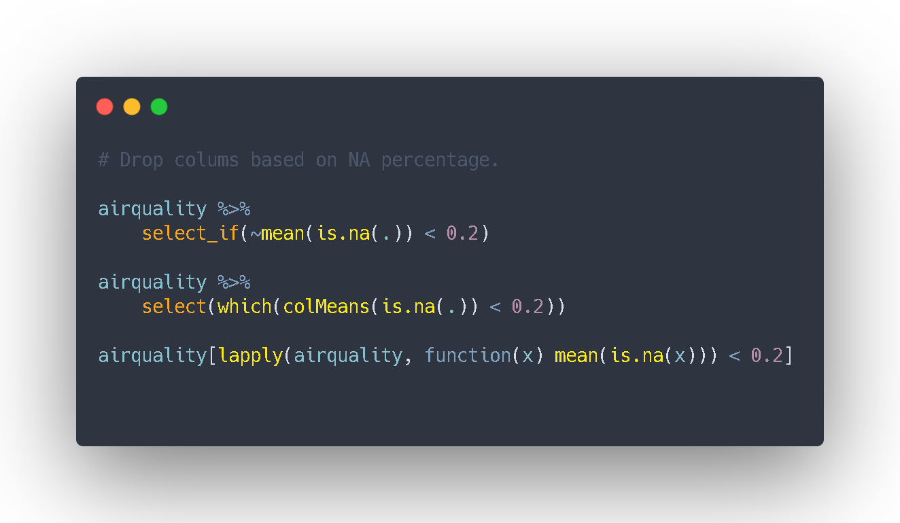

Los NAs pueden ser muy informativos, y estudiar cómo se distribuyen en base a una segunda variable suele ser una genial idea. Esto puede aportarnos un extra de información o mostrarnos un fenómeno que de otra manera(mediante imputación o descarte de observaciones) nos pasaría desapercibido.

Sin embargo, para un estudio preliminar o tras haber analizado los valores faltantes, nos encontramos casos en los que queremos quitarlos de manera automatizada basándonos en el porcentaje de NAs.

[En este artículo](../../vizs-and-tips/recuento-nas-por-columna-r) hablamos y comparamos diferentes funciones de BaseR vs Tidy & Purrr para contar el número de NAs por columna.

**¿Cuanto cuesta no salir del *pipeflow*?** Dependerá del número de variables, del porcentaje que elijas como frontera y la distribución de NAs a lo largo de las variables, **pero no suele ser más que unos pocos nanosegundos.**

```{r, warning=FALSE, message=FALSE, eval=FALSE}

# library(microbenchmark)  Puedes comparar su performance en diferentes datasets
library(tidyverse)

airquality %>% select_if(~mean(is.na(.)) < 0.2)

airquality %>% select(which(colMeans(is.na(.)) < 0.2))

airquality[lapply(airquality, function(x) mean(is.na(x))) < 0.2]

```


¿Qué forma eliges tú?

<script type="text/javascript" src="//downloads.mailchimp.com/js/signup-forms/popup/unique-methods/embed.js" data-dojo-config="usePlainJson: true, isDebug: false"></script><script type="text/javascript">window.dojoRequire(["mojo/signup-forms/Loader"], function(L) { L.start({"baseUrl":"mc.us4.list-manage.com","uuid":"91551f7ed29389a0de4f47665","lid":"d95c503a48","uniqueMethods":true}) })</script>

