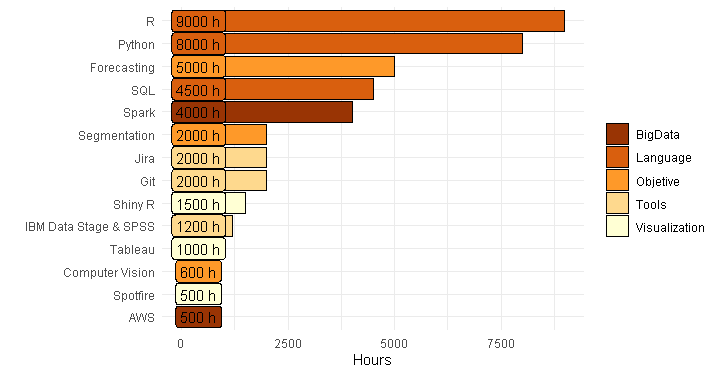

```{r, include=FALSE}
nchar("¿Quieres añadir un gráfico con tus habilidades a tu curriculum como Data Scientist? ¡Te mostramos cómo hacerlo en pocas lineas de código con R y ggplot")
```

```{r setup, include=FALSE}
knitr::opts_chunk$set(echo = TRUE)
```



A la hora de presentar tus habilidades ya sea en una página web o en tu CV, una buena idea sueles ser sintetizarlas mediante una gráfica. Muchas plantillas de CVs incluyen una gráfica por defecto.

En este post queremos dar un *template* el cual poder personalizar con vuestras habilidades y evolucionar incorporando mejoras estéticas. ¡Estaremos encantados de ver tu versión!

Os dejamos el código comentado en el siguiente *chunk*:

```{r, warning=FALSE, message=FALSE}
library(ggplot2)
# library(plotly)                      Es simple transformarlo a plotly
library(tibble)
library(dplyr)

skills <- tribble(                    # Creamos el dataset con las habilidades
    ~ Skill, ~ Hours, ~ Class,
    "AWS", 500, "BigData",
    "Python", 8000, "Language",
    "Spark", 4000, "BigData",
    "R", 9000, "Language",
    "Git", 2000, "Tools",
    "Jira", 2000, "Tools",
    "Forecasting", 5000, "Objetive",
    "Segmentation", 2000, "Objetive",
    "Computer Vision", 600, "Objetive",
    "SQL", 4500, "Language",
    "IBM Data Stage & SPSS", 1200, "Tools",
    "Shiny R", 1500, "Visualization",
    "Tableau", 1000, "Visualization",
    "Spotfire", 500, "Visualization"
) 
```


```{r, skills-plot, warning=FALSE, eval=FALSE}
# plotly(                              
ggplot(data=skills,
       aes(x=reorder(Skill,-desc(Hours)),           # Ordenamos las habilidades según las horas dedicadas
           y= Hours,                                
           fill=Class,                              # Coloreamos según ek tipo de habilidad
           label=paste0(Hours," h"))) +             # Añadimos un label con las horas
    geom_bar(stat = "identity", colour="black") +   # Stat identity para que pueda tener eje Y
    coord_flip() +                                  # Hacemos las barras horizontales
    labs(x=" ", y="Hours", fill=" ")  +             # Definimos el nombre de los ejes
    theme_minimal() +                               # Theme sin background
    scale_fill_brewer(palette = "YlOrBr",           # Paleta deseado
                      direction = -1) +
    geom_label(show_guide  = F, aes(y=400))         # Usar show_guide a pesar del warning

```

