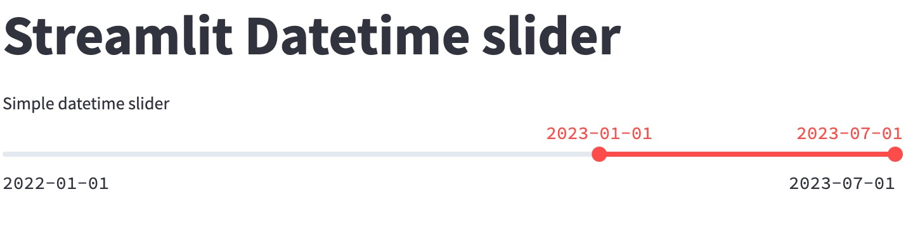

<br>

```{r setup, include=FALSE}
knitr::opts_chunk$set(echo = TRUE, eval = FALSE)
```


Ayer, me pidieron configurar de manera sencilla un control deslizante de fecha y hora en Streamlit. Anteriormente, requería cierto esfuerzo y ajustes en la función `st.slider()`. Sin embargo, ahora es posible lograrlo de manera fluida, ya que la función del control deslizante funciona casi a la perfección con fechas.

```{python, eval=FALSE, warning=FALSE, message=FALSE}
import datetime
import streamlit as st

MIN_MAX_RANGE = (datetime.datetime(2022,1,1), datetime.datetime(2023,7,1))
PRE_SELECTED_DATES = (datetime.datetime(2023,1,1), datetime.datetime(2023,7,1))

selected_min, selected_ax = st.slider(
    "Datetime slider",
    value=PRE_SELECTED_DATES,
    min_value=MIN_MAX_RANGE[0],
    max_value=MIN_MAX_RANGE[1],
)

```

Para configurar los pasos del control deslizante cuando el usuario interactúa con él, puedes hacerlo de la siguiente manera. Ten en cuenta que los valores intermedios no serán seleccionables por defecto y podrían requerir un paso adicional. Además, existe la opción de personalizar el formato de la fecha para su visualización.

```{python, warning=FALSE, message=FALSE}
selected_min, selected_ax = st.slider(
    "Datetime slider",
    value=PRE_SELECTED_DATES,
    step=datetime.timedelta(days=2),
    min_value=MIN_MAX_RANGE[0],
    max_value=MIN_MAX_RANGE[1],
    format="YYYY-MM-DD",    
)

```


Otra funcionalidad de los controles deslizantes es incluir un ayudante, que usamos con bastante frecuencia. Sin embargo, ten en cuenta que en ciertas versiones de Streamlit, utilizar el argumento "help" en el control deslizante de fecha y hora podría alterar la visualización del título del control deslizante.

<br>

Puedes acceder a más contenido gratis sobre Streamlit en nuestro blog [TypeThePipe](https://typethepipe.com)

<br>
