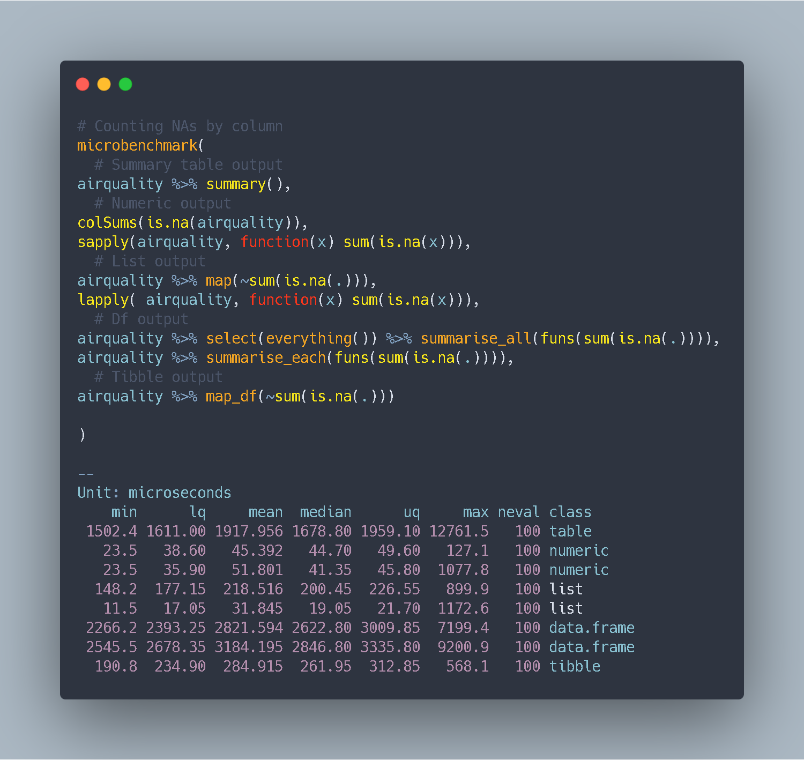

Are you starting your data exploration? Do you want to have an easy overview of your variable NA percentage?

Let's benchmark different ways of achieving it:

```{r, warning=FALSE, message=FALSE}
library(microbenchmark)
library(tidyverse)

microbenchmark(
  # Summary table output
airquality %>% summary(),
  # Numeric output
colSums(is.na(airquality)),
sapply(airquality, function(x) sum(is.na(x))),
  # List output
airquality %>% map(~sum(is.na(.))),
lapply( airquality, function(x) sum(is.na(x))),
  # Df output
airquality %>%
  select(everything()) %>% 
  summarise_all(funs(sum(is.na(.)))),
 airquality %>% 
   summarise_each(funs(sum(is.na(.)))),
  # Tibble output
airquality %>% map_df(~sum(is.na(.)))

)

```


<script type="text/javascript" src="//downloads.mailchimp.com/js/signup-forms/popup/unique-methods/embed.js" data-dojo-config="usePlainJson: true, isDebug: false"></script><script type="text/javascript">window.dojoRequire(["mojo/signup-forms/Loader"], function(L) { L.start({"baseUrl":"mc.us4.list-manage.com","uuid":"91551f7ed29389a0de4f47665","lid":"d95c503a48","uniqueMethods":true}) })</script>

