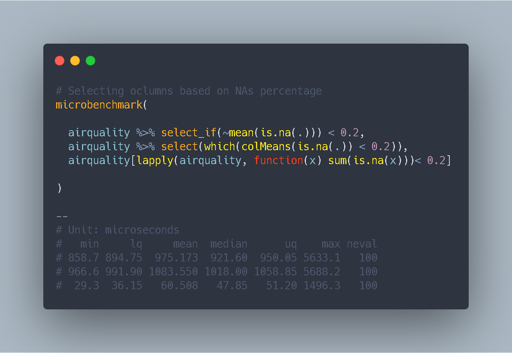

Are you developing an automated exploration tool? Here we propose some alternatives to drop columns with high percentage of NAs.

[In this previous tip](../../vizs-and-tips/counting-nas-by-column-r-benchmark) we talk about BaseR vs Tidy & Purrr  counting NAs performance. 

**Not leaving the pipeflow. How much does it cost?;)  It depends on the NA distribution between features and its number, but not much that a few nanoseconds in small and big datasets**

```{r, warning=FALSE, message=FALSE, eval=FALSE}

# library(microbenchmark)  You can benchmark them in small and big datasets
library(tidyverse)

airquality %>% select_if(~mean(is.na(.)) < 0.2)

airquality %>% select(which(colMeans(is.na(.)) < 0.2))

airquality[lapply(airquality, function(x) mean(is.na(x))) < 0.2]

```

<br>

Soooo  what's your choice??

<br>

<script type="text/javascript" src="//downloads.mailchimp.com/js/signup-forms/popup/unique-methods/embed.js" data-dojo-config="usePlainJson: true, isDebug: false"></script><script type="text/javascript">window.dojoRequire(["mojo/signup-forms/Loader"], function(L) { L.start({"baseUrl":"mc.us4.list-manage.com","uuid":"91551f7ed29389a0de4f47665","lid":"d95c503a48","uniqueMethods":true}) })</script>

